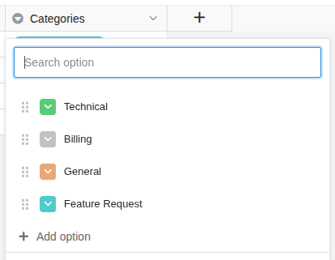
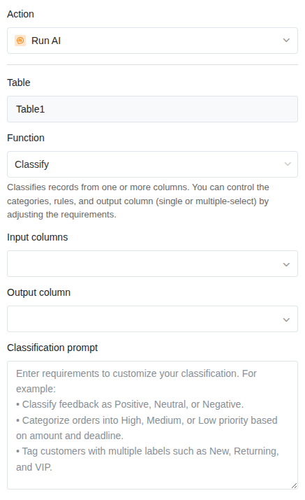

The AI function **Classify** analyzes the content of one or more columns and assigns each entry to a category. The result is written to a single-select or multi-select column. This way, you can automatically classify incoming texts without having to read each entry manually.

## Typical use cases

- **Support tickets**: Automatically classify requests as "Technical", "Billing", "General" or "Feature Request".
- **Feedback and reviews**: Categorize customer feedback by sentiment (positive, neutral, negative).
- **Email inbox**: Sort incoming messages by topic or urgency.
- **Job applications**: Classify cover letters by field of expertise or experience level.

## Prerequisites

- A table with at least one **text column** that serves as input.
- A **single-select column** or **multi-select column** for the result.



## Step-by-step guide

### 1. Create categories in the select column

Before you set up the automation, create all desired **categories** as options in the single-select column (or multi-select column). For example: "Technical", "Billing", "General", "Feature Request".

### 2. Create an automation and choose a trigger

Create a new automation rule as described in the article [Set up an AI automation](). A typical trigger is **When a row is added**, so that each new entry is classified immediately.

### 3. Add "Call AI" action

Click **Add action** and select **Call AI**.

### 4. Select the "Classify" function

In the action settings, choose:

- **Table**: The table in which the AI should work.
- **Function**: **Classify**

### 5. Define input columns

Select one or more columns whose content the AI should analyze to determine the category. The AI reads the texts from these columns and decides based on the content which category fits best.

### 6. Customize the prompt

In the prompt field, you can give the AI additional instructions on how it should classify. This is especially helpful when the category names alone are not clear enough.

**Example prompts:**

| Prompt | Effect |
|---|---|
| *Classify the request based on the main topic.* | Simple assignment by topic |
| *Choose "Technical" if it involves error messages or malfunctions. Choose "Billing" if it involves payments or invoices. Everything else is "General".* | Clear rules for each category |
| *Evaluate the sentiment of the text: positive, neutral or negative.* | Sentiment analysis |



### 7. Define the result column

Select the [single-select column]() or [multi-select column]() where the result should be written.

- **Single-select**: The AI selects exactly one category.
- **Multi-select**: The AI can assign multiple categories simultaneously.

### 8. Save and test

Click **Save** and test the automation with an entry where the category is obvious. Check whether the AI assigns the expected category.

## Application example: Categorizing support tickets

In your helpdesk, support requests arrive daily via a web form. Each request contains a **description** of the problem. You want each ticket to be automatically assigned to a category so that your team members can work on the tickets in a filtered view.

**Configuration:**

- **Trigger**: When a row is added
- **Function**: Classify
- **Input column**: Description
- **Prompt**: *Classify the support request. Choose "Technical" for errors, crashes and malfunctions. Choose "Billing" for questions about payments, invoices or subscriptions. Choose "Feature Request" for improvement suggestions. Everything else is "General".*
- **Result column**: Category (single-select with the options "Technical", "Billing", "Feature Request", "General")

As soon as a new ticket arrives, the AI automatically assigns it to the appropriate category. Your team members can then filter by category and prioritize their tickets.

## Tips for good results

- **Keep the number of categories manageable.** Five to ten categories usually work well. With too many similar categories, accuracy decreases.
- **Describe each category in the prompt.** Especially with ambiguous category names, a brief explanation helps the AI with the assignment.
- **Use a single-select** when each entry should be assigned to exactly one category. Use a multi-select only when an entry can actually fall into multiple categories.
- **Review the first results.** Adjust the prompt if the AI repeatedly classifies incorrectly.

## Next steps

- [Summarize texts (Summarize)]()
- [Extract information (Extract)]()
- [Custom AI action (Custom)]()
