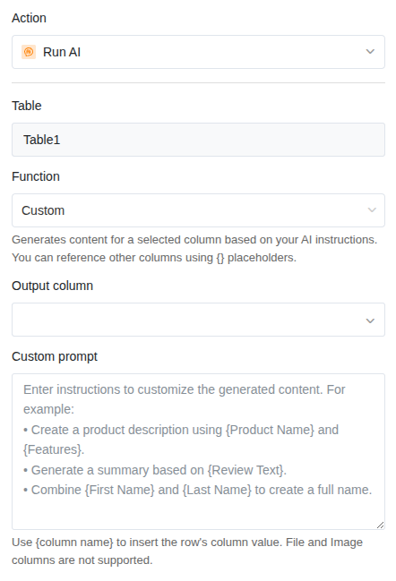
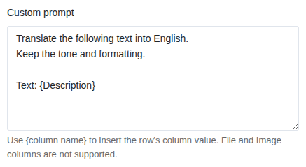

Функция ИИ **Custom** — самая гибкая из пяти ИИ-действий. Вы пишете собственный промпт и свободно определяете, что ИИ делает с вашими данными. Всё, что не вписывается в четыре стандартные функции (Summarize, Classify, OCR, Extract), можно реализовать с помощью Custom.

## Типичные сценарии использования

- **Перевод**: Автоматический перевод текстов на другой язык.
- **Перефразирование**: Переписывание текстов в другом тоне или стиле (например, формальный, клиентоориентированный, упрощённый).
- **Предложения ответов**: Генерация черновика ответа на основе запроса клиента.
- **Оценка**: Оценка текстов по собственным критериям по шкале (например, релевантность, качество, срочность).
- **Генерация**: Создание описаний товаров, публикаций для соцсетей или мета-текстов из тезисов.
- **Корректура**: Автоматическое исправление орфографических и грамматических ошибок в текстах.

## Предварительные требования

- Таблица с как минимум одним столбцом, содержимое которого ИИ должен обработать.
- **Текстовый столбец** или **столбец форматированного текста** для результата.

## Пошаговое руководство

### 1. Создание автоматизации и выбор триггера

Создайте новое правило автоматизации, как описано в статье [Настройка ИИ-автоматизации](). Выберите подходящий триггер для вашего сценария использования.

### 2. Добавление действия «Вызвать ИИ»

Нажмите **Добавить действие** и выберите **Вызвать ИИ**.

### 3. Выбор функции «Custom»

В настройках действия выберите:

- **Таблица**: Таблица, в которой ИИ должен работать.
- **Функция**: **Custom**



### 4. Написание промпта

Промпт — это ядро функции Custom. Здесь вы формулируете инструкцию для ИИ. Используйте **{Название столбца}** в фигурных скобках, чтобы вставить значение столбца из текущей строки в промпт.

**Структура хорошего промпта:**

```
Переведи следующий текст на английский язык.
Сохрани тон и форматирование.

Текст: {Описание}
```

В этом примере `{Описание}` при каждом выполнении заменяется фактическим содержимым столбца «Описание».



### 5. Определение столбца результата

Выберите столбец, в который должен быть записан результат ИИ. Он должен быть типа **Текст** или **Форматированный текст**.


### 6. Сохранение и тестирование

Нажмите **Сохранить** и протестируйте автоматизацию с одной записью. Проверьте, соответствует ли результат в столбце результата вашим ожиданиям, и при необходимости скорректируйте промпт.

## Примеры промптов для частых задач

### Перевод текстов

```
Переведи следующий текст на английский язык.
Сохрани технические термины и не переводи их.

Текст: {Описание товара}
```

### Генерация предложения ответа

```
Напиши дружелюбный и профессиональный ответ
на следующий запрос клиента. Ответ должен быть
не длиннее пяти предложений.

Запрос: {Запрос клиента}
```

### Перефразирование текста

```
Перефразируй следующий текст так, чтобы он подходил
для пресс-релиза. Используй деловой,
профессиональный тон.

Исходный текст: {Заметки}
```

### Оценка содержимого

```
Оцени следующий текст по шкале от 1 до 5
по степени срочности. Ответь только числом
и кратким обоснованием в одном предложении.

Текст: {Обращение в поддержку}
```

### Генерация описания товара

```
Создай привлекательное описание товара для
интернет-магазина на основе следующих тезисов.
Описание должно быть длиной 50–80 слов.

Название товара: {Название}
Характеристики: {Характеристики}
Целевая аудитория: {Целевая аудитория}
```

### Исправление орфографии и грамматики

```
Исправь орфографические и грамматические ошибки
в следующем тексте. Не изменяй содержание
и формулировки. Верни только исправленный текст.

Текст: {Свободный текст}
```

## Пример применения: Перевод описаний товаров

В вашей таблице товаров содержатся описания на немецком языке. Для международного интернет-магазина вам нужны переводы на английский. Вместо того чтобы переводить каждое описание вручную, ИИ должен делать это автоматически.

**Конфигурация:**

- **Триггер**: Когда добавляется строка
- **Функция**: Custom
- **Промпт**: *Переведи следующий немецкий текст на английский язык. Используй привлекательный тон, подходящий для интернет-магазина. Сохрани названия товаров и брендов без изменений. Текст: {Описание DE}*
- **Столбец результата**: Описание EN (текстовый столбец)

Как только добавляется новый товар с описанием на немецком языке, в столбце результата автоматически появляется перевод на английский.


## Советы по написанию хороших промптов

- **Будьте конкретны.** «Напиши хороший текст» даёт непредсказуемые результаты. «Напиши описание товара длиной 50–80 слов в дружелюбном тоне» — значительно лучше.
- **Используйте ссылки на столбцы.** С помощью `{Название столбца}` вы можете комбинировать значения из нескольких столбцов в одном промпте для предоставления контекста.
- **Определите формат вывода.** Результат должен быть одним предложением? Списком? Числом с обоснованием? Укажите это в промпте.
- **Тестируйте и дорабатывайте.** Попробуйте промпт с разными записями. Если результаты не подходят, скорректируйте формулировку.
- **Пишите промпт на целевом языке.** Если результат должен быть на английском, пишите промпт на английском. Это улучшает качество результатов.

## Следующие шаги

- [Резюмирование текстов (Summarize)]()
- [Классификация записей (Classify)]()
- [Извлечение информации (Extract)]()
- [Распознавание текста на изображениях (OCR)]()
