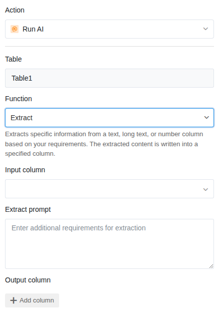
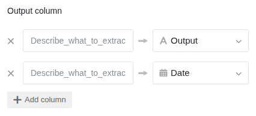

La función de IA **Extract** lee de forma específica determinada información de texto no estructurado y la escribe en columnas individuales. De este modo, transforma texto corrido en datos estructurados — por ejemplo, número de factura, fecha e importe de un texto de factura.

## Casos de uso típicos

- **Facturas**: Leer número de factura, fecha, importe y destinatario de textos de facturas.
- **Correos electrónicos**: Extraer nombre del remitente, asunto y solicitud principal de mensajes entrantes.
- **Contratos**: Registrar duración del contrato, plazo de rescisión y partes contratantes de textos de contratos.
- **Pedidos**: Leer número de artículo, cantidad y dirección de entrega de textos de pedidos.
- **Tarjetas de visita** (después de OCR): Leer nombre, empresa, número de teléfono y correo electrónico del texto reconocido.

## Requisitos previos

- Una tabla con al menos una **columna de texto** que contenga el texto a analizar.
- Una o más **columnas de resultados** en las que se escribirán las informaciones extraídas.

## Guía paso a paso

### 1. Crear una automatización y elegir un disparador

Cree una nueva regla de automatización como se describe en el artículo [Configurar una automatización IA](). Elija un disparador adecuado — por ejemplo **Cuando se añade una fila**, para que las nuevas entradas se procesen inmediatamente.

### 2. Añadir la acción "Llamar a la IA"

Haga clic en **Añadir acción** y seleccione **Llamar a la IA**.

### 3. Seleccionar la función "Extract"

En la configuración de la acción, elija:

- **Tabla**: La tabla en la que debe trabajar la IA.
- **Función**: **Extract**

### 4. Definir la columna de entrada

Seleccione la columna cuyo contenido debe analizar la IA. Normalmente se trata de una **columna de texto** con texto no estructurado — por ejemplo, el texto completo de una factura o un correo electrónico.

### 5. Definir el prompt

El prompt es especialmente importante para la función Extract. Describa exactamente **qué información** debe extraer la IA. Sea lo más preciso posible.

**Ejemplos de prompts:**

| Prompt | Información extraída |
|---|---|
| *Extrae el número de factura, la fecha de factura y el importe total.* | Tres valores individuales |
| *Lee el nombre, la empresa y la dirección de correo electrónico del texto.* | Datos de contacto |
| *Encuentra la fecha de inicio, la fecha de finalización y el plazo de rescisión.* | Información contractual |
| *Extrae la descripción del artículo y la cantidad del pedido.* | Detalles del pedido |

### 6. Definir las columnas de resultados

Asigne cada información a extraer a su propia **columna de resultados**. Elija el tipo de columna adecuado al contenido esperado — la IA reconoce el formato y escribe los valores directamente en el tipo de columna correcto. Así, las fechas se almacenan de forma fiable en una columna de fecha y los textos en una columna de texto.

### 7. Guardar y probar

Haga clic en **Guardar** y pruebe la automatización con una entrada que contenga la información a extraer. Compruebe si los valores se registran correctamente en las columnas de resultados.

## Ejemplo de aplicación: Lectura de datos de facturas

En su tabla almacena facturas entrantes como texto corrido (o después de reconocimiento OCR). Desea extraer automáticamente los datos de facturación más importantes en columnas individuales.

**Configuración:**

- **Disparador**: Cuando se añade una fila
- **Función**: Extract
- **Columna de entrada**: Texto de la factura
- **Prompt**: *Extrae la siguiente información del texto de la factura: número de factura, fecha de factura (en formato DD/MM/AAAA), importe neto, importe de IVA e importe bruto.*
- **Columnas de resultados**: Número de factura, Fecha de factura, Importe neto, IVA, Importe bruto

En cuanto se crea una nueva entrada con un texto de factura, la IA extrae los datos relevantes y los escribe en las columnas correspondientes.

## Consejos para buenos resultados

- **Sea específico en el prompt.** En lugar de "Extrae la información importante", escriba exactamente qué campos necesita. Cuanto más preciso sea el prompt, más fiable será el resultado.
- **Indique el formato deseado.** Si necesita una fecha en formato DD/MM/AAAA, escríbalo en el prompt. Lo mismo aplica para importes con o sin símbolo de moneda.
- **Pruebe con diferentes textos.** Las facturas de diferentes remitentes tienen formatos diferentes. Compruebe si la IA también encuentra la información correcta con diseños diferentes.
- **Combine Extract con OCR.** Si sus datos de origen están en forma de imágenes (por ejemplo, facturas escaneadas), utilice primero la [función OCR]() y luego Extract en una segunda acción.

## Próximos pasos

- [Reconocimiento de texto a partir de imágenes (OCR)]()
- [Resumir textos (Summarize)]()
- [Acción de IA personalizada (Custom)]()
