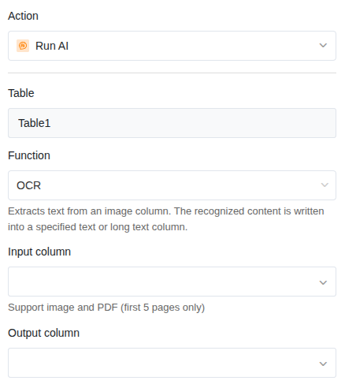

ИИ-функция **OCR** (Optical Character Recognition) распознаёт текст на изображениях и записывает распознанное содержимое в текстовый столбец. Это позволяет автоматически преобразовывать отсканированные документы, фотографии визитных карточек или изображения счетов в текст с возможностью поиска.

## Типичные сценарии использования

- **Визитные карточки**: автоматический захват фотографий визитных карточек в виде текста.
- **Счета и квитанции**: преобразование отсканированных счетов в читаемый текст.
- **Накладные**: извлечение текста из сфотографированных накладных.
- **Рукописные заметки**: оцифровка фотографий рукописных заметок.
- **Документы**: преобразование отсканированных договоров или форм в текстовый формат.

## Предварительные условия

- Таблица со [столбцом изображений]() или [столбцом файлов](), содержащим изображения или документы для распознавания.
- [Текстовый столбец или столбец форматированного текста]() для распознанного текста.

## Пошаговая инструкция

### 1. Создание автоматизации и выбор триггера

Создайте новое правило автоматизации, как описано в статье [Настройка ИИ-автоматизации](). Типичный триггер — **При добавлении строки** — таким образом каждое вновь загруженное изображение обрабатывается автоматически.

В качестве альтернативы вы можете использовать **При изменении строки** и определить столбец изображений как отслеживаемый столбец. В этом случае распознавание OCR запускается каждый раз, когда новое изображение вставляется в столбец.

### 2. Добавление действия «Вызвать ИИ»

Нажмите **Добавить действие** и выберите **Вызвать ИИ**.

### 3. Выбор функции «OCR»

В настройках действия выберите:

- **Таблица**: таблица, в которой должен работать ИИ.
- **Функция**: **OCR**

### 4. Определение входного столбца

Выберите столбец, из которого ИИ должен распознавать текст. В качестве входного столбца можно использовать **столбец изображений** или **столбец файлов**. При использовании столбца файлов вы можете обрабатывать, например, PDF-файлы или отсканированные документы.



### 5. Определение столбца результатов

Выберите столбец, в который должен быть записан распознанный текст. Он должен быть типа **Текст** или **Форматированный текст**.

### 6. Сохранение и тестирование

Нажмите **Сохранить** и загрузите тестовое изображение с хорошо читаемым текстом в столбец изображений. Через несколько секунд распознанный текст должен появиться в столбце результатов.

## Пример применения: оцифровка визитных карточек

Ваш отдел продаж фотографирует визитные карточки на выставках и загружает фотографии в таблицу SeaTable. ИИ должен автоматически распознать текст на визитной карточке, чтобы вы могли искать контактные данные.

**Конфигурация:**

- **Триггер**: При добавлении строки
- **Функция**: OCR
- **Входной столбец**: Изображение визитной карточки (столбец изображений)
- **Столбец результатов**: Распознанный текст (текстовый столбец)

Как только создаётся новая запись с изображением визитной карточки, ИИ считывает текст с изображения и записывает его в столбец результатов. Оттуда вы можете далее обрабатывать данные — например, с помощью последующего действия **Extract**, чтобы целенаправленно извлечь имя, компанию и номер телефона.



## Советы для хороших результатов

- **Качество изображения имеет значение.** Чем чётче и контрастнее изображение, тем лучше распознавание текста. Размытые фотографии или плохое освещение могут привести к ошибкам.
- **Печатный текст распознаётся надёжнее рукописного.** Машинный текст распознаётся практически без ошибок. Для рукописного текста качество зависит от разборчивости.
- **Держите изображение ровно.** Сильно искажённые или повёрнутые изображения могут затруднить распознавание.
- **Используйте распространённые форматы изображений.** JPG и PNG работают надёжно.

## Комбинирование OCR с Extract

Функция OCR возвращает **весь распознанный текст** в виде сплошного текста. Если вы хотите целенаправленно извлечь отдельные данные (например, имя, адрес, номер счёта), вы можете добавить второе действие с функцией [Extract]() в той же автоматизации. Таким образом, распознанный текст структурируется и распределяется по отдельным столбцам на втором шаге.

## Следующие шаги

- [Извлечение информации (Extract)]()
- [Обобщение текстов (Summarize)]()
- [Пользовательское ИИ-действие (Custom)]()
