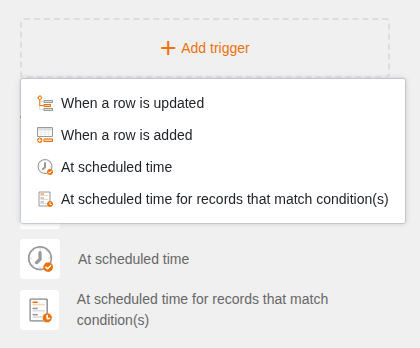
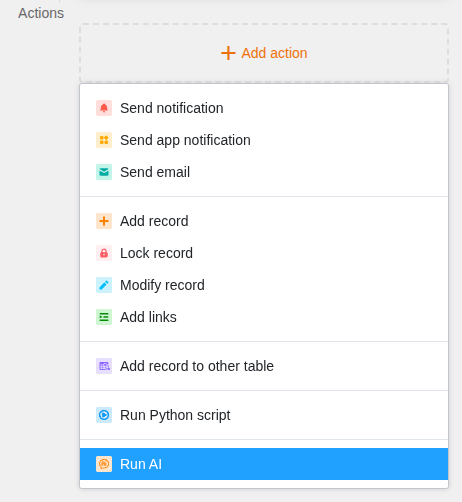
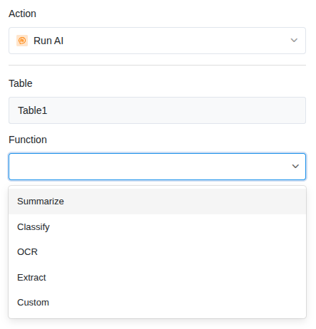
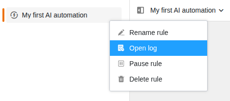

В этом руководстве вы создадите автоматизацию с действием **Запустить ИИ**. После настройки SeaTable будет автоматически обрабатывать ваши данные с помощью ИИ-модели — например, для обобщения текстов, категоризации записей или извлечения информации.

## Предварительные требования

- Подписка SeaTable **Enterprise** (Cloud или самостоятельный хостинг)
- SeaTable **версии 6.0** или выше
- База с таблицей, содержащей текстовые данные



В **SeaTable Cloud** ИИ-сервер уже интегрирован. SeaTable использует собственную языковую модель (Gemma 3) на GPU-инфраструктуре в Германии — вы можете использовать ИИ-автоматизации сразу.

Если вы используете **самостоятельный хостинг** SeaTable, вам необходимо либо запустить собственный ИИ-сервер, либо настроить подключение к облачному ИИ-провайдеру. Подробнее см. в [руководстве по установке SeaTable AI](https://admin.seatable.com/installation/components/seatable-ai/).



## Шаг 1: Создание правила автоматизации

1. Откройте базу и нажмите  в заголовке базы, затем **Правила автоматизации**.
2. Нажмите **Добавить правило или папку** и выберите **Добавить правило**.
3. Дайте автоматизации понятное **название**, например «Обобщить запросы в поддержку».

## Шаг 2: Выбор триггера

Нажмите **Добавить триггер** и выберите триггер. Для ИИ-автоматизаций доступны два триггера:

- **При изменении строки** — ИИ немедленно обрабатывает изменённую строку
- **При добавлении строки** — ИИ автоматически обрабатывает каждую новую запись

Затем выберите **таблицу** и **представление**, в которых должна работать автоматизация. При необходимости можно задать **условия**, чтобы автоматизация срабатывала только для определённых записей.



## Шаг 3: Добавление ИИ-действия

1. Нажмите **Добавить действие**.
2. Выберите **Запустить ИИ** внизу списка доступных действий.

## Шаг 4: Настройка ИИ-функции

После выбора действия **Запустить ИИ** справа откроются **настройки действия**. Настройте следующее:

### Таблица
Выберите таблицу, в которой должен работать ИИ. Как правило, это та же таблица, что и в триггере.

### Функция
Выберите одну из пяти доступных ИИ-функций:

| Функция | Описание | Типичное применение |
|---|---|---|
| **Summarize** | Обобщает тексты | Сжатие длинных описаний |
| **Classify** | Присваивает категории | Категоризация обращений в поддержку |
| **OCR** | Распознаёт текст на изображениях | Чтение визиток, счетов |
| **Extract** | Извлекает конкретную информацию | Извлечение номера счёта, даты |
| **Custom** | Пользовательский промпт | Перевод, оценка, перефразирование |

### Входные колонки
Выберите одну или несколько колонок, содержимое которых должен обработать ИИ. Это текст (или изображение/файл для OCR), который ИИ получает на вход.

### Промпт
Для всех функций, кроме OCR, можно ввести **промпт** для управления результатом. Например: «Резюме должно содержать не более двух предложений и быть написано на русском языке.» Для OCR промпт не нужен — ИИ автоматически распознаёт текст на изображении.

### Колонка(и) результатов
Выберите колонку, в которую должен быть записан результат ИИ. Тип колонки должен соответствовать выбранной функции — например, текстовая колонка для обобщений или колонка одиночного выбора для классификации.

## Шаг 5: Сохранение и активация

1. Нажмите **Сохранить**, чтобы сохранить настройки действия.
2. Автоматизация теперь активна и будет выполняться автоматически при следующем событии триггера.

## Тестирование автоматизации

Чтобы сразу протестировать автоматизацию, вызовите событие вручную:

- Для **При добавлении строки**: создайте новую строку с тестовыми данными.
- Для **При изменении строки**: измените значение в отслеживаемой колонке.

Затем проверьте, записал ли ИИ результат в колонку результатов. Статус и возможные ошибки можно просмотреть в [журнале выполнения]().

## Частые проблемы

| Проблема | Решение |
|---|---|
| Колонка результатов остаётся пустой | Проверьте, содержит ли входная колонка значение. Пустые входные данные не дают результата. |
| Неверный тип колонки | Колонка результатов должна соответствовать результату. Для классификации нужна колонка одиночного выбора, для обобщений — текстовая колонка. |
| Автоматизация не срабатывает | Проверьте, активирована ли автоматизация и происходит ли изменение в правильной таблице и представлении. |

## Следующие шаги

Подробные руководства по каждой ИИ-функции вы найдёте в этих статьях:

- [Обобщение текстов (Summarize)]()
- [Классификация записей (Classify)]()
- [Распознавание текста на изображениях (OCR)]()
- [Извлечение информации (Extract)]()
- [Пользовательское ИИ-действие (Custom)]()
