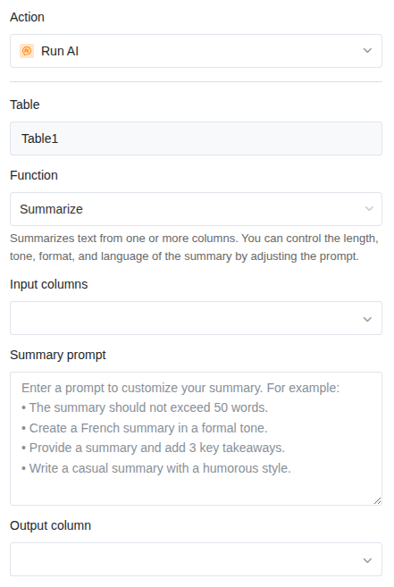

A função de IA **Summarize** resume automaticamente o conteúdo de uma ou mais colunas. Isto é especialmente útil quando a sua tabela contém descrições longas, relatórios ou notas e precisa de um resumo compacto numa coluna adicional.

## Casos de uso típicos

- **Pedidos de suporte**: Comprimir descrições detalhadas de problemas de clientes em duas ou três frases.
- **Notas de reunião**: Condensar atas extensas num breve resumo.
- **Avaliações de produtos**: Reduzir avaliações longas aos pontos essenciais.
- **Candidaturas**: Resumir cartas de apresentação ou currículos de forma abreviada.

## Pré-requisitos

- Uma tabela com pelo menos uma **coluna de texto** ou **coluna de texto formatado** que sirva como entrada.
- Uma **coluna de texto** ou **coluna de texto formatado** para o resultado (o resumo).

## Guia passo a passo

### 1. Criar uma automatização e escolher um acionador

Crie uma nova regra de automatização conforme descrito no artigo [Configurar automatização IA](). Escolha um acionador adequado — por exemplo **Quando uma linha é adicionada**, para que cada nova entrada seja automaticamente resumida.

### 2. Adicionar a ação "Chamar IA"

Clique em **Adicionar ação** e selecione **Chamar IA**.

### 3. Selecionar a função "Summarize"

Nas configurações da ação, escolha:

- **Tabela**: A tabela na qual a IA deve trabalhar.
- **Função**: **Summarize**

### 4. Definir as colunas de entrada

Selecione uma ou mais colunas cujo conteúdo deve ser resumido. Se selecionar várias colunas, a IA combina o conteúdo de todas as colunas num único resumo.

### 5. Personalizar o prompt

No campo **Summary prompt**, pode controlar como o resumo deve ser. Se deixar o campo vazio, a IA cria um resumo padrão. Com um prompt, pode influenciar o comprimento, o tom, o formato e o idioma.

**Exemplos de prompts:**

| Prompt | Resultado |
|---|---|
| *O resumo deve ter no máximo 50 palavras.* | Resumo curto e conciso |
| *Resuma o texto em três pontos.* | Visão geral em tópicos |
| *Crie um resumo formal em português.* | Tom formal, língua portuguesa |
| *Resuma o mais importante numa frase.* | Resumo numa frase |



### 6. Definir a coluna de resultado

Selecione a coluna onde o resumo deve ser escrito. Esta deve ser do tipo **Texto** ou **Texto formatado**.

### 7. Guardar e testar

Clique em **Guardar**. Teste a automatização acionando o evento de acionamento — por exemplo, crie uma nova linha com um texto mais longo. O resumo deverá aparecer na coluna de resultado em poucos segundos.

## Exemplo de aplicação: Resumir pedidos de suporte

Imagine uma tabela onde os pedidos de suporte chegam através de um formulário web. Cada pedido contém uma **Descrição do problema** detalhada numa coluna de texto. Para o líder de equipa, deve ser gerada automaticamente uma **Descrição breve** para que possa rever os pedidos mais rapidamente.

**Configuração:**

- **Acionador**: Quando uma linha é adicionada
- **Função**: Summarize
- **Coluna de entrada**: Descrição do problema
- **Prompt**: *Resuma o pedido de suporte em no máximo duas frases. Mencione o problema principal e a funcionalidade afetada.*
- **Coluna de resultado**: Descrição breve

Assim que um cliente envia o formulário e uma nova linha é criada, a IA escreve automaticamente uma descrição breve na coluna de resultado.

## Dicas para bons resultados

- **Indique o comprimento desejado.** Sem indicação, o comprimento do resumo pode variar. Um prompt como "no máximo 50 palavras" garante resultados uniformes.
- **Utilize várias colunas de entrada** quando o contexto estiver distribuído por diferentes colunas. A IA tem em conta todas as entradas.
- **Teste com dados reais.** Crie algumas linhas de teste com textos realistas para avaliar a qualidade antes de colocar a automatização em produção.

## Próximos passos

- [Classificar entradas (Classify)]()
- [Extrair informações (Extract)]()
- [Ação de IA personalizada (Custom)]()
