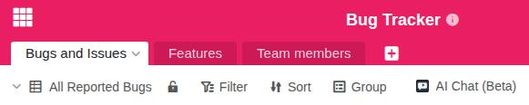
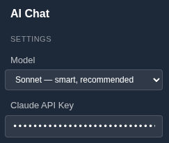

Con el plugin de chat con IA puede chatear directamente con sus datos en SeaTable. En esta guía aprenderá cómo instalar el plugin, registrar una clave API e iniciar su primera conversación. Encontrará una descripción general del plugin en el [artículo introductorio]().



## Requisitos previos

- Una cuenta de SeaTable con acceso a al menos una base
- Una **clave API** de uno de los proveedores de IA compatibles:
  - [Anthropic](https://console.anthropic.com/) (Claude)
  - [OpenAI](https://platform.openai.com/) (GPT)
  - [Mistral](https://v2.auth.mistral.ai/login) (Mistral)

## Paso 1: Instalar el plugin en su base

1. Abra la base en la que desea utilizar el plugin de chat con IA.
2. Haga clic en **Plugins** en el encabezado de la base.
3. Busque **AI Chat** en el gestor de plugins y haga clic en **Añadir**.

El plugin aparecerá ahora en su barra de plugins y podrá abrirlo en cualquier momento.

## Paso 2: Seleccionar el modelo de IA y registrar la clave API

1. Abra el plugin de chat con IA.
2. Seleccione el modelo deseado de uno de los tres proveedores de IA (Anthropic, OpenAI o Mistral). Los modelos más potentes suelen ofrecer mejores resultados, pero generan costes más elevados por consulta.
3. Introduzca su **clave API** en el campo correspondiente.



## Paso 3: Iniciar la primera conversación

Escriba su primera pregunta en el campo de entrada y pulse **Enter**.

El plugin analiza la estructura y los datos de su base y responde a su pregunta en la ventana del chat.

## Consejos para empezar

Comience con una pregunta sencilla para probar la conexión y familiarizarse con el plugin. Buenos ejemplos de primeras preguntas son:

- "¿Qué tablas hay en mi base?"
- "¿Cuántas entradas tiene la tabla [nombre de la tabla]?"
- "Resume los datos de la tabla [nombre de la tabla]."

Cuanto más precisa sea su pregunta, más exacta será la respuesta. Siempre que sea posible, mencione el nombre concreto de la tabla o columna a la que se refiere su pregunta.
