En una aplicación, puede crear tantas **páginas**, **carpetas** y **enlaces** como desee para que los datos de una base sean accesibles a un grupo específico de usuarios, para organizarlos y presentarlos de forma atractiva.



## Gestionar páginas en aplicaciones

Hay una variedad de [tipos de páginas]() que ya conoce de otros lugares en SeaTable y que puede crear en su aplicación con sólo unos clics.

### Crear una nueva página en una aplicación

1. Abra una **Base** a la que ya haya añadido una aplicación.
2. Haga clic en **Aplicaciones** en la cabecera Base.
   
3. Pase el ratón por encima de la aplicación y haga clic en el **icono del lápiz** .
   
4. Haga clic en **el círculo naranja con el símbolo más** en la parte superior izquierda y seleccione **Añadir página**.
   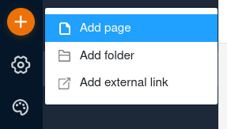
5. Seleccione uno de los [tipos de página]() y haga clic en **Siguiente**.
   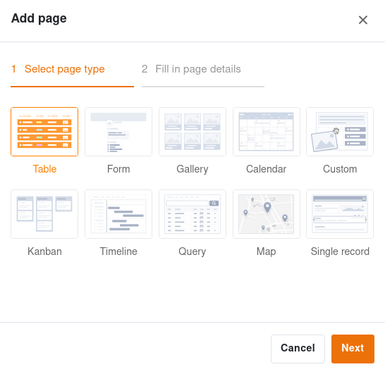
6. Dé un **nombre** a la página, defina la **tabla** subyacente y, opcionalmente, especifique un **icono** para la página.
   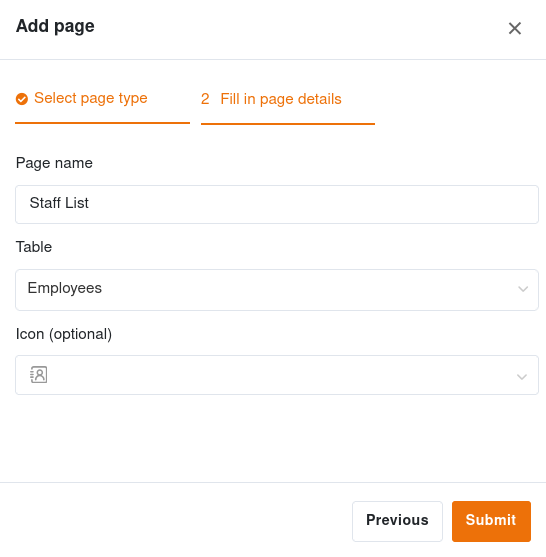 
7. Confirme con **Enviar**.

### Editar el nombre y el icono de una página

Cuando se crean páginas nuevas, a menudo hay que hacerlo rápidamente y se elige espontáneamente un nombre que luego se quiere cambiar. Por eso puede **cambiar el nombre de las páginas** en cualquier momento utilizando los **tres puntos** y también personalizar el **icono** de la página de esta manera.

### Duplicar página

Configurar páginas en el App Builder puede llevar mucho tiempo, especialmente en el caso de páginas personalizadas como los cuadros de mando. Si ya ha creado páginas que sólo desea modificar ligeramente, el App Builder ofrece una función que le ahorrará mucho tiempo y esfuerzo: Haga clic en los **tres puntos** y seleccione **Duplicar página**. La copia toma todo el contenido, la configuración y las autorizaciones de la página original.

### Eliminar página

Puede **eliminar** las páginas que ya no necesite de su aplicación en cualquier momento. Tenga en cuenta que la eliminación es definitiva y que las páginas eliminadas **no** se pueden restaurar. Sin embargo, los **datos** permanecerán **guardados** en la base subyacente.

### Mover página

Si ya ha creado una **carpeta** en su aplicación, puede mover sus páginas a esta carpeta utilizando los **tres puntos**.

También puede mover las páginas **arrastrándolas y soltándolas**. Para ello, mantenga pulsado el botón del ratón sobre los **seis puntos** situados delante del icono de la página, arrastre la página en la navegación hasta la posición deseada y suéltelo.

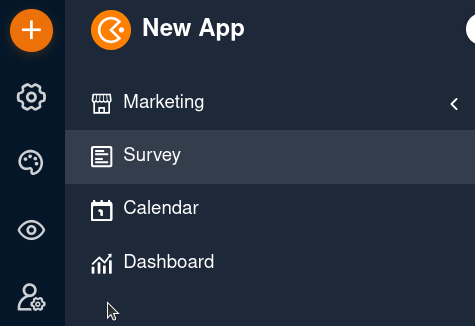

## Gestionar carpetas en aplicaciones

Con un gran número de páginas y enlaces, **las carpetas** son útiles para agruparlas temáticamente y facilitar la navegación a los usuarios.

### Crear una nueva carpeta en una aplicación

1. Abra una **Base** a la que ya haya añadido una aplicación.
2. Haga clic en **Aplicaciones** en la cabecera Base.
   
3. Pase el ratón por encima de la aplicación y haga clic en el **icono del lápiz** .
   
4. Haga clic en **el círculo naranja con el símbolo más** en la parte superior izquierda y seleccione **Añadir carpeta**.
   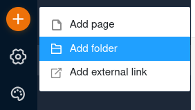
5. **Asigne un nombre a la** carpeta y, opcionalmente, seleccione un **icono** adecuado para ella.
   
6. Confirme con **Enviar**.

### Añadir página a carpeta

Si ya ha creado una carpeta en su aplicación, puede hacer clic en los **tres puntos** de esta carpeta y **añadir** una página directamente.

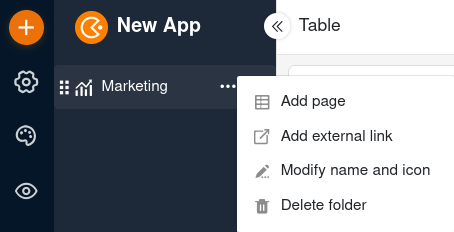

Del mismo modo, también puede añadir un **enlace externo** a la carpeta.

### Editar el nombre y el icono de una carpeta

Puede **cambiar el nombre de** las carpetas de su aplicación en cualquier momento utilizando los **tres puntos**. También puede personalizar así el **icono** de su carpeta.

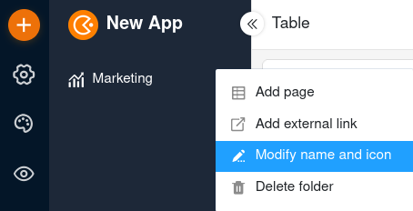

### Eliminar carpeta

Puede **eliminar** las carpetas que ya no necesite de su aplicación en cualquier momento. Tenga en cuenta que también se **eliminarán** **todas las páginas** de la carpeta. La eliminación es definitiva. Esto significa que ni la carpeta ni las páginas individuales podrán **restaurarse** posteriormente.

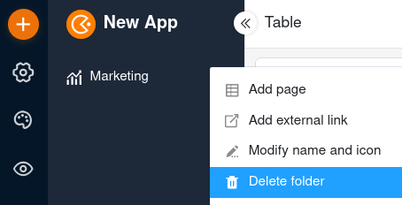

### Mover carpeta

Sólo puede mover carpetas **arrastrándolas y soltándolas**. Para ello, mantenga pulsado el botón del ratón sobre los **seis puntos** situados delante del icono de la carpeta, arrastre la carpeta en la navegación hasta el lugar deseado y suéltelo.

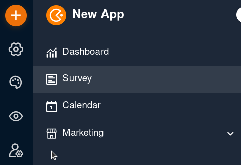

## Gestionar enlaces externos en aplicaciones

Ocasionalmente puede querer hacer referencia a recursos que no están almacenados en SeaTable. Simplemente añada un **enlace externo** en la navegación para que los usuarios de la aplicación puedan abrir la página web correspondiente con un clic del ratón.

### Crear un enlace externo en una aplicación

1. Abra una **Base** a la que ya haya añadido una aplicación.
2. Haga clic en **Aplicaciones** en la cabecera Base.
   
3. Pase el ratón por encima de la aplicación y haga clic en el **icono del lápiz** .
   
4. Haga clic en **el círculo naranja con el símbolo más** en la parte superior izquierda y seleccione **Añadir enlace externo**.
   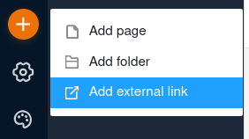
5. Introduzca la **dirección del enlace** y un **título**.
   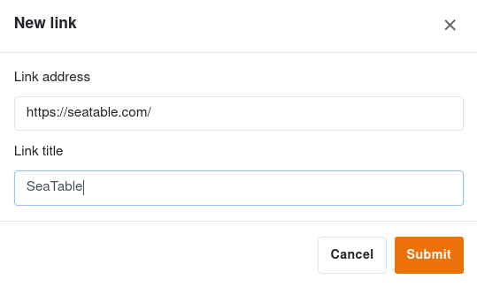 
6. Confirme con **Enviar**. Cuando haga clic en el enlace de la navegación, se abrirá la página web deseada.

### Editar la dirección y el título de un enlace

Con los **tres puntos** puede **cambiar el nombre** del enlace y **ajustar la dirección del enlace** en cualquier momento.

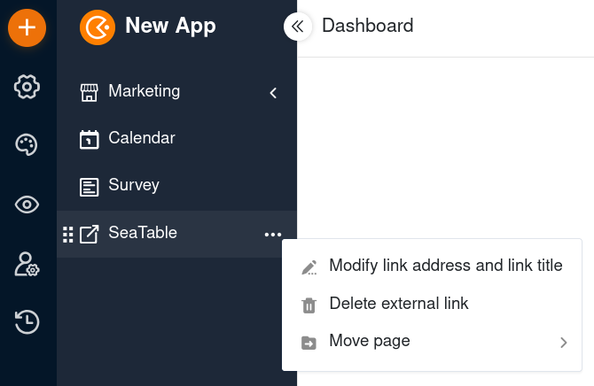

### Eliminar enlace

Puede **eliminar** los enlaces que ya no necesite de su aplicación en cualquier momento. Tenga en cuenta que la eliminación es definitiva y que los enlaces eliminados **no** se pueden restaurar.

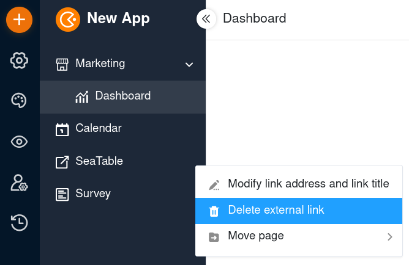

### Mover enlaces

Si ya ha creado una **carpeta** en su aplicación, puede mover los enlaces a esta carpeta utilizando los **tres puntos**.

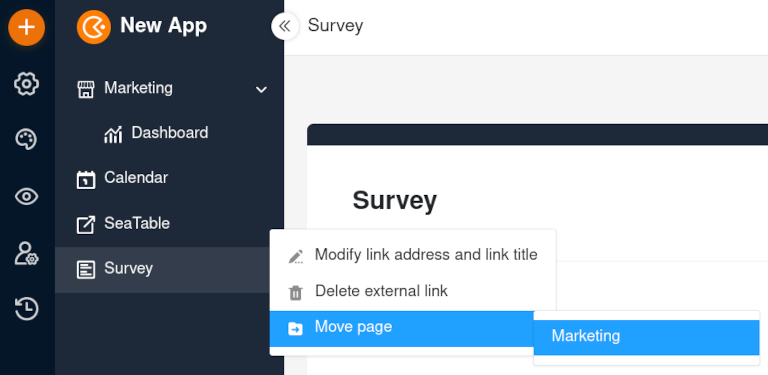

También puede mover los enlaces **arrastrándolos y soltándolos**. Para ello, mantenga pulsado el botón del ratón sobre los **seis puntos** situados delante del icono del enlace, arrastre el enlace en la navegación hasta la posición deseada y suéltelo.

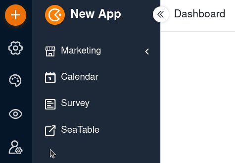
