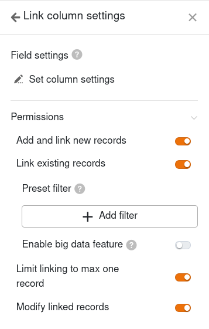

Este tipo de página oferece-lhe a opção de apresentar entradas como cartões de índice num **quadro Kanban**. Um caso de utilização específico poderia ser a **visualização de fluxos de trabalho e do progresso de um projeto**, por exemplo.

## Alterar as definições da página

Se pretender alterar as definições de uma página, clique no **símbolo da roda dentada**  correspondente na barra de navegação.

Nas **definições da página**, especificar o **quadro** em que se baseia o quadro Kanban, a coluna em que as entradas são **agrupadas** e a coluna de onde provêm os **títulos**.

## Filtros predefinidos, ordenação e colunas ocultas

Também é possível definir filtros predefinidos, ordenação e colunas ocultas para limitar e organizar os dados apresentados aos utilizadores. Para filtrar ou ordenar, clique em **Adicionar filtro** ou **Adicionar ordenação**, seleccione a **coluna** e a **condição** pretendidas e confirme com **Enviar**.

Os utilizadores podem ver mais informações sobre uma entrada clicando num separador. Por conseguinte, decida quais os dados que devem ser **visíveis** e mostre ou oculte as colunas correspondentes utilizando os **cursores**.



## Definições da coluna de ligações

Nas **opções da coluna de ligação**, é possível especificar quais os dados visíveis e quais as operações permitidas para cada tabela ligada.

- **Permitir adicionar novas entradas**: Se ativar este seletor, os utilizadores podem adicionar novas entradas à tabela ligada. Pode utilizar as definições de campo para definir as colunas que são **visíveis** e as que são **obrigatórias**, ou seja, que têm de ser preenchidas.
- **Permitir a ligação de entradas existentes**: Se ativar esta barra deslizante, os utilizadores podem ligar entradas existentes na tabela ligada. Pode utilizar as definições de campo para definir as colunas que são **visíveis**.
- **Limitar as ligações a um máximo de uma linha**: Se ativar esta barra deslizante, os utilizadores só podem ligar uma linha da tabela ligada nas células da coluna de ligação.
- **Filtros predefinidos**: Se adicionar um filtro aqui, apenas as opções que satisfazem as condições do filtro serão apresentadas ao ligar as entradas.
- **Ativar** a função de grandes volumes de dados: Se a função de grandes volumes de dados estiver activada, os utilizadores podem pesquisar mais de 20.000 registos de dados, desde que existam este número de entradas na tabela ligada.

## Outras definições da página

Com três outros selectores, pode definir o SeaTable **para não apresentar linhas vazias**, para apresentar os **nomes das colunas** nos cartões de índice e para **envolver o texto**.

Também é possível apresentar outros **dados** da tabela subjacente nos cartões de índice: Ativar qualquer número de **campos a serem apresentados**.

## Autorizações de páginas

É possível definir as seguintes [autorizações de página]() para páginas Kanban:

Decida quem está autorizado a ver a página Kanban, adicionar, editar e eliminar linhas. Graças às opções de autorização diferenciadas deste tipo de página, pode definir isto com precisão.
