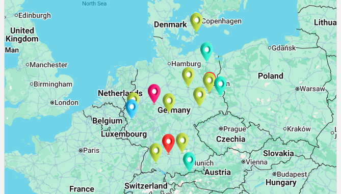
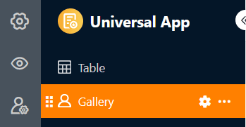
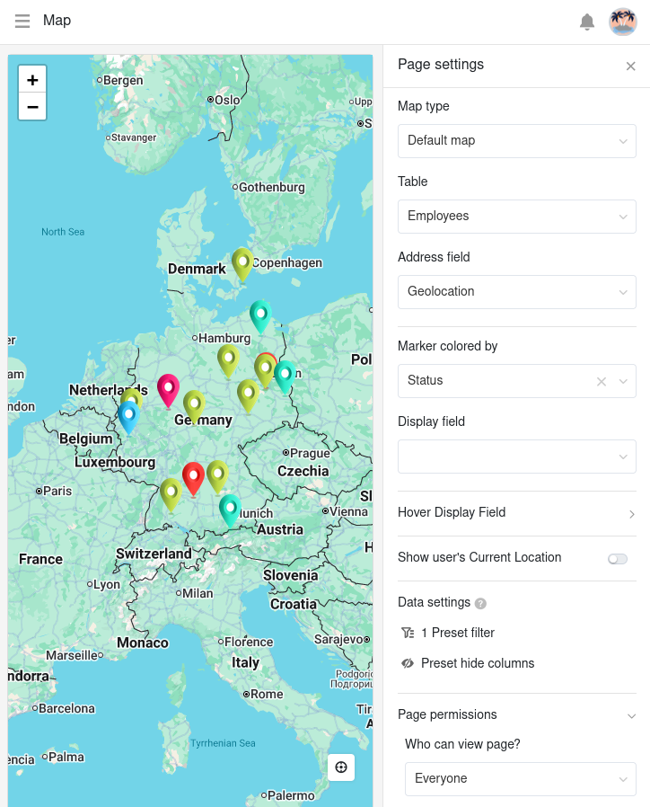
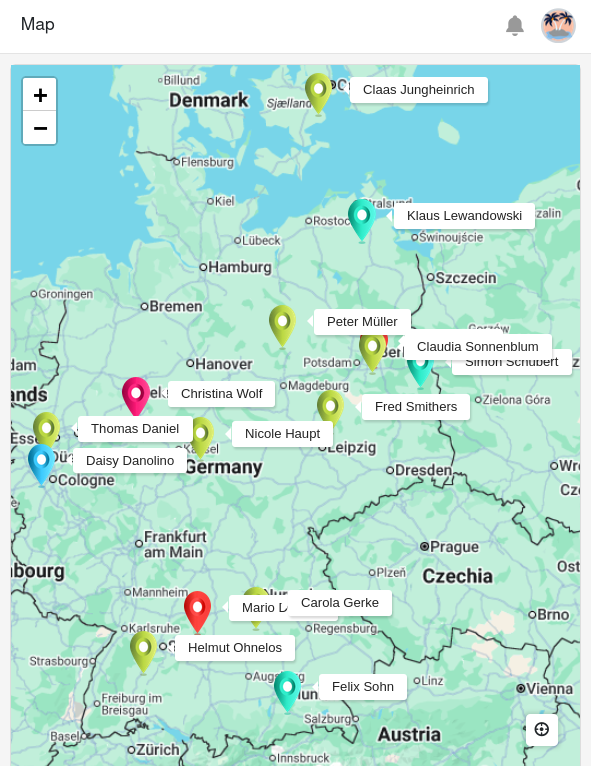
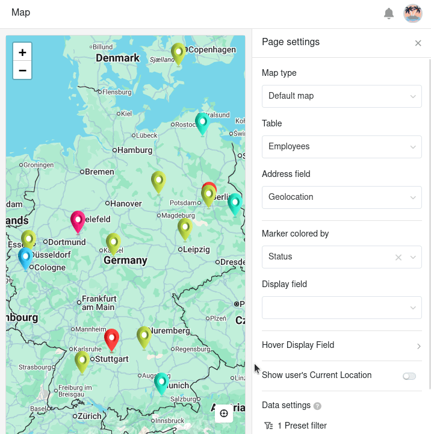
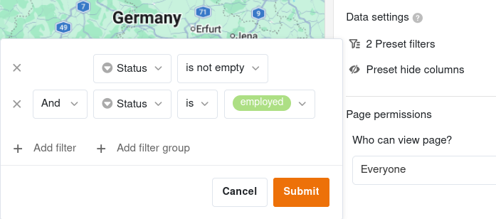
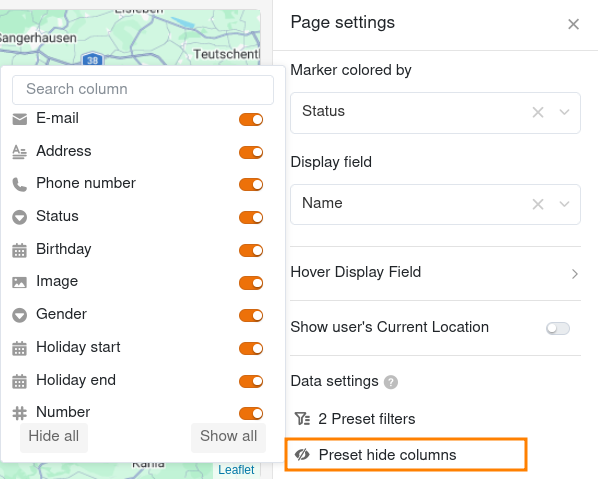

Pode utilizar este tipo de página para apresentar **localizações** que tenha guardado na sua tabela utilizando **dados de geoposição ou endereços** num **mapa do mundo** dentro da aplicação.

## Definições da página

Se pretender alterar as definições de uma página, clique no ícone de roda dentada correspondente  na barra de navegação.

Nas **configurações da página** pode selecionar o **tipo de mapa** (padrão ou imagens), a **tabela** e uma coluna para o **endereço** e a **cor do pino**. Tenha em atenção que apenas determinados tipos de colunas podem ser utilizados para estas informações.

Se especificar uma **coluna a ser apresentada**, as localizações serão permanentemente identificadas no mapa.

No entanto, também pode definir colunas a serem apresentadas de forma flexível, que só se tornam visíveis através de um **efeito de ponte**. Active os cursores para as colunas que devem ser visíveis quando passa o rato sobre um pin.

## Filtros predefinidos e colunas ocultas

Também pode definir filtros predefinidos e colunas ocultas para limitar os dados apresentados. Para filtrar, clique em **Adicionar filtro**, selecione a **Coluna** e a **Condição** pretendidas e confirme com **Enviar**.

Oculte as colunas que não devem estar disponíveis para a página do mapa utilizando o **deslizador**.



## Autorizações de página

Para as páginas de mapa, só pode definir uma [permissão de página]() – nomeadamente quem tem permissão para ver a página de mapa. Isto deve-se ao facto de você **não poder adicionar, editar ou apagar linhas** nas páginas de mapas.
