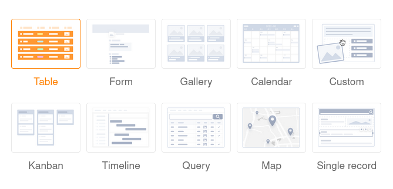
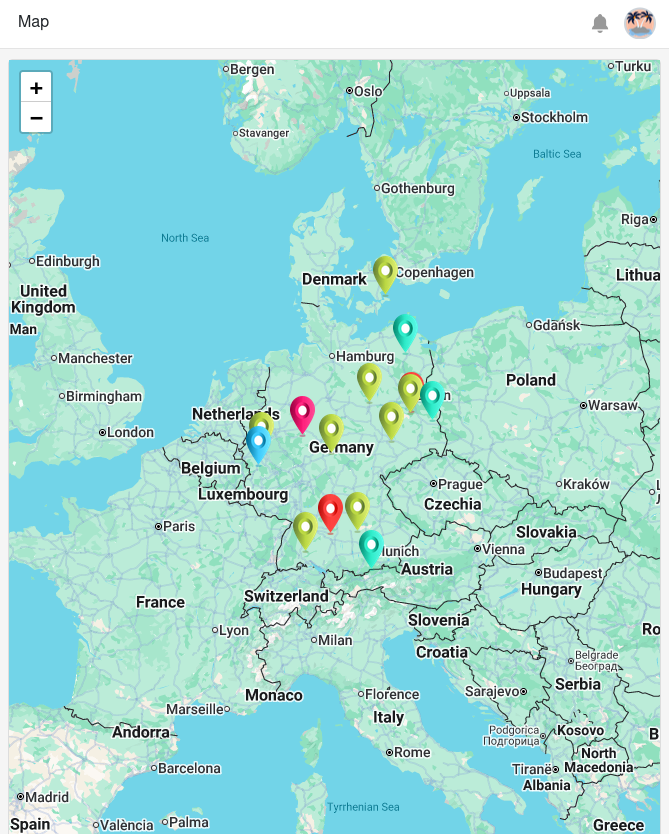

In the editing mode of **SeaTable apps** you can choose between different **page types** for the design of your app. Most of the page types you already know in a similar form from other places in SeaTable.

In this overview article, you will learn about the available page types and their different uses.

## Page types in the app builder

You can currently choose from a total of **10 page types** in the app builder.

[Learn how to create new pages in SeaTable apps here.]()

To edit existing pages, click on the **gearwheel icon**  of the corresponding page in the navigation.

## Page type: Table

You can use this page type to add any **table** from your base as a page to your app. You can use the [page permissions]() to control exactly who can see and edit the data on this page. You can also define **preset filters**, **sorting**, **grouping** and **hidden and read-only columns** to tailor, limit and organize the displayed data precisely to a user group.

[Learn more about table pages in SeaTable apps.]()

## Page type: Form

You can use this page type to build different **forms** that users can then submit. [Web forms]() are not only available in the app, but also as a separate feature. Form pages in the app are ideal for collecting **data from many different users**. One possible use case is [recording working hours]().

[Learn more about form pages in SeaTable apps.]()

## Page type: Gallery

Using this page type you can display **images** that you have saved in an [image column]() of your table in the form of a **gallery**. Other **data** from your table can also be displayed in the gallery. For example, you could use a gallery page for clear **profiles of your employees**.

  

[Learn more about gallery pages in SeaTable apps.]()

## Page type: Calendar

This page type allows you to display records with one or two [date columns]() in a **calendar**. For example, a concrete use case could be the calendar display of upcoming **meetings**.

[Find out more about calendar pages in SeaTable apps.]()

## Page type: Custom page

With this page type, you can let your creativity run wild and build a **custom page** just the way you want it. Add **text** and **images** to your page or use [statistics]() to create meaningful **dashboards** with the data from your base.

[Find out more about custom pages in SeaTable apps.]()

## Page type: Kanban

This page type allows you to display records as cards on a **Kanban board**. To do this, specify the column by which the records should be **grouped**. A specific use case could be the **visualization of workflows and project progress**, for example.

[Learn more about Kanban pages in SeaTable Apps.]()

## Page type: Timeline

This page type allows you to display different time spans in the form of a **timeline**. For example, a concrete use case could be **vacation planning in a company**.

[Learn more about timeline pages in SeaTable apps.]()

## Page type: Query

Using this page type, you can search your records across specific fields for specific values. The page type proves particularly useful for **large datasets** such as product catalogs or libraries. For example, a specific use case could be querying identification numbers.

[Learn more about query pages in SeaTable apps.]()

## Page type: Map

This page type displays **geolocation data or addresses** on a world map to illustrate geographic distributions. For example, you can use it to display **company locations on a map**.

[Learn more about map pages in SeaTable apps.]()

## Page type: Single record

This page type allows you to design a page with static elements, dynamic table fields, colors, frames, etc. in order to visually prepare the **data stored in a row**. Users of the app can browse, search or edit the individual data records on this page. This type of page is therefore suitable for displaying the data in an employee database as **personal profiles**, for example.

[Learn more about single record pages in SeaTable apps.]()
