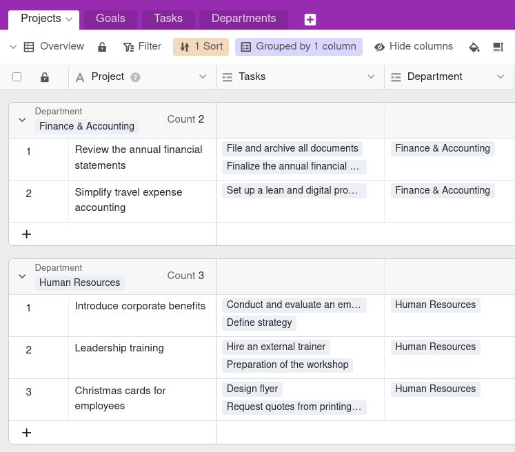
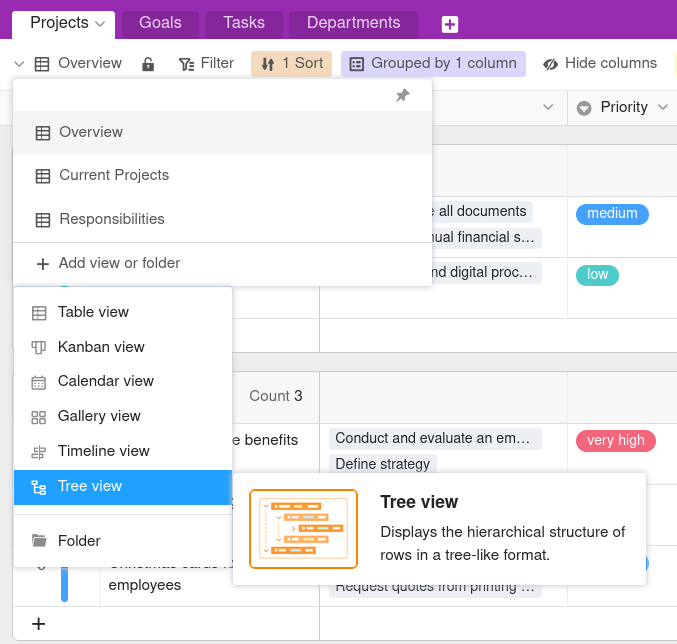
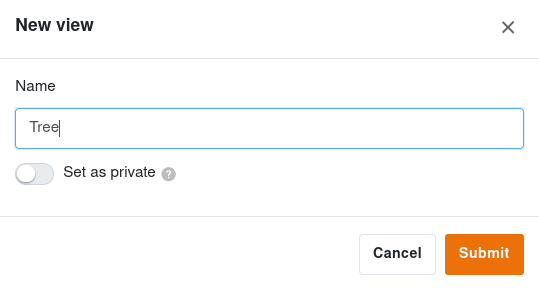
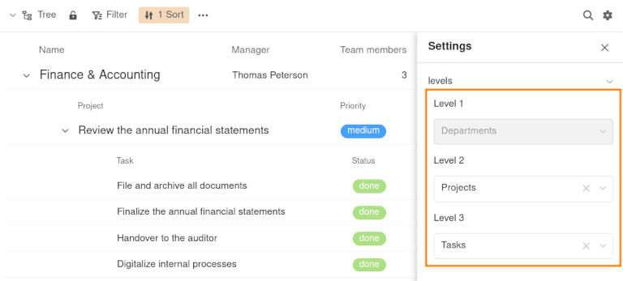
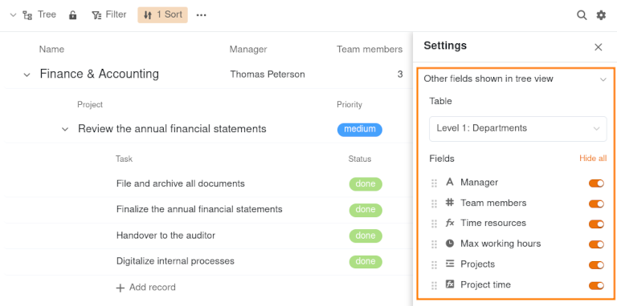
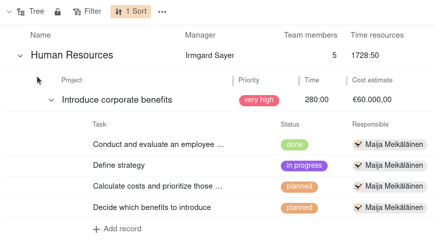
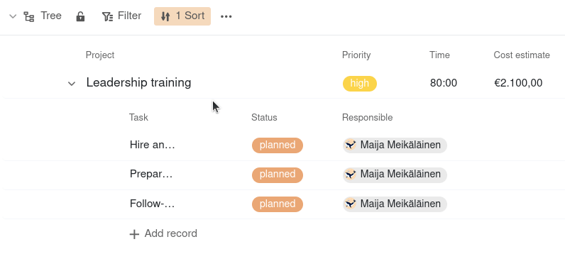
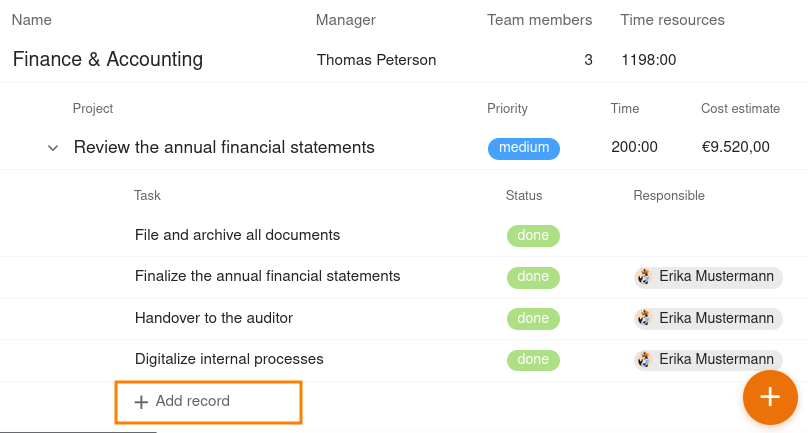
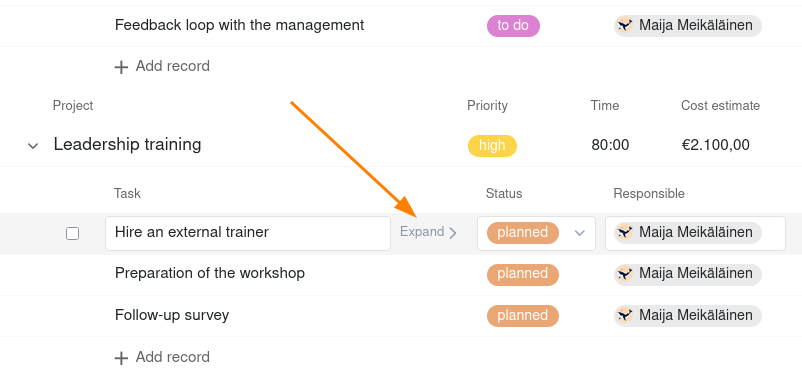

Die **Baum-Ansicht** ermöglicht die kompakte **hierarchische Darstellung** verknüpfter Datensätze. Das heißt, Sie können Daten, die in verschiedenen **miteinander verknüpften Tabellen** liegen, auf unterschiedlichen Ebenen in einem Baumdiagramm visualisieren. Gerade bei großen Datenmengen wie Finanz- oder Projektdaten, schafft die Ansicht einen strukturierten Überblick.



Um die Baum-Ansicht sinnvoll nutzen zu können, benötigen Sie eine Base mit **mindestens zwei Tabellen**, die über eine [Verknüpfungsspalte]() miteinander verbunden sind.



## Funktionsweise der Baum-Ansicht

Bevor Sie eine Baum-Ansicht anlegen, sollten Sie sich überlegen, welche **Baumstruktur** (also Hierarchie verknüpfter Datensätze in Ihrer Base) Sinn ergibt: Bei einem [Projektportfolio]() könnten dies beispielsweise die Abteilungen auf der ersten Ebene, die Projekte auf der zweiten Ebene und die Aufgaben auf der dritten Ebene sein. Dementsprechend müssen die Abteilungen, Projekte und Aufgaben in drei verschiedenen Tabellen erfasst sein, die miteinander verknüpft sind. Jede Aufgabe ist einem Projekt zugeordnet, das wiederum einer Abteilung untergeordnet ist.

Wie die Datensätze voneinander abhängen bzw. welche Tabellen sich auf welcher Ebene befinden, definieren Sie über die **Levels**. Aktuell können Sie in der Baum-Ansicht bis zu drei Ebenen, das heißt Daten aus drei Tabellen darstellen.

## Wie Sie eine Baum-Ansicht anlegen

1. Klicken Sie auf den **Namen der aktuellen Ansicht**.
2. Klicken Sie auf **Ansicht oder Ordner hinzufügen** und wählen Sie den gewünschten **Ansichtstyp** aus.

3. Geben Sie der neuen Ansicht einen **Namen**.
4. Aktivieren Sie den Regler, falls die neue Ansicht nicht für alle sichtbar, sondern **privat** sein soll.
5. Bestätigen Sie mit **Abschicken**.

6. Klicken Sie auf das **Zahnrad-Symbol**  in der oberen rechten Ecke und passen die **Einstellungen** an.
7. Legen Sie fest, welche **Tabelle** auf dem jeweiligen Level angezeigt werden soll. Klicken Sie dazu in das Feld für **Level 2** und **Level 3**, um in der Drop-down-Liste die gewünschte Tabelle auszuwählen. **Level 1** wird immer von der Tabelle belegt, in der sich die Ansicht befindet.

Die verknüpften Datensätze auf der zweiten und dritten Ebene des Baumdiagramms sind anschließend unter den jeweils übergeordneten Datensätzen gruppiert.

## Informationen ein- und ausblenden

Über die **Einstellungen**, die Sie per Klick auf das **Zahnrad-Symbol**  erreichen, können Sie die sichtbaren Spalten für jede Ebene des Baumdiagramms festlegen. Wählen Sie dafür zuerst das **Level** aus, auf dem Sie Spalten ein- oder ausblenden möchten. Wenn Sie anschließend die entsprechenden **Regler** am rechten Rand deaktivieren, sind die Spalten nicht im Baumdiagramm sichtbar.

### Spalten verschieben

Zudem haben Sie auf jedem Level die Möglichkeit, die Spalten anders als in der Tabellenansicht anzuordnen. Halten Sie dazu die linke Maustaste auf der **Sechs-Punkte-Greiffläche** vor dem Spaltennamen gedrückt und verschieben Sie die Spalte **per Drag-and-Drop** an die gewünschte Stelle.

## Ansichtsoptionen

Folgende Optionen können Sie in einer Baum-Ansicht nutzen:
- [Ansicht sperren]()
- nach beliebigen Werten [filtern]() oder [sortieren]()
- **Alle einklappen** oder **Alle erweitern**

## Verknüpfte Datensätze einklappen und ausklappen

Um alle verknüpften Datensätze unter einem Eintrag einzuklappen, klicken Sie auf den **Drop-down-Pfeil** links vor der Zeile. Um die Datensätze wieder auszuklappen, gehen Sie genauso vor.

## Spaltenbreite anpassen

Um abgeschnittene Einträge oder große Lücken zwischen den Werten zu vermeiden, können Sie nach Belieben **die Spaltenbreite anpassen**. Halten Sie dazu die linke Maustaste auf der Begrenzungslinie zwischen zwei Spalten gedrückt und ziehen Sie den Cursor nach links oder rechts.

## Datensätze in der Baum-Ansicht hinzufügen und bearbeiten

Um einen neuen Datensatz auf der ersten Ebene der Baum-Ansicht hinzuzufügen, klicken Sie auf den **orangen Kreis mit dem Plus-Symbol** in der unteren rechten Ecke. Anschließend öffnen sich die **Zeilendetails**. Füllen Sie diese wie gewünscht aus und schließen Sie das Fenster, um den Datensatz zu speichern.

Um einen neuen Datensatz auf der zweiten oder dritten Ebene der Baum-Ansicht hinzuzufügen, klicken Sie auf **\+ Zeile hinzufügen**. Die angelegte Zeile wird automatisch mit dem übergeordneten Datensatz verknüpft und entsprechend gruppiert. Die restlichen Felder können Sie direkt in der Zeile ausfüllen.

Ebenso lassen sich bestehende Einträge direkt in der Baum-Ansicht bearbeiten. Außerdem können Sie mit einem Klick auf **Erweitern** die Zeilendetails öffnen und Änderungen vornehmen.

Die Daten werden natürlich auch in den zugrundeliegenden Tabellen gespeichert.