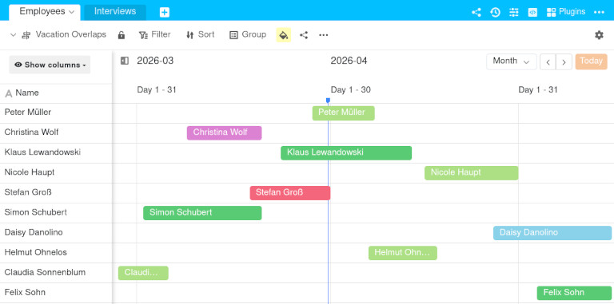
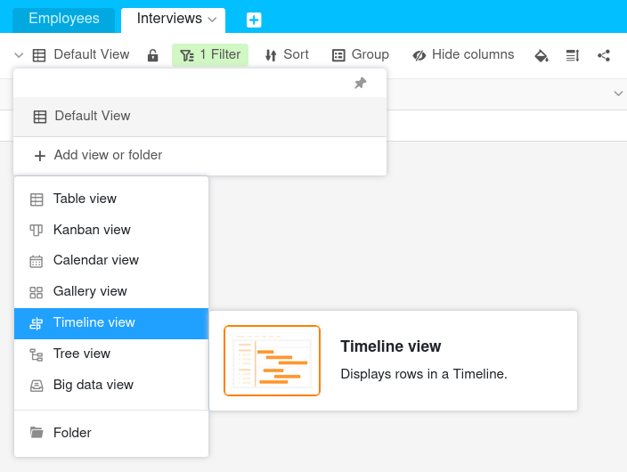
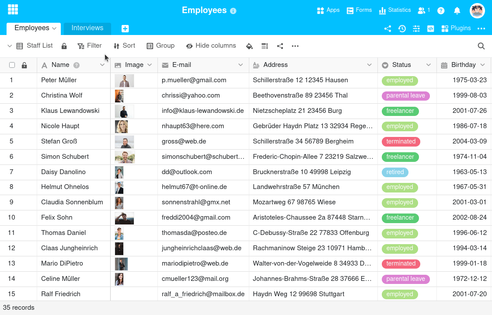
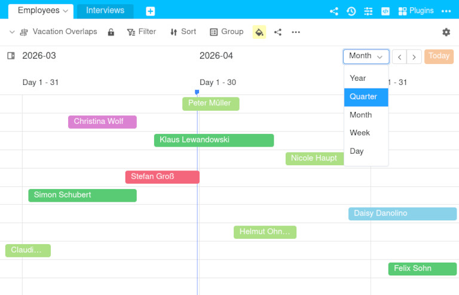
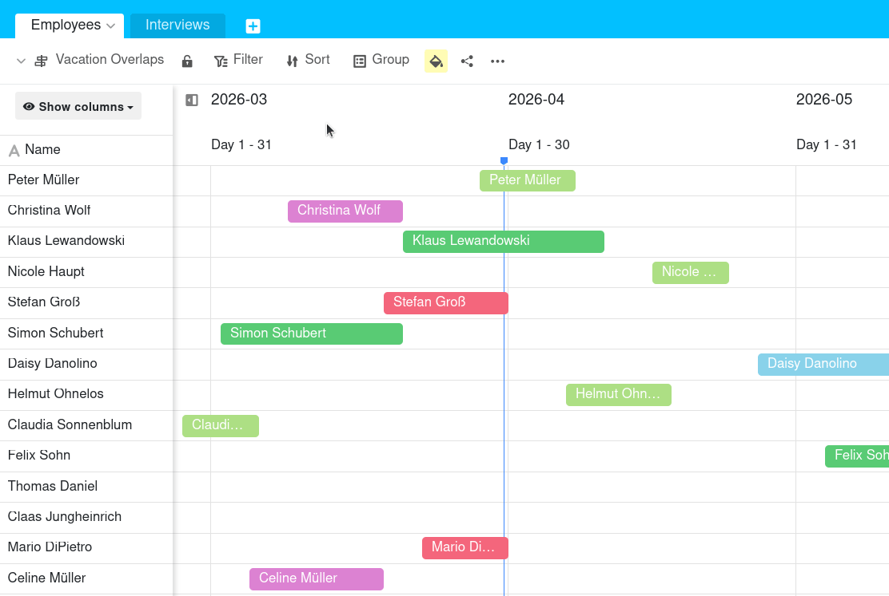
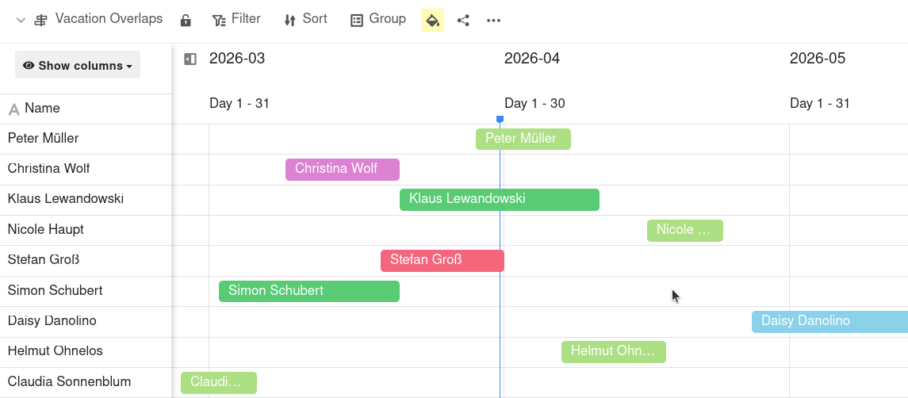

The **Timeline view** allows you to visualize different time periods on a **timeline**. This is very useful, for example, if you want to visualize the sequence of processes or see whether time periods **overlap**. Accordingly, you can use the timeline view for [vacation planning](), [project plans]() or booking conference rooms, among other things.



This view type displays **time spans**. Therefore, you need **two** [date columns]() in a table that define the **start** and **end** of the time periods. The result is a **Gantt chart**.



## How to create a timeline view

1. Click on the **name of the current view**.
2. Click on **Add view or folder** and select the desired **View type**.

3. Give the new view a **name**.
4. Activate the slider if the new view should not be visible to everyone but **private**.
5. Confirm with **Submit**.
6. Then specify the **Start and End date** and the **Date range** that the timeline should cover in the settings. The new view is then generated automatically.
7. In the top input field, select the column on which the **block label** depends.

## View options

You can use the following options in a timeline view:
- [Lock view]()
- [Filter]() or [sort]() by any value
- [Row color]()
- [Share view with others]()
- [Print view]()

## Display options

There are a total of 5 display options for the scale of the timeline: **Year**, **Quarter**, **Month**, **Week** and **Day**. You can easily switch between these options. Simply click on the corresponding option in the **drop-down menu** above the timeline.

## Show and hide information

Click on **Show columns** to display more or less information by showing or hiding columns. Activate the **slider** of the respective columns to display more information from the data records in the timeline.

## Edit data records in the timeline view

Double-click on a record and a window with the **Row details** will open. Make the desired adjustments to the data record. The changes are saved automatically when you close the window.

## Extend, shorten or move time periods

To extend or shorten a period, hold down the mouse button and drag **on the left or right edge of a record**. If you want to move a period, hold down the left mouse button and move the entry **by drag and drop** in the desired direction. The corresponding values in the date columns will adjust automatically.

