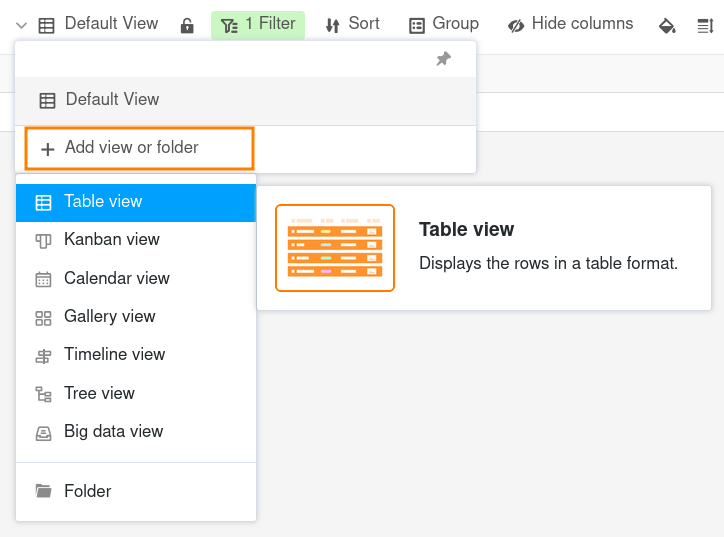
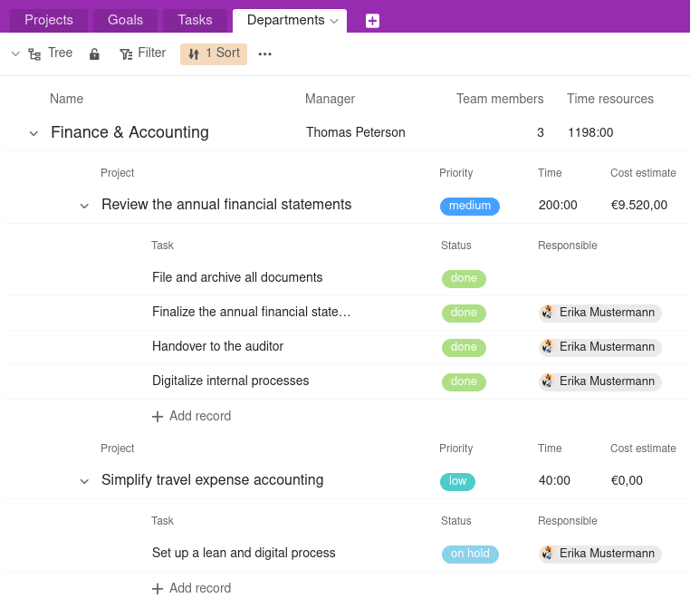

Immer wenn Sie Ihre Daten in einer Tabelle anschauen, betrachten Sie diese über eine **Ansicht**. Selbst wenn Sie eine brandneue Tabelle angelegt haben, betrachten Sie diese bereits in der standardmäßig mitgelieferten Ansicht **"Default View"**.

## Wozu werden Ansichten verwendet?

In einer herkömmlichen Tabelle sehen Sie die Daten immer auf die gleiche Weise. Sie können zwar Zeilen und Spalten hinzufügen oder löschen, aber nicht dieselben Daten aus unterschiedlichen Blickwinkeln betrachten.

In SeaTable können Sie Ansichten erstellen und mithilfe von **Filtern, Sortierungen, Gruppierungen, Ausblendungen, farblichen Hervorhebungen und der Zeilenhöhe** festlegen, welchen Ausschnitt Ihrer Daten Sie auf welche Weise betrachten wollen. So können Sie sich genau die Daten anzeigen lassen, die gerade individuell für Sie relevant sind, ohne Datensätze verändern oder löschen zu müssen.

Zudem können Sie bestimmte Darstellungsformen wählen, um die Daten ansprechend zu visualisieren. Hier sind Beispiele für **Ansichtstypen**, die Sie erstellen können:

- Tabellenansicht
- Kanban-Ansicht
- Kalenderansicht
- Galerie-Ansicht
- Zeitleisten-Ansicht
- Baum-Ansicht
- Big-Data-Ansicht

Es ist wichtig zu verstehen, dass eine Ansicht nur eine andere Art ist, **dieselben zugrundeliegenden Daten** zu betrachten! Das heißt, wenn Sie die Daten einer Tabelle in einer Ansicht bearbeiten, ändern sich diese Daten in allen Ansichten der Tabelle, da alle Ansichten denselben Datensatz repräsentieren.



Weitere Darstellungsformen wie Organigramm oder Landkarte können Sie in Form von [Plugins]() verwenden.



## Die Tabellenansicht

Die **Tabellenansicht** ist die Standard-Darstellungsform in einer SeaTable Base. Sie ist einer Tabellenkalkulation sehr ähnlich, da die Datensätze in Zeilen und Spalten organisiert sind.

Wenn Sie eine gefilterte Ansicht erstellen oder Spalten ausblenden, bekommen Sie nur die Datenmenge angezeigt, die Sie gerade benötigen. Indem Sie nach bestimmten Ordnungsprinzipien sortieren oder gruppieren, lässt sich die Ansicht ebenfalls übersichtlicher gestalten.

## Die Kanban-Ansicht

Wenn Sie **Spalten mit einer begrenzten Anzahl an Optionen** in Ihrer Tabelle haben, können Sie Ihre Zeilen in Gruppen zusammenfassen. Eine spezielle Darstellungsform davon ist die **Kanban-Ansicht**. Sie eignet sich besonders, um **Prozesse mit verschiedenen Phasen** darzustellen.

Mehr dazu erfahren Sie im Artikel über die [Kanban-Ansicht]().

## Die Kalender-Ansicht

Wenn Sie eine Tabelle mit **Datum-Spalten** haben, können Sie eine Kalenderansicht erstellen, die alle Ihre Datensätze **chronologisch** ordnet.

Mehr dazu erfahren Sie im Artikel über die [Kalender-Ansicht]().

## Die Galerie-Ansicht

Wenn Sie eine Tabelle mit einer **Bild-Spalte** besitzen, können Sie eine Galerie-Ansicht anlegen, um die Datensätze mit Vorschaubildern zu illustrieren.

Mehr dazu erfahren Sie im Artikel über die [Galerie-Ansicht]().

## Die Zeitleisten-Ansicht

Wenn Sie eine Tabelle mit **zwei Datum-Spalten** haben, können Sie eine Zeitleisten-Ansicht erstellen, die verschiedene Zeitspannen auf einem **Zeitstrahl** visualisiert. Sie eignet sich besonders, um die Abfolge von Prozessen darzustellen oder zu prüfen, ob sich Zeiträume **überschneiden** – etwa bei der Urlaubsplanung, Projektplänen oder der Buchung von Räumen.

Mehr dazu erfahren Sie im Artikel über die [Zeitleisten-Ansicht]().

## Die Baum-Ansicht

Wenn Sie eine Base mit **mindestens zwei miteinander verknüpften Tabellen** haben, können Sie eine Baum-Ansicht erstellen, um verknüpfte Datensätze **hierarchisch** darzustellen. Sie eignet sich besonders, um komplexe Strukturen wie Projektportfolios oder Organisationshierarchien übersichtlich zu visualisieren – mit bis zu drei Ebenen im Baumdiagramm.

Mehr dazu erfahren Sie im Artikel über die [Baum-Ansicht]().

## Die Big-Data-Ansicht

Wenn Sie den **Big-Data-Speicher** in Ihrer Base aktiviert haben, können Sie **große Datenmengen archivieren**, die nicht unmittelbar für jeden Anwender sichtbar sind. Um auf die Daten im Big-Data-Speicher zugreifen zu können, ist eine spezielle Big-Data-Ansicht erforderlich.

Mehr dazu erfahren Sie im Artikel über die [Big-Data-Ansicht]().

## Weitere Artikel zum Thema Ansichten

- [Anlegen einer neuen Ansicht]()
- [Umbenennen einer Ansicht]()
- [Löschen einer Ansicht]()
- [Das Duplizieren von Ansichten]()
- [Unterschiede zwischen privaten und normalen Ansichten]()
- [Das Drucken einer Ansicht]()
- [Die Reihenfolge von Ansichten ändern]()
- [Ansichten in Ordnern gruppieren]()
- [Filtern von Einträgen in einer Ansicht]()
- [Filter-Regeln mit UND und ODER verknüpfen]()
- [Sortieren von Einträgen in einer Ansicht]()
- [Gruppieren von Einträgen in einer Ansicht]()
- [Einfärben von Zellen]()
- [Farbliche Markierung von Zeilen]()
- [Zeilenhöhe anpassen]()
- [Anzahl der fixierten Spalten anpassen]()
- [Ausblenden und Verschieben von Spalten]()
- [Ansichten sperren]()
- [Freigabe einer Ansicht an ein Teammitglied]()
- [Externen Link für eine Ansicht erstellen]()
