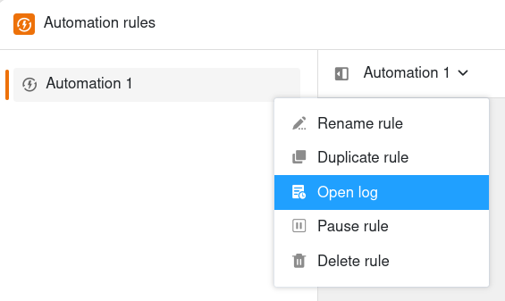
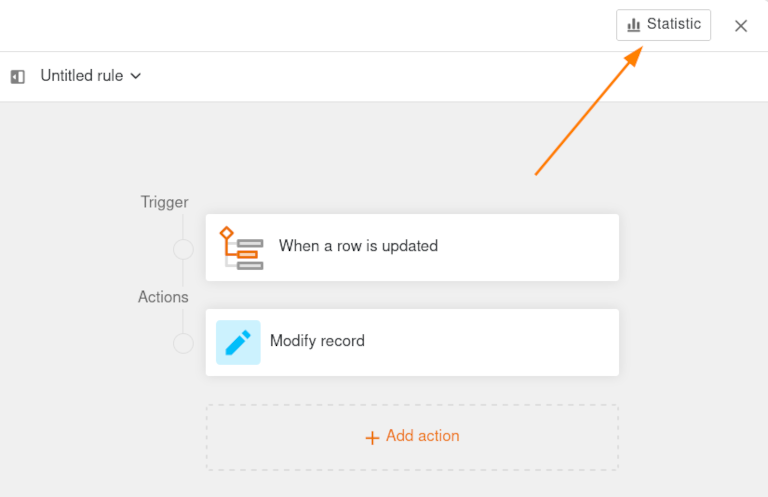
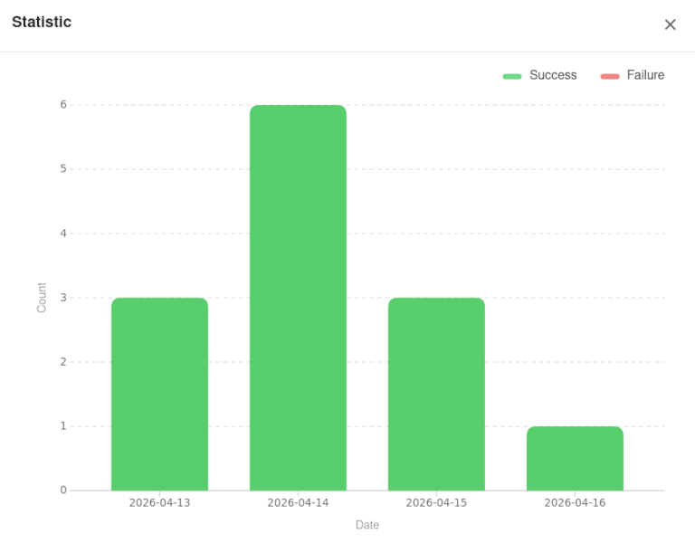

Para verificar a **correcta execução de uma automatização**, tem a opção de visualizar o **registo de execução**. SeaTable regista as seguintes informações para cada execução de automatização: tempo de execução, condição de execução, estado e quaisquer avisos. Existem também **estatísticas** abrangentes para todas as execuções de automatização.



## Para dar uma vista de olhos ao registo de execução

1. Clique em  no cabeçalho da Base e depois nas **Regras de Automatização**.
2. Mova o ponteiro do rato sobre a **regra de automatização** cujo registo pretende visualizar.
3. Clique nos **três pontos** e depois em  **Abrir registo**.

## Estrutura do registo de execução

Pode visualizar as seguintes informações no registo de execução de uma automatização:

**Tempo de execução**  
Aqui SeaTable armazena o momento exacto em que o gatilho iniciou a automatização.

**Condição de execução**  
Se a automatização for desencadeada pela alteração ou adição de uma entrada, a mensagem **per_update** aparece. Se, por outro lado, a automatização é desencadeada periodicamente, a mensagem **por_dia/semana/mês** aparece.

**Estado**  
O estado indica se a automatização foi executada com sucesso. Se for este o caso, a mensagem **Sucesso** aparece aqui.

**Avisos**  
Se houve problemas durante a execução de uma automatização, uma mensagem de aviso correspondente aparece aqui.

## Estatística de todas as execuções de automatização

Também pode ver as estatísticas sobre **quantas execuções de automatização ocorreram no total dentro da base**, independentemente das regras de automatização individuais. Isto permite-lhe saber com que frequência as suas regras de automatização são acionadas e quantas das execuções de automatização disponíveis para si na sua subscrição mensal já foram utilizadas.

1. Clique em **Estatística** no canto superior direito do editor de automatização aberto.

2. Isto abre uma janela na qual pode ver o **número de todas as automatizações executadas por dia**.
