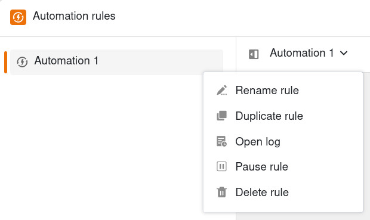

Puede gestionar, agrupar y mover las reglas de automatización que haya creado para poder realizar ajustes en las automatizaciones existentes en cualquier momento.

## Gestionar reglas de automatización

1. Abra una **Base** en la que ya haya creado una automatización.
2. En la cabecera de la base, haga clic en  y después en **Reglas de automatización**.
3. Mueva el puntero del ratón sobre la regla de automatización correspondiente y haga clic en los **tres puntos**.
4. Realice los **ajustes** deseados en la automatización.

Las siguientes opciones de gestión están disponibles para cada regla de automatización:

- **Renombrar regla**
- **Duplicar regla**
- [Abrir registro]()
- [Pausar regla]()
- [Borrar regla]()

Puede obtener más información sobre cada una de las opciones en los artículos enlazados.

## Agrupar reglas de automatización

Para resumir las reglas de automatización en grupos, puede crear las carpetas correspondientes.

Para ello, haga clic en **Añadir regla o carpeta** y después en **Carpeta**.

Dé un **nombre** a la carpeta y confirme con el botón **Intro**.

Mueva el puntero del ratón sobre la carpeta y haga clic en los **tres puntos** para renombrar o borrar la carpeta. También puede añadir una nueva regla de automatización directamente en la carpeta.

## Mover reglas de automatización

Para cambiar el orden de las reglas de automatización o moverlas a una carpeta, mantenga pulsado el botón izquierdo del ratón y arrastre y suelte la regla a la ubicación deseada. Puede mover carpetas del mismo modo.

