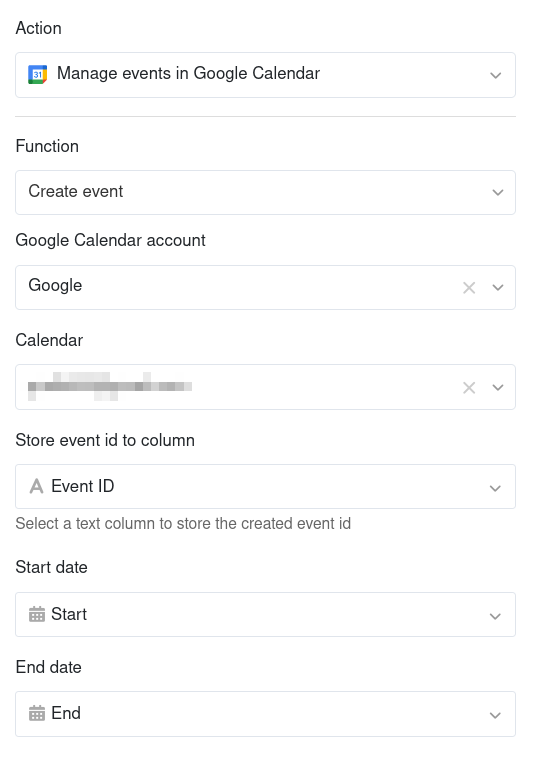
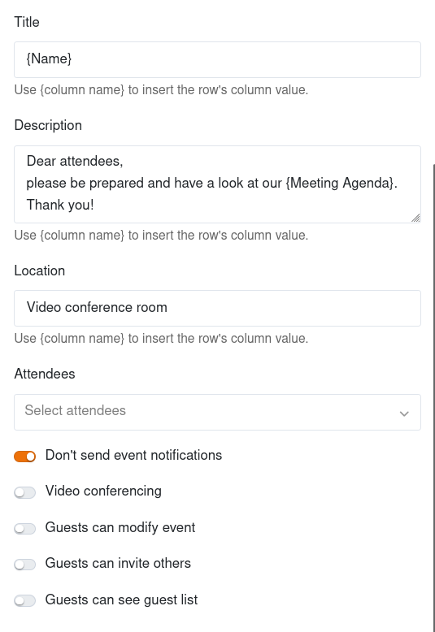
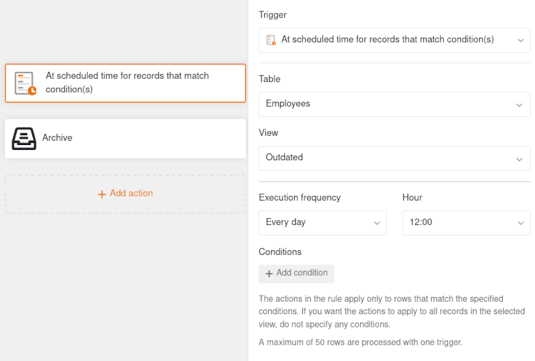

As **acções automatizadas** representam uma das duas componentes essenciais das automatizações. As acções são desencadeadas por **eventos de desencadeamento** definidos. Dependendo do [accionador](), SeaTable pode realizar diferentes acções de automatização. Este artigo fornece uma **visão geral** dos diferentes tipos de acções automatizadas.

## Acções de automatização disponíveis

A última versão do SeaTable oferece um total de 15 acções de automatização diferentes à sua escolha:

- Enviar notificação
- Enviar notificação de aplicação
- Enviar e-mail
- Adicionar registro
- Bloquear registro
- Modificar registro
- Adicionar ligações
- Adicionar uma nova entrada a outra tabela
- Executar o script Python
- Chamar a IA
- Gerir eventos no Google Calendar
- Executar processamento de dados
- Converter página em PDF
- Gerar PDF a partir do documento e enviar
- Arquivar

## Adicionar, duplicar, mover e eliminar acções de automatização

Para adicionar uma ação, clique no **botão grande com o símbolo de mais** e selecione a ação correspondente na lista pendente. Tenha em atenção que as acções disponíveis diferem consoante o acionador.

Se já tiver configurado acções mais complexas, como o envio de e-mails, o processamento de dados ou funções de IA, também as pode duplicar. Basta clicar nos **três pontos** e depois em **Duplicar**. Isto significa que só tem de fazer pequenos ajustes a estas acções e poupa-lhe muito tempo.

A ordem das acções pode ser facilmente alterada **arrastando e largando**. Mova o ponteiro do rato sobre uma caixa de ação, mantenha premido o botão esquerdo do rato na **área de arrastamento de seis pontos** e mova a ação para a posição pretendida. Isto permite-lhe personalizar de forma flexível a sequência de automatização.

Naturalmente, também pode eliminar as acções que já não são necessárias. Para o fazer, clique nos **três pontos** e depois em **Eliminar**. Tenha em atenção que as acções automatizadas são removidas **imediata e permanentemente** e não podem ser restauradas.

## Ação de automatização: Enviar notificação

Ao definir "Enviar notificação" como uma ação automática, pode definir uma notificação para um ou mais utilizadores. Os utilizadores selecionados receberão uma **notificação** sempre que o acionador correspondente for acionado. Esta ação de automatização está disponível **para todos os accionadores de automatização**.

Pode editar os **destinatários** e o **conteúdo** das notificações em qualquer altura nas **configurações** da ação. Para os destinatários, pode selecionar especificamente **utilizadores individuais** ou utilizadores numa coluna específica do tipo [Colaborador](), [Criador]() ou [Último modificador](). Escreva a mensagem pretendida no campo de texto e utilize as referências de coluna entre chavetas para inserir valores específicos.

Os utilizadores podem consultar as suas notificações através do  **ícone de campainha** junto ao seu avatar no canto superior direito.

O artigo [Enviar notificações através de automatização]() analisa esta automatização utilizando um caso de utilização específico.

## Ação de automatização: Enviar notificação de aplicação

Ao definir "Enviar notificação de aplicação" como uma ação automatizada, pode definir uma notificação para um ou mais utilizadores de uma aplicação. Os utilizadores selecionados recebem uma **notificação** na aplicação sempre que o acionador correspondente é acionado. Esta ação de automatização está disponível **para todos os accionadores de automatização**.

Nas **Definições** da ação, pode definir para que **aplicação** e para que **receptores** as notificações devem ser enviadas. Para os destinatários, pode selecionar especificamente **utilizadores individuais da aplicação** ou notificar utilizadores numa coluna específica do tipo **Colaborador, Criador ou Último modificador**. Introduza o **conteúdo** pretendido da notificação no campo de texto. Utilize referências de coluna entre chavetas para inserir valores específicos.

Os utilizadores da respectiva aplicação podem consultar as suas notificações através do  **ícone de campainha** junto ao seu avatar no canto superior direito.

## Ação de automatização: Enviar e-mail

Ao definir "Enviar e-mail" como uma ação automatizada, pode enviar e-mails predefinidos a um ou mais utilizadores. SeaTable envia um **e-mail** a cada utilizador selecionado assim que o acionador correspondente é acionado. Esta ação de automatização está disponível **para todos os accionadores de automatização**.

Pode editar a **conta de e-mail**, o **assunto**, o **destinatário**, a **mensagem** e os **anexos** do e-mail em qualquer altura nas **configurações** da ação. Utilize referências de coluna entre chavetas para inserir determinados valores em campos de texto.

O artigo [Enviar e-mails através da automatização]() analisa esta automatização utilizando um caso de utilização específico.

## Ação de automatização: Adicionar registro

Se definir "Adicionar registro" como uma ação automatizada, é adicionada uma **nova linha** à tabela sempre que o acionador correspondente é acionado. Pode definir antecipadamente os valores exactos para cada coluna individualmente.

A ação de automatização "Adicionar registro" está atualmente disponível para os seguintes **accionadores de automatização**:
- Quando uma linha é alterada
- Quando uma linha é adicionada
- Numa hora programada

O artigo [Adicionar registros através da automatização]() analisa esta automatização utilizando um caso de utilização específico.

## Ação de automatização: Bloquear registro

Se definir "Bloquear registro" como uma ação automatizada, a **linha** que desencadeou a automatização é bloqueada para edição. Não pode fazer quaisquer outras definições para esta ação – deve configurar as condições para o bloqueio da linha no **Acionador**. Tenha em atenção que já não pode **desbloquear** linhas bloqueadas sem direitos de administrador.

A ação de automatização "Bloquear registro" está atualmente disponível para os seguintes **accionadores de automatização**:
- Quando uma linha é alterada
- Quando uma linha é adicionada
- Numa hora programada para entradas que preencham determinadas condições

O artigo [Bloquear linhas utilizando a automatização]() analisa esta automatização utilizando um caso de utilização específico.

## Ação de automatização: Modificar registro

Se selecionar "Modificar registro" como uma ação automatizada, as **linhas** na tabela são ajustadas de acordo com as **configurações** previamente definidas depois de o acionador ser acionado. Pode definir um valor para cada coluna que as linhas adoptam automaticamente após a alteração.

A ação de automatização "Modificar registro" está atualmente disponível para os seguintes **accionadores de automatização**:
- Quando uma linha é alterada
- Quando uma linha é adicionada
- Numa hora programada para entradas que preencham determinadas condições

## Ação de automatização: Adicionar ligações

Se selecionar "Adicionar ligações" como uma ação automática, é criada uma [ligação a outras entradas]() na coluna correspondente quando o acionador é acionado. Nas **definições** da ação, pode especificar exatamente em que condições o link é adicionado à tabela.

A ação de automatização "Adicionar ligações" está atualmente disponível para os seguintes **accionadores de automatização**:
- Quando uma linha é alterada
- Quando uma linha é adicionada
- Numa hora programada

O artigo [Ligar entradas através da automatização]() analisa esta automatização utilizando um caso de utilização específico.

## Ação de automatização: Adicionar nova entrada a outra tabela

Se selecionar "Adicionar nova entrada a outra tabela" como uma ação automatizada, é criada uma **linha noutra tabela** quando o acionador é acionado. Nas **definições** da ação, pode definir valores individuais para cada coluna que são atribuídos às linhas na tabela selecionada como parte da automatização. Também pode selecionar colunas do mesmo tipo na tabela de origem para copiar entradas de linha para a outra tabela.

A ação de automatização "Adicionar nova entrada noutra tabela" está atualmente disponível para os seguintes **accionadores de automatização**:
- Quando uma linha é alterada
- Quando uma linha é adicionada

O artigo [Adicionar entradas a outras tabelas através da automatização]() analisa esta automatização utilizando um caso de utilização específico.

## Ação de automatização: Executar script Python

Se selecionar a execução de um script Python como uma ação automatizada, o acionador põe em movimento um **Script Python** previamente definido. Pode criar ou editar o script a qualquer momento no [editor de scripts]() e depois seleccioná-lo nas **definições** da ação.

A ação de automatização "Executar script Python" está atualmente disponível para os seguintes **accionadores de automatização**:
- Quando uma linha é alterada
- Quando uma linha é adicionada
- Numa hora programada

## Ação de automatização: Chamar a IA

Se selecionar a execução de uma função de IA como uma ação automatizada, o acionador chama um **modelo de IA** que executa uma ação predefinida na tabela. Pode configurar a ação exacta a ser executada nas **definições**. Dependendo do tipo de função de IA, podem ser necessárias **colunas de entrada**, **colunas de saída** e um **prompt**.

Pode fazer com que as seguintes **funções de IA** sejam executadas com um automatismo:

- **Resumir**: Resume o texto de uma ou mais colunas. Pode controlar a extensão, o tom, o formato e o idioma do resumo, personalizando o aviso.
- **Classificar**: Classifica os registos de uma ou mais colunas. Pode personalizar as categorias e regras utilizando o prompt. O resultado termina numa [coluna de seleção única]() ou [coluna de seleção múltipla]().
- **OCR**: Extrai texto de uma [coluna de imagem](). O conteúdo reconhecido é escrito na coluna de resultado do tipo [Texto ou Texto formatado]().
- **Extrair**: Extrai informações específicas de uma coluna do tipo texto ou número, de acordo com os seus requisitos. A informação extraída é escrita nas colunas de resultados.
- **Personalizar**: Gera conteúdo com base no seu pedido. Utilize {nome da coluna} entre chavetas para inserir o valor da coluna de uma linha.

A ação de automatização "Chamar IA" está atualmente disponível para os seguintes **accionadores de automatização**:
- Quando uma linha é alterada
- Quando uma linha é adicionada
- Numa hora programada

## Ação de automatização: Gerir eventos no Google Calendar

Se selecionar "Gerir eventos no Google Calendar" como uma ação automatizada, um compromisso do SeaTable é criado ou atualizado num calendário do Google quando o acionador é acionado. Existem alguns requisitos que devem ser cumpridos para que esta ação funcione sem problemas:
- Primeiro, tem de [sincronizar a sua conta do Google Calendar com SeaTable]().
- Devem existir duas [colunas de data]() numa tabela, que definem o **início** e o **fim** das datas.
- Também precisa de uma [coluna de texto]() na qual o Google pode escrever o **identificador do evento** para que os compromissos possam ser sincronizados.

Também pode efetuar outras definições. Adicione um **título**, uma **descrição**, uma **localização** e **participantes** ao evento. Para o fazer, escreva os detalhes nos **campos de texto** ou trabalhe com **referências de coluna entre parênteses rectos** para inserir valores específicos da tabela. Ao ativar os **controladores**, pode decidir se pretende enviar notificações, se se trata de uma videoconferência e se os convidados podem editar o compromisso, ver a lista de convidados e convidar outros convidados.

A ação de automatização "Gerir eventos no Google Calendar" está atualmente disponível para os seguintes **accionadores de automatização**:
- Quando uma linha é alterada
- Quando uma linha é adicionada

## Ação de automatização: Executar processamento de dados

Se selecionar a execução de processamento de dados como uma ação automatizada, o acionador inicia uma [operação de processamento de dados]() predefinida na tabela. Pode configurar a ação exacta a ser executada nas **definições**. Dependendo do tipo de operação, podem ser necessárias **certas colunas de entrada e saída**.

Pode fazer com que as seguintes **operações de processamento de dados** sejam executadas com um automatismo:

- [Calcular delta]()
- [Calcular a porcentagem]()
- [Calcular a classificação]()
- [Extraia o nome de usuário]()
- [Comparar e copiar]()

A ação de automatização "Executar operação de processamento de dados" está atualmente disponível para o seguinte **acionador de automatização**:
- Numa hora programada

## Ação de automatização: Converter página em PDF

Se selecionar "Converter página em PDF" como uma ação automatizada, o SeaTable irá **criar um documento PDF a partir do conjunto de dados** quando o acionador for acionado e guardá-lo numa [coluna de ficheiro](). Para o fazer, selecione um **template** que tenha criado previamente no [plugin de design de página](). Também pode definir o **nome do ficheiro** nas definições da ação.

A ação de automatização "Converter página em PDF" está atualmente disponível com o seguinte **acionador de automatização**:
- Numa hora programada para entradas que satisfaçam determinadas condições

## Ação de automatização: Gerar PDF a partir do documento e enviar

Se selecionar "Gerar PDF a partir do documento e enviar" como uma ação automatizada, SeaTable irá **criar um documento PDF** quando o acionador for acionado e guardá-lo na [gestão de ficheiros](). O SeaTable também pode enviá-lo diretamente por correio eletrónico.

Nas **definições** da ação, selecione um **template** que tenha criado anteriormente no **Plugin de conceção de relatórios** e atribua um **nome de ficheiro**. Em seguida, active o cursor para selecionar uma **pasta própria** na qual gostaria de guardar o ficheiro. Se apenas pretender gerar o documento, pode terminar a configuração neste ponto.

Se pretender enviar o documento gerado, active o seletor "Enviar para e-mail". Pode editar a **conta de correio eletrónico**, o **destinatário**, o **assunto** e a **mensagem** do correio eletrónico em qualquer altura nas **configurações** da ação.

A ação de automatização "Gerar PDF a partir do documento e enviar" está atualmente disponível com o seguinte **acionador de automatização**:
- Numa hora programada

## Ação de automatização: Arquivar

Pode utilizar a ação de arquivamento para [mover automaticamente as linhas para a memória de big data](). A função de big data deve, naturalmente, ser activada na respectiva base. Uma vez que já definiu a **vista** e quaisquer condições de filtragem para as linhas a arquivar nas definições do acionador, não pode efetuar quaisquer definições para a própria ação.

A ação de automatização "Arquivar" está atualmente disponível para os seguintes **accionadores de automatização**:
- Numa hora programada
- Numa hora programada para entradas que preencham determinadas condições