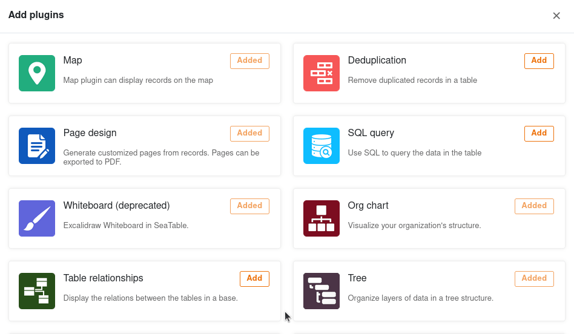
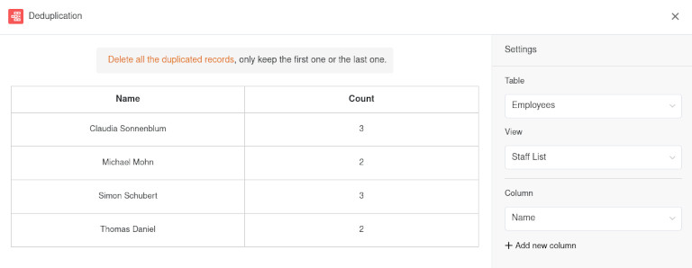
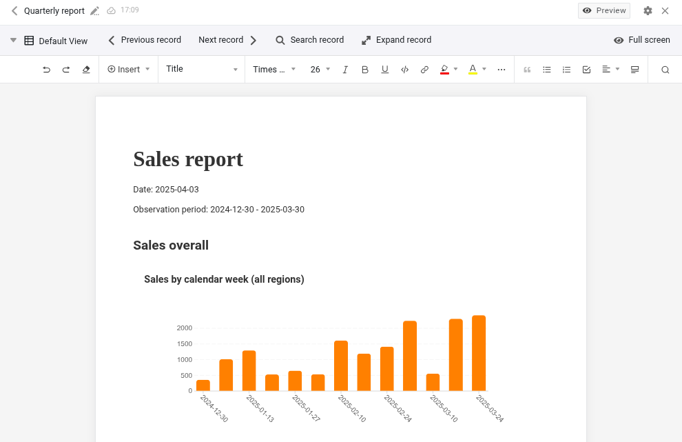
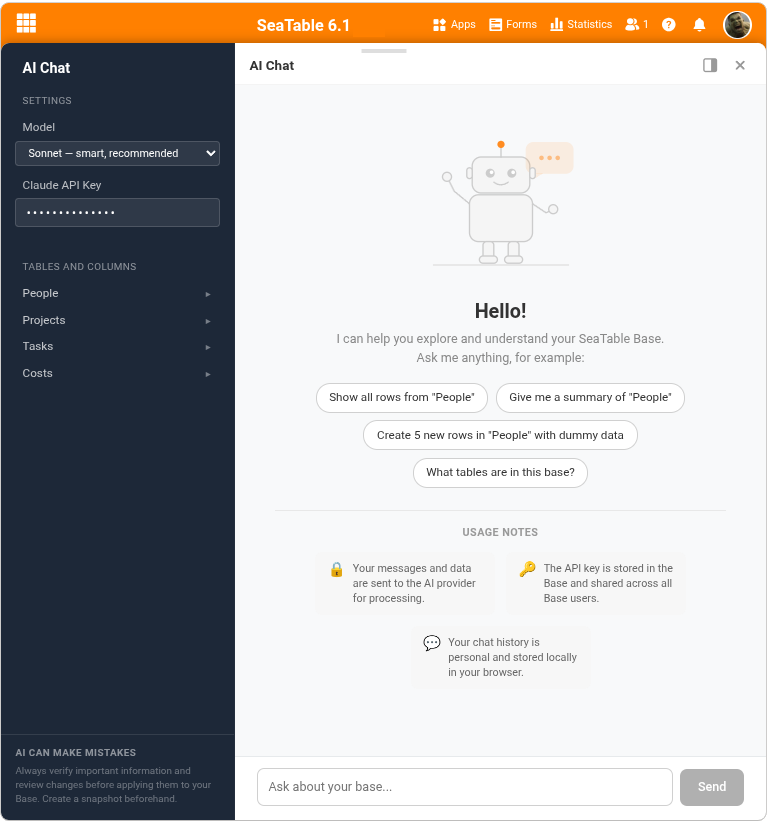

SeaTable **plugins** give you the opportunity to see your data from completely different perspectives and use extended functions. For example, visualize locations, org charts and table relationships, create laid-out documents or set up an AI chat in your base. In the following article, we explain which plugins are available in SeaTable and how you can use them.

## What is a plugin?

In SeaTable you can create different [views]() for your tables, with which you can visualize your data, for example, in **calendars**, **galleries** and **tree diagrams**. Beyond that, there are plugins.

A **plugin** is an optional software component in SeaTable that offers you additional functions. Various plugins can be activated in each base, which display the data of the respective table, for example on **maps**, in **org charts** or **documents**. You can also use extended functions to track **duplicates**, set up an **AI chat**, or let your creativity run free on the **whiteboard**.

Read more about [how to activate a plugin]() in the linked help article.

## Map plugin

**Locations** can be displayed on a map with the map plugin. You can visualize the entered geographic information with position markers or images. The map plugin can handle **GPS coordinates** as well as **addresses**. However, addresses must be unique in order to be displayed.

[More about the map plugin]()

## Data deduplication plugin

The data deduplication plugin uncovers **duplicate entries** in a table. This is especially helpful with large amounts of data to detect duplicates and remove them. You can delete all duplicate entries with just one click.

[More about the data duplication plugin]()

## Page design plugin

Using the Page Design plugin, you can layout **documents** such as form letters, business cards, and certificates and populate them with the data in your table. More precisely, you can build layouts with **static elements** that are completed and customized with **dynamic elements** and **table fields**. These offer you the great advantage of inserting all related information (for example, a person's name, address, and job title) into standardized templates, depending on the record, without the need to manually copy data into the documents. In this way, you can create print-ready invoices, certificates or other important documents from the stored data with just a few clicks.

[More about the page design plugin]()

## SQL query plugin

The SQL query plugin is perfect for direct **execution of SQL commands** and is therefore especially interesting for database professionals who work with larger amounts of data.

[More about SQL query plugin]()

## Whiteboard plugin

The whiteboard plugin gives you the freedom to graphically visualize processes and structures that you cannot display with the previous plugins. You can also **freely sketch** layouts and mockups. For the design, you have various **elements** such as squares, ellipses and arrows as well as **tools** such as pen, eraser and the text tool to choose from.

[More about the whiteboard plugin]()

## Organizational chart plugin

You can use the organization chart plugin to display **hierarchies** between the data records in a table. This is useful, for example, to visualize the positions in a company or superordinate and subordinate tasks in a project.

[More about the organization chart plugin]()

## Table relations plugin

Especially when there are many tables with dozens of columns in a base, it is easy to lose track of how they relate to each other. Using the table relationships plugin, you can visualize **which tables are linked to each other via which columns**.

[More about the table relationships plugin]()

## Report design plugin

With this plugin you can create **multi-page reports** in which tables, charts and fields are dynamically fed with data from your base. It is similar to the page design plugin in that it also creates **PDF documents based on laid-out templates**. However, the static and dynamic elements are not positioned pixel-precisely on the template, but placed one below the other in sequence, like in a **word processor** (e.g. Microsoft Word or Google Docs).

## AI chat plugin

The latest plugin from SeaTable is absolutely in tune with the times. It allows you to set up an **AI chat** with your preferred language model. This way you can edit and analyze your bases in natural language, e.g. create records, change values, link rows or create analyses.

[More about the AI chat plugin]()

## Other helpful articles

### Statistics

The **statistics module** allows you to display data in all kinds of graphics and statistics. The following **chart types** are available to you: column, bar, line and pie charts, as well as maps, thermal images, speedometers and pivot tables. You can configure the right visualization for you in the various **graphics** and build a **dashboard with the most important statistics**.

[More about the statistics module]()

### Forms

With the **form editor**, you can create a web form from the columns of a table with which you can have users enter certain data in the fields of an **online survey**.

[More about the web forms]()
