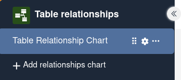
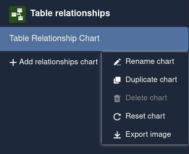
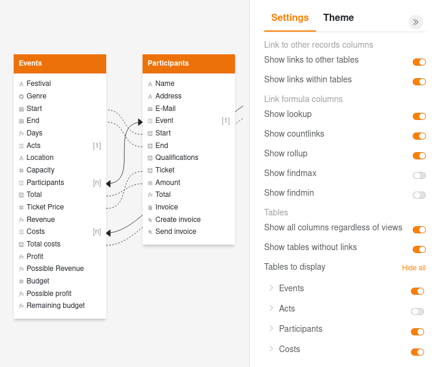
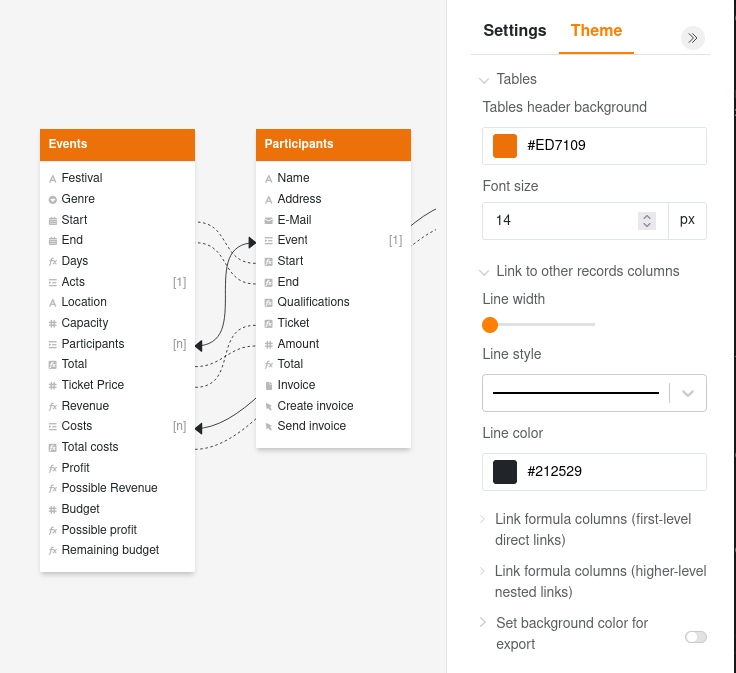
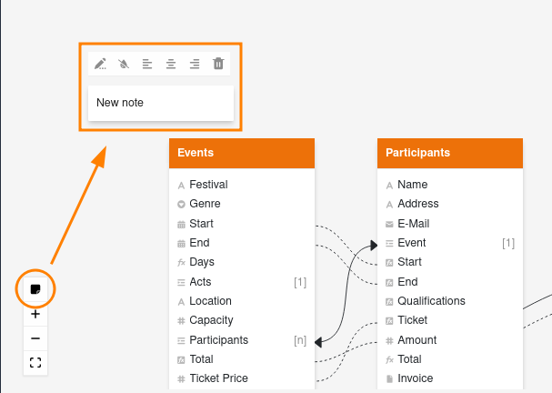

Особенно когда в базе много таблиц с десятками столбцов, легко потерять представление о том, как они связаны друг с другом. Вы можете использовать плагин отношений таблиц, чтобы визуализировать, какие таблицы связаны друг с другом через какие столбцы.

О том, как активировать плагин в базе, вы можете узнать [здесь]().

## Как работает плагин

После настройки и открытия плагина отношений таблиц вы увидите **все таблицы** в базе. **Все столбцы**, созданные в соответствующих таблицах, перечислены под цветными названиями таблиц.

Для визуализации связей в таблице вы увидите не только **сплошные линии** для _прямых_ связей через [столбцы ссылок](), но и **пунктирные линии** для _косвенных_ связей через столбцы формул ссылок (например, [поиск]().

## Управление диаграммой отношений

По умолчанию при первом открытии плагина отношений таблиц уже создается диаграмма со всеми связями таблиц. Если вы хотите создать ещё одну диаграмму отношений, нажмите на кнопку  **Добавить диаграмму отношений**. Откроется поле ввода, в котором вы можете ввести желаемое **название**.

При наведении курсора мыши на название диаграммы появляются три значка. Чтобы **изменить порядок диаграмм**, удерживайте левую кнопку мыши на **поверхности захвата**  и **перетащите** диаграмму в нужное место.

Кроме того, вы можете нажать на **три точки**, чтобы управлять диаграммой. Доступны следующие параметры:
- **переименовать**
- **дублировать**
- **удалить**
- **сбросить**
- **экспортировать как изображение**.



## Настройки диаграммы отношений

В **настройках**, доступ к которым можно получить, нажав на **символ шестеренки** , вы можете задать следующие параметры для диаграммы, **(де)активируя ползунки**:

- Хотите ли вы отображать **ссылки на другие таблицы** (прямые связи)?
- Хотите ли вы отображать **ссылки внутри таблицы** (прямые связи)?
- Хотите ли вы отображать **формулы для ссылок** (косвенные связи)? Если да, то какие типы формул ссылок?
- Хотите ли вы отображать **все столбцы независимо от представлений**?
- Хотите ли вы отображать **таблицы без ссылок**?
- Хотите ли вы **показывать или скрывать таблицы**?

## Параметры дизайна диаграммы отношений

Перейдите на вкладку **Дизайн** в правом верхнем углу рядом с настройками, чтобы изменить стиль определенных элементов в диаграмме. Нажмите на **раскрывающуюся стрелку** перед элементом, чтобы развернуть доступные настройки:

- **Таблицы**: цвет заголовка таблицы и размер шрифта
- **Столбцы ссылок** (прямые связи): ширина линии, стиль линии и цвет линии
- **Формулы для ссылок** (косвенные связи первого уровня): ширина линии, стиль линии и цвет линии
- **Многоуровневые формулы для ссылок** (вложенные связи более высоких уровней, например формула поиска, которая берет значения через другой столбец ссылок связанной таблицы): ширина линии, стиль линии и цвет линии
- **Установить цвет фона для экспорта**

## Перемещение таблиц в диаграмме

Вы можете перемещать различные таблицы в диаграмме по мере необходимости с **помощью перетаскивания**. Для этого, удерживая левую кнопку мыши, перетащите таблицу в нужное место и отпустите.

## Добавление заметки на диаграмму отношений

Кроме того, вы можете добавить заметку на диаграмму отношений, нажав на значок заметки в левом нижнем углу. Затем у вас будут следующие параметры:

- редактировать текст
- скрыть фон
- выровнять текст по левому краю, по центру или по правому краю
- удалить заметку

