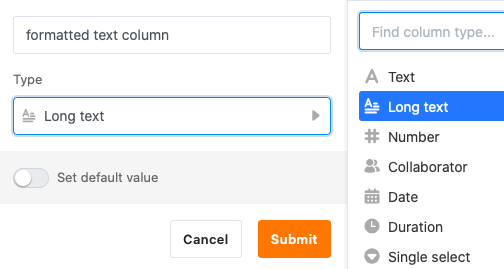
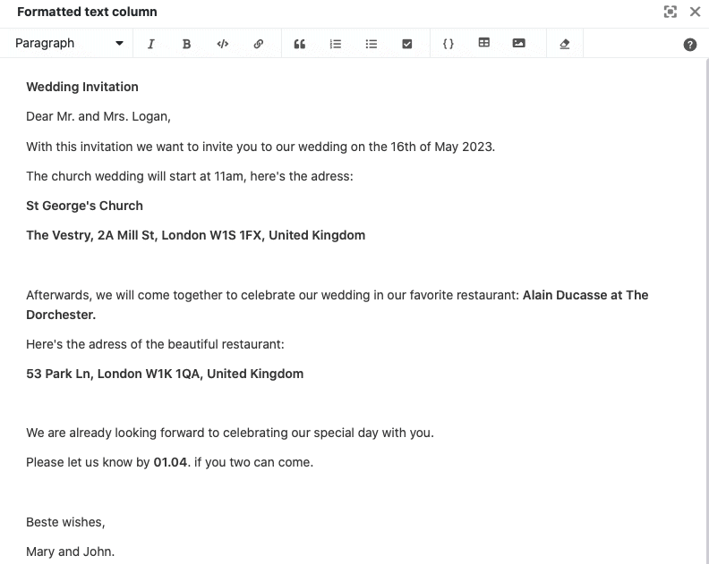

Para o **registo de textos estruturados de qualquer dimensão**, o SeaTable disponibiliza o tipo de coluna *Texto longo*. Saiba neste artigo quais são as diferenças relativamente à coluna de texto e em que casos faz sentido recorrer à coluna de texto longo.

## Utilização da coluna de texto longo

Ao contrário da coluna de texto, o tipo de coluna **Texto longo** não regista cadeias de caracteres não estruturadas, mas sim textos formatados com quebras de linha, listas, imagens, etc.

As colunas de texto longo são particularmente adequadas para guardar **textos mais longos**, por exemplo descrições de produtos, listas de verificação ou publicações nas redes sociais.



**Não** escreve as suas entradas diretamente na célula, mas num **editor** que pode ser chamado com um clique, o qual oferece várias **opções de formatação**. Assim, ao contrário da coluna de texto, também pode estruturar textos mais longos.

Entre outras coisas, pode escolher um **formato de parágrafo**, definir a **fonte** para itálico ou negrito, bem como inserir **links**, **citações**, **listas**, **tabelas** e **imagens**.



## Outros tipos de colunas baseadas em texto

Se pretender registar **cadeias de caracteres curtas sem formatação** (por exemplo nomes, palavras-passe, matrículas de veículos), deve utilizar a [coluna de texto]().

Para além da coluna de texto longo, existem no SeaTable três outros tipos de colunas baseadas em texto para casos de utilização especiais:
- a [coluna de correio eletrónico]()
- a [coluna URL]()
- a [coluna de número de telefone]()

## Definir valor predefinido

É possível definir um [valor predefinido]() para cada coluna de texto longo. Este texto é automaticamente introduzido na célula em cada linha criada recentemente.

1. Clique na **seta do menu pendente** à direita do nome da coluna.
2. Vá a **Definir valor predefinido**.
3. Ao clicar em **Editar texto**, abre-se o editor, onde pode redigir o texto que servirá de valor predefinido.

## Restrições nos filtros, na ordenação e no agrupamento

Não é possível ordenar nem agrupar as entradas de uma tabela por colunas de texto longo. Nos filtros, apenas tem as opções "está vazio" e "não está vazio" à disposição.
