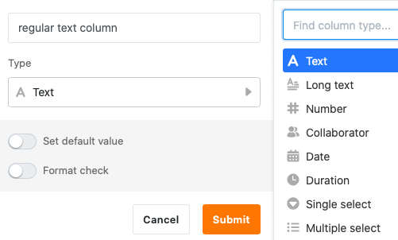
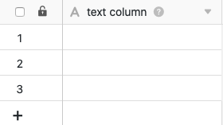
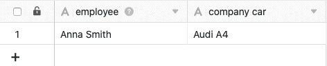
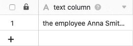
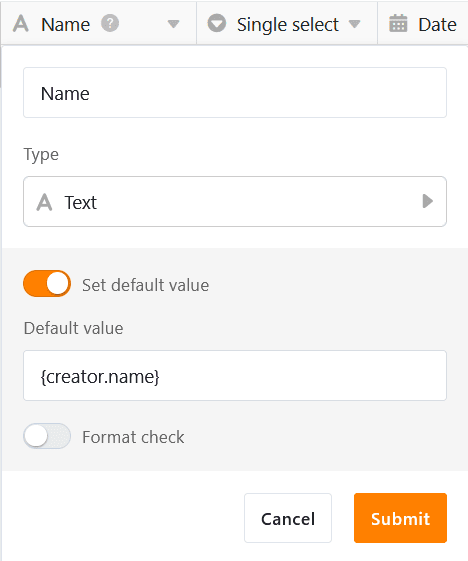

La columna de texto es uno de los **tipos de columna** más básicos en SeaTable y también se muestra en primer lugar en el menú de selección del tipo de columna.

De forma predeterminada, SeaTable añade automáticamente una **columna de texto** como primera columna a cada tabla recién creada. Además, puede añadir manualmente tantas columnas de texto como desee a su tabla. Puede consultar cómo hacerlo [aquí]().

La **primera columna** de una tabla tiene varias [características]() especiales, como puede leer en el artículo enlazado.

## Uso de la columna de texto

La columna de texto es especialmente adecuada para registrar y [ordenar]() cadenas alfanuméricas cortas, por ejemplo, **términos**, **nombres**, **contraseñas**, **matrículas de vehículos** o **IBAN**.



Al utilizar la columna, es conveniente que las entradas **sean cortas**, ya que solo se puede mostrar un **número limitado de caracteres** sin tener que aumentar el ancho de la columna.

## Otros tipos de columnas basadas en texto

Tenga en cuenta que **no hay opciones de formato** disponibles para las entradas de la columna de texto. Si desea registrar textos estructurados con saltos de línea, listas, imágenes, etc., debería utilizar la columna [Texto con formato]().

En SeaTable existen otros tres tipos de columnas basadas en texto para casos de uso especiales:
- la [columna de correo electrónico]()
- la [columna de URL]()
- la [columna de número de teléfono]()


Existen numerosas funciones de texto para las [columnas de fórmula](), que se comportan como columnas de texto cuando los resultados son **cadenas de caracteres**.


## Establecer el valor por defecto

Puede definir un [valor predeterminado]() para cada columna de texto. Este valor se introduce automáticamente en cada nueva fila de la tabla.

Si especifica la referencia **{creator.name}** o **{creator.id}** como valor por defecto, se introduce automáticamente el **nombre** o el **ID del usuario** que ha añadido la fila.

## Validar entradas

Cuando utilice columnas de texto en sus tablas, tiene la opción de validar las entradas. Mediante la validación, que admite expresiones regulares, puede **comprobar los valores de las celdas** y resaltar las celdas cuyo contenido se desvíe del formato válido.

Puede configurar la comprobación de formato ya al crear una columna de texto, activando el control deslizante.

Si desea validar las entradas de una columna de texto ya creada, haga clic primero en el **símbolo del triángulo**  de la columna correspondiente y seleccione **Personalizar tipo de columna** en el menú desplegable.

1. Active el control deslizante **Validar entrada**
2. Defina un **formato de destino**.

3. Confirme con **Enviar**.

### Consecuencia de la validación

Tras una validación correcta, las **celdas** cuyo **contenido se desvía** del formato de destino se resaltan en rojo.

### Expresiones regulares

Para validar sus entradas en columnas de texto, SeaTable admite **expresiones regulares**. En la siguiente tabla encontrará algunos ejemplos:

| Expresión regular               | Función                                                                          |
| ------------------------------- | -------------------------------------------------------------------------------- |
| \[123456\]                      | Comprobar si una entrada corresponde a una nota escolar de 1 a 6.                |
| \[1-9\]\[0-9\]?\[0-9\]?\[a-z\]? | Comprobar el formato de un número de casa alemán (3 dígitos + 1 letra)           |
| \[0-9\]{5}                      | Comprobar el formato de los códigos postales alemanes (5x un número entre 0 y 9) |
| \[0-9/. \\-\]+                  | Comprobar el formato de un número de teléfono                                    |
| Max.\*Mustermann                | Buscar un posible segundo nombre de un autor                                     |


