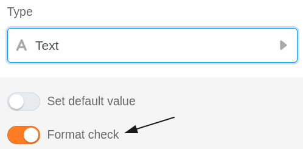
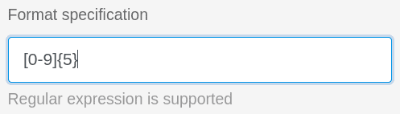
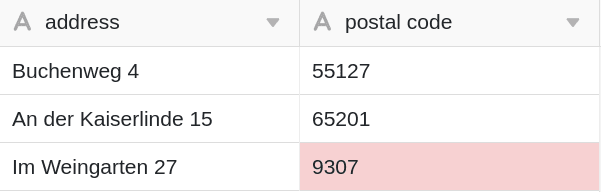

Ao utilizar colunas de texto nas suas tabelas, tem a opção de validar entradas. Utilizando a validação, que suporta expressões regulares, é possível verificar os valores das células e destacar as células com conteúdo que se desvia do formato válido.



Basicamente, existem duas formas diferentes de validar entradas em colunas de texto. A validação pode ser efectuada tanto ao **adicionar uma nova** [coluna]() **já criadas**.



## Validar entradas

1. Se pretender validar as entradas numa coluna de texto já criada, clique primeiro no **símbolo do triângulo**  da coluna correspondente.
2. Seleccione **Personalizar tipo de coluna** no menu pendente.
3. Activar o cursor de **validação de entrada**
4. Definir um **formato de destino**.
5. Confirmar com **Submeter**.

## Consequência da validação

Após uma validação bem sucedida, as **células** com **conteúdo que se desvia do** formato de destino são destacadas a vermelho.

## Expressões regulares

O SeaTable suporta **expressões regulares** para validar as suas entradas em colunas de texto.  
Pode encontrar alguns exemplos na tabela seguinte:

| Expressão regular               | Função                                                                     |     |     |     |     |
| ------------------------------- | -------------------------------------------------------------------------- | --- | --- | --- | --- |
| \[123456\]                      | Verificar se uma entrada corresponde a um ano escolar de 1 a 6.            |     |     |     |     |
| \[1-9\]\[0-9\]?\[0-9\]?\[a-z\]? | Verificar o formato de um número de porta alemão (3 dígitos + 1 letra)     |     |     |     |     |
| \[0-9\]{5}                      | Verificar o formato dos códigos postais alemães (5x um número entre 0 e 9) |     |     |     |     |
| \[0-9/. \\-\]+                  | Verificar o formato de um número de telefone                               |     |     |     |     |
| Max Mustermann                  | Procurar um possível nome do meio de um autor                              |     |     |     |     |


