С помощью колонки ссылок вы создаёте в SeaTable связи между таблицами без SQL и программирования. Запись в одной таблице ссылается на одну или несколько записей в другой таблице, например заказ — на клиента и на заказанные товары. Такие **связанные записи** (англ. _linked records_) лежат в основе функций [реляционной базы данных]() SeaTable. Тип столбца называется **Ссылка на другие записи**.

## Какие отношения можно отобразить

| Отношение | Пример | Как это сделать в SeaTable |
|---|---|---|
| **1:1** (один к одному) | Счёт относится ровно к одному заказу. | Колонка ссылок с настройкой [Ограничение ссылок одной строкой](#ограничение-ссылок-одной-строкой) |
| **1:n** (один ко многим) | У клиента много заказов, каждый заказ принадлежит одному клиенту. | Колонка ссылок, ограниченная одной строкой в таблице заказов и без ограничения в таблице клиентов |
| **n:m** (многие ко многим) | Заказ содержит несколько товаров, товар встречается во многих заказах. | Колонка ссылок без ограничения, промежуточная таблица не нужна |
| **Внутри одной таблицы** | Задачи и подзадачи, сотрудники и их руководители | [Ссылки внутри таблицы]() |

Связь видна в обеих таблицах. При создании колонки ссылок вы выбираете, будет ли связь отображаться в **существующей колонке** другой таблицы или там будет создана **новая колонка**.



### Пример: клиенты, заказы и товары

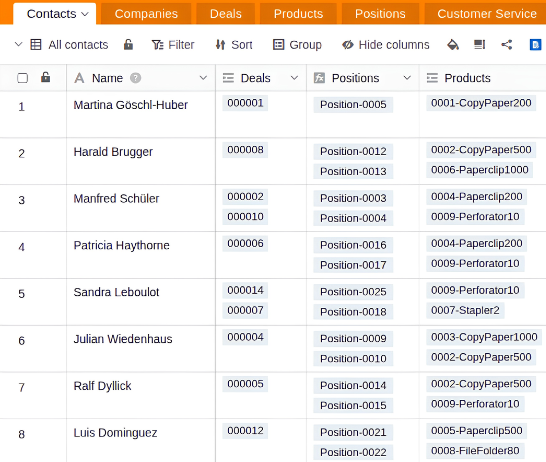

- Таблица **Клиенты** содержит название, контактное лицо и адрес.
- Каждая запись в **Заказах** связана с одним клиентом.
- **Позиции заказа** связывают заказ с товаром и содержат количество и цену.
- Таблица **Товары** содержит артикул, наименование и прейскурантную цену.

С помощью [формулы связи](#данные-из-связанных-записей-lookup-rollup-и-другие) вы показываете имя клиента в каждом заказе и рассчитываете выручку по каждому клиенту в таблице клиентов. [Плагин отношений таблиц](#наглядные-связи-диаграмма-отношений) показывает всю структуру в виде диаграммы.

## Чтобы связать две таблицы вместе

1. Создайте новый столбец и выберите тип столбца **Ссылка на другие записи**.
2. Дайте колонке **имя**.
3. В разделе **Выбрать таблицу для связывания** выберите таблицу, записи которой вы хотите связать с текущей таблицей.
4. Нажмите **Отправить**.
5. Содержимое нового столбца все еще пусто. Чтобы заполнить его, можно **связать существующие записи** или **добавить новые строки**.

Как только таблицы будут связаны, вы можете вызвать информацию о связанных записях через **диалог ссылок**. Для этого нажмите на **символ двойной стрелки** в **ячейке** столбца ссылок или **дважды щелкните мышь**ю. **Связанные записи** перечислены в открывшемся диалоге ссылок. Щелкните на записи, чтобы просмотреть **информацию о строке** в дополнительном окне.

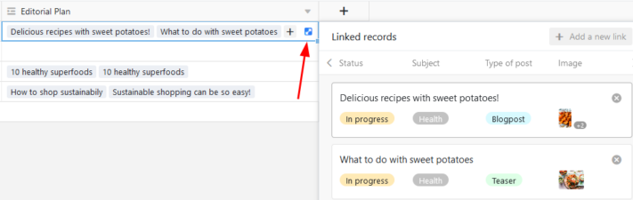

## Связать существующие записи

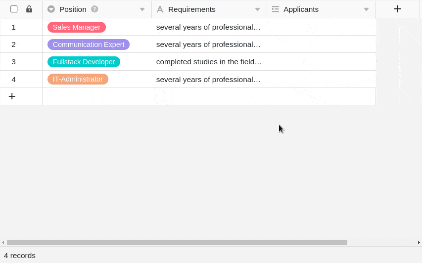

1. Щелкните в **ячейке столбца ссылок**, а затем нажмите на появившийся **символ плюса**.
2. Теперь перечислены доступные **строки связанной таблицы**. Выберите строку (строки), которую нужно связать со строкой текущей таблицы.
3. В колонке ссылок каждая строка сразу отображается **как связанная запись**.



Используя **встроенную функцию поиска** в диалоге ссылок, можно перебирать записи связанной таблицы, чтобы быстро найти нужную строку.



## Добавить новый ряд

Вы можете даже добавить **новую строку** в **связанную таблицу** через диалог ссылок, не переключаясь на эту таблицу. Строка добавляется в связанную таблицу среди существующих записей и отображается как связанная запись в колонке ссылок открытой таблицы.

1. **Дважды щелкните** по **ячейке** **столбца ссылок** или нажмите на синий **символ двойной стрелки**, чтобы открыть диалог ссылок.
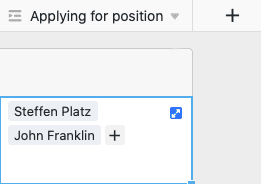
2. Нажмите кнопку **Добавить строку**.
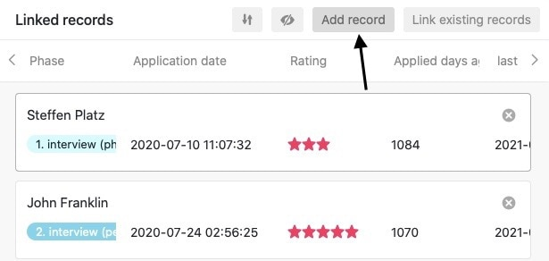
3. В открывшемся окне заполните различные **столбцы таблицы**.
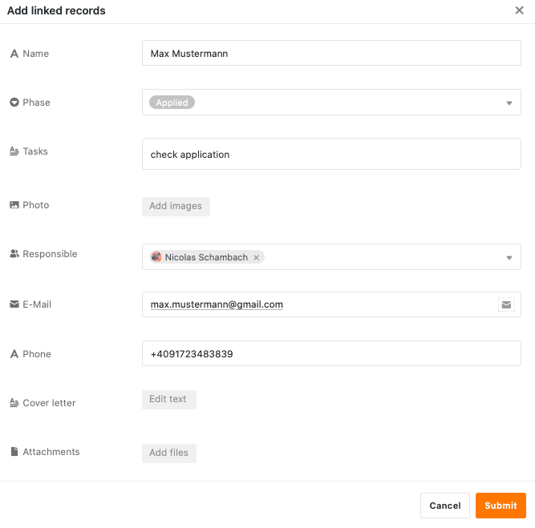
4. Нажмите кнопку **Отправить**, чтобы создать новую строку.

5. **Новая строка** автоматически добавляется в **связанную таблицу** и отображается в текущей открытой таблице как **связанная запись** в столбце ссылки.

## Редактирование существующих записей связанной таблицы

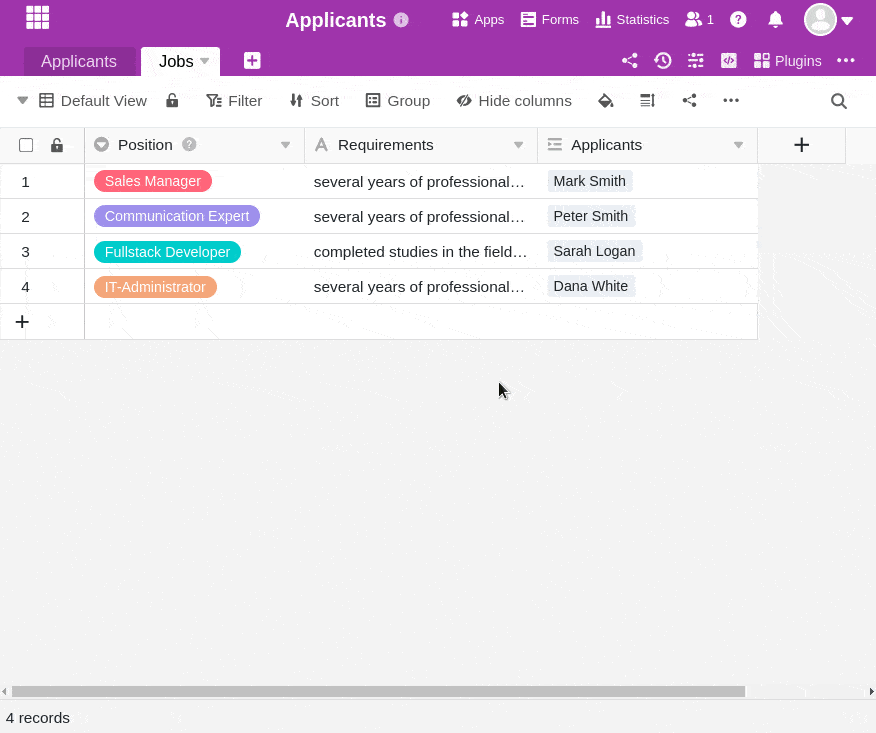

1. Щелкните мышью в **ячейке** столбца ссылок.
2. Щелкните на **связанной записи**, которую необходимо отредактировать.
3. Откроются **реквизиты строки**. Внесите в них необходимые **изменения**.
4. **Закройте** окно для **сохранения** изменений.

## Удалить ссылки

Удалить записи, связанные в колонке ссылок, можно всего несколькими щелчками мыши. Для этого достаточно открыть **диалог** ссылок соответствующего столбца ссылок и щелкнуть на **символе X** справа от нужной записи.

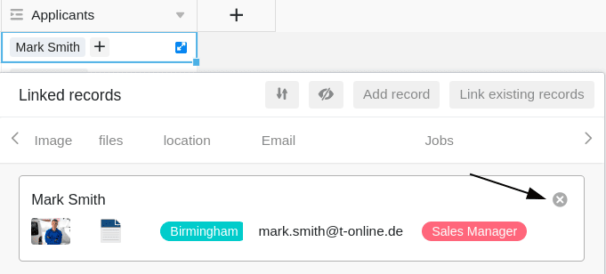



## Настройки колонки ссылок

Колонка ссылок позволяет очень легко создавать и изменять различные настройки. Для этого нажмите на треугольный **раскрывающийся символ** колонки ссылок в заголовке таблицы, а затем на **Настройки**.

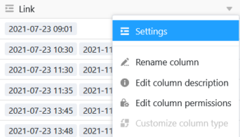

### Выбор связанного столбца из связанной таблицы

В выпадающем меню можно сначала выбрать **столбец связанной таблицы**, **записи** которого будут отображаться в столбце ссылок.

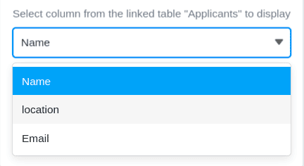

### Ограничение ссылок одной строкой

Активизировав соответствующий ползунок, можно ограничить связывание **не более чем одной строкой**. Если эта настройка активна, то в каждую ячейку столбца ссылок может быть добавлена только **одна связанная запись**.

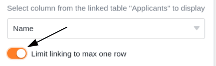

Если в ячейку уже добавлена связанная запись, опции добавления дополнительных записей больше **не** отображаются.

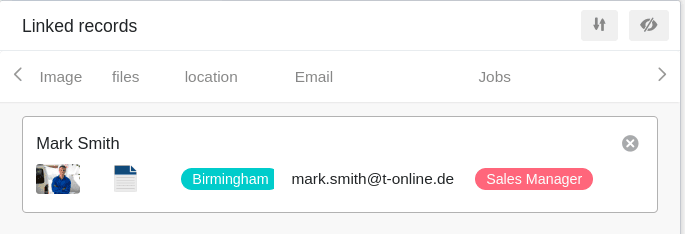

Эта настройка может быть полезна, например, если счет-фактура должен быть связан с соответствующим заказом из другой таблицы - т.е. если связанные записи данных образуют логические **пары**. В этом случае добавление дополнительных связей может привести к путанице и негативно сказаться на рабочих процессах.

### Ограничение ссылок для одного вида

Активизировав эту настройку, можно ограничить ссылки **одним представлением** связанной таблицы. Для этого задается ранее определенное **представление** связанной таблицы. После этого в колонке ссылок можно связывать **только** записи этого представления. Связывание записей из других представлений при этом становится **невозможным**.

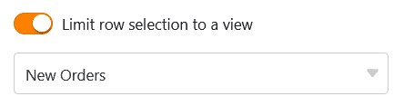

Эта настройка особенно полезна для **фильтрованных представлений** и может быть полезна, если Вы хотите связать **конкретные записи** в Ваших таблицах.

### Предотвращение связывания существующих записей

В настройках колонки ссылок можно также запретить связывание существующих записей, активировав соответствующий ползунок. Если ползунок **активирован**, то соответствующий столбец ссылок поддерживает **только** добавление **новых строк** или записей.

После этого существующие записи в связанной таблице больше **не** могут быть связаны в столбце. Однако на записи, которые уже были связаны в столбце, эта настройка **не влияет**.

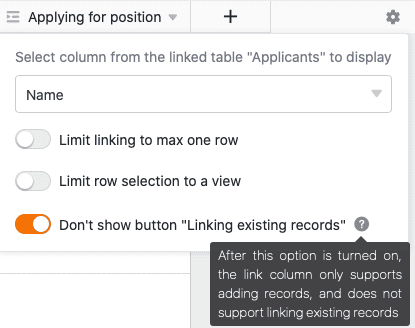

### Ограничение ссылок с помощью правила фильтрации

Если Вы активируете эту опцию, выбор ссылающихся строк может быть ограничен на основе правил фильтрации. Сами фильтры могут быть статическими или динамическими:
- При использовании **статического фильтра** Вы используете единое значение для фильтрации строк в связанной таблице (например, только те строки, которые не имеют значения "архивировано", могут быть связаны). Таким образом, эффект схож с опцией **Ограничить ссылки одним видом**.
- При использовании **динамического фильтра** значением, используемым для фильтрации строк в связанной таблице, является значение столбца активной строки (например, только строки, статус которых совпадает со статусом активной строки, могут быть связаны). Поэтому **строки с разными значениями фильтра** имеют разные связываемые строки.

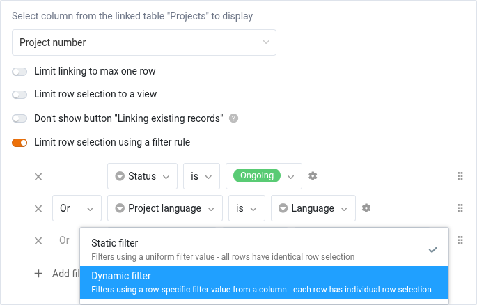

## Параметры просмотра диалога ссылок

В диалоге ссылок колонки ссылок также доступны различные варианты просмотра.

### Настройте размер окна

Чтобы все связанные записи были видны сразу, можно изменить **размер** диалогового окна ссылок. Для этого достаточно навести курсор мыши на один из внешних краев, пока курсор не превратится в **двойную стрелку**, и, удерживая кнопку мыши, перетащить край в нужном направлении.

### Настройте ширину столбца

Чтобы вместить в окно больше записей столбцов связанных строк, вы также можете настроить **ширину** отображаемых **столбцов** в диалоге ссылок. Для этого наведите курсор мыши на **область между двумя названиями столбцов**, пока курсор не превратится в **двойную стрелку**, и, удерживая кнопку мыши, перетащите невидимую пограничную линию влево или вправо, пока не достигнете нужной **ширины столбцов**.

### Скрыть колонки

Чтобы сделать диалог ссылок еще более понятным, вы можете скрыть любое количество колонок связанных записей, нажав на **символ глаза**. Откроется окно, в котором вы можете **(де)активировать** отдельные колонки с помощью ползунков. Соответственно, колонки скрываются или отображаются в обзоре связанных записей.

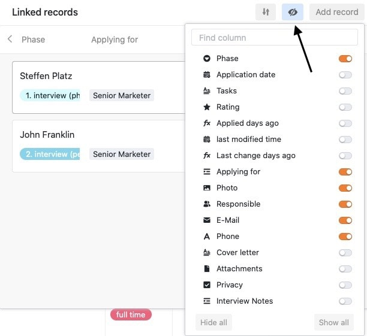

### Сортировка записей

Нажмите на **символы стрелок, чтобы** **отсортировать** связанные записи в диалоге ссылок. Используйте эту функцию, например, для отображения связанных записей в алфавитном порядке на основе текстовой колонки или для сортировки по другой колонке.

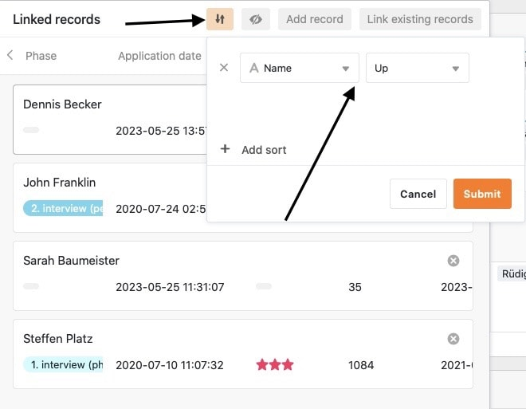



## Данные из связанных записей: lookup, rollup и другие

Связанные записи сначала показывают только одно значение из другой таблицы, например имя. Чтобы получить, подсчитать или обобщить другие значения, используйте колонку типа [Формула связи](). Доступны пять формул:

| Формула | Что она делает | Пример |
|---|---|---|
| [Lookup]() | получает значения столбца из связанных записей | показать телефон клиента в заказе |
| [Rollup]() | обобщает значения связанных записей, например как сумму или среднее | выручка по клиенту по всем заказам |
| [Countlinks]() | подсчитывает связанные записи | количество заказов на клиента |
| [Findmax]() | находит связанную запись с наибольшим значением | последний заказ клиента |
| [Findmin]() | находит связанную запись с наименьшим значением | первый заказ клиента |

Формулы связи работают и на нескольких уровнях: lookup может обращаться к колонке lookup или rollup связанной таблицы. Так позиция заказа показывает имя клиента: заказ получает его через lookup из таблицы клиентов, а позиция заказа через lookup обращается к этой колонке заказа.

## Наглядные связи: диаграмма отношений

При большом количестве связанных таблиц легко потерять общую картину. [Плагин отношений таблиц]() показывает все таблицы базы с их колонками в виде **диаграммы отношений**. Сплошные линии обозначают прямые связи через колонки ссылок, пунктирные — косвенные связи через формулы связи, такие как lookup или rollup. Диаграмму можно экспортировать как изображение.

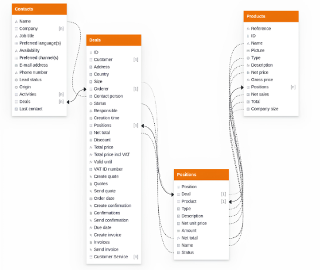

## Ограничения

- **Изменение типа колонки задним числом:** Существующую колонку нельзя преобразовать в колонку ссылок. Вместо этого создайте новую колонку (см. [Часто задаваемые вопросы](#часто-задаваемые-вопросы)).
- **Одна колонка на lookup:** Каждая колонка lookup получает значения ровно одной колонки связанной таблицы. Для других значений создайте дополнительные колонки lookup.

## Часто задаваемые вопросы

Да. Колонка ссылок без ограничения допускает любое количество связанных записей в каждой ячейке, а запись может быть связана с любым количеством строк другой таблицы. Промежуточная таблица нужна только в том случае, если вы хотите хранить данные о комбинации, например количество и цену по позиции заказа.


Нет. Связи, lookup и rollup настраиваются полностью в интерфейсе. При желании со связанными записями можно также работать через [API](https://developer.seatable.com) или с помощью скриптов на Python и JavaScript.


Да. При [миграции баз Airtable]() вы указываете колонки ссылок в скрипте миграции, и они попадают в SeaTable как связи. Импортируются все колонки, кроме **Button**, **Count**, **Lookup** и **Rollup**. После импорта создайте колонки lookup и rollup заново как формулы связи.


Колонка Link доступна в каждой подписке SeaTable. Однако вы, вероятно, пытаетесь изменить тип колонки существующей колонки. Когда вы [изменяете]() тип колонки, тип колонки "Ссылка на **другие записи** " вам фактически _недоступен_. Вместо этого создайте **новую колонку**, и вам будет предложен нужный тип колонки.


