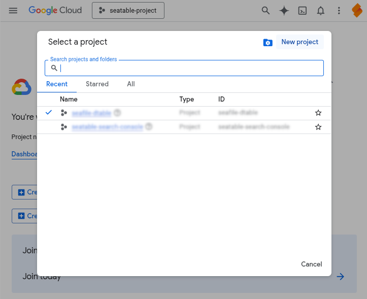
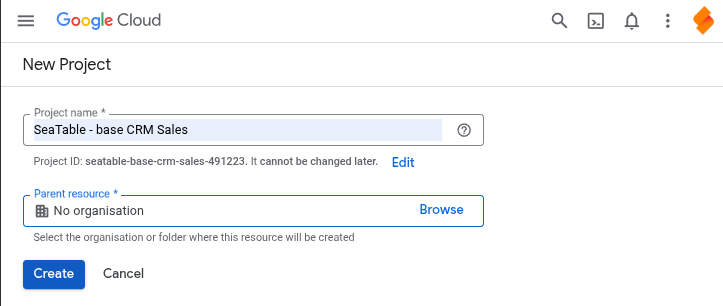
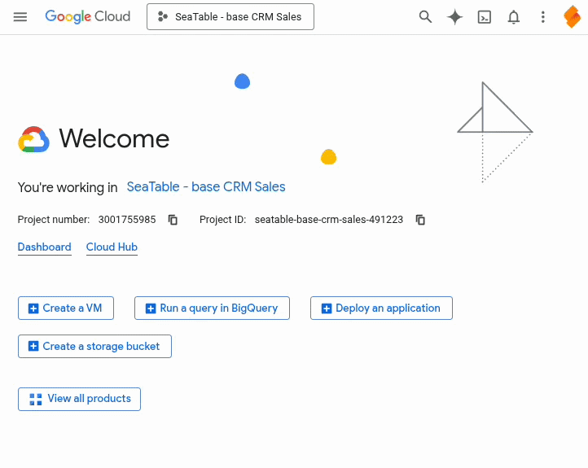
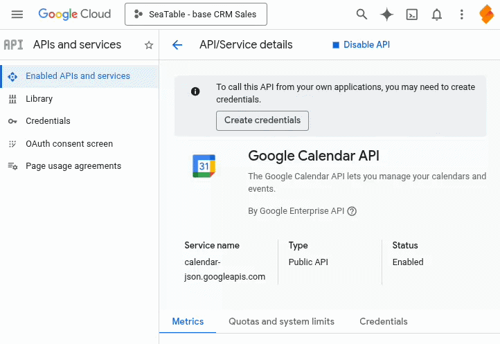
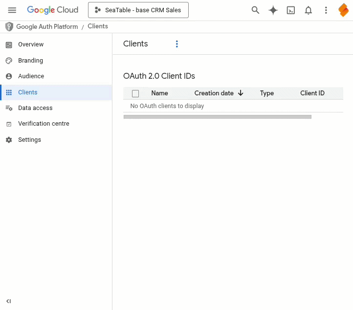
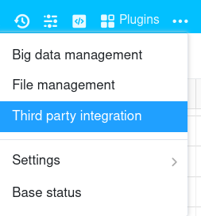
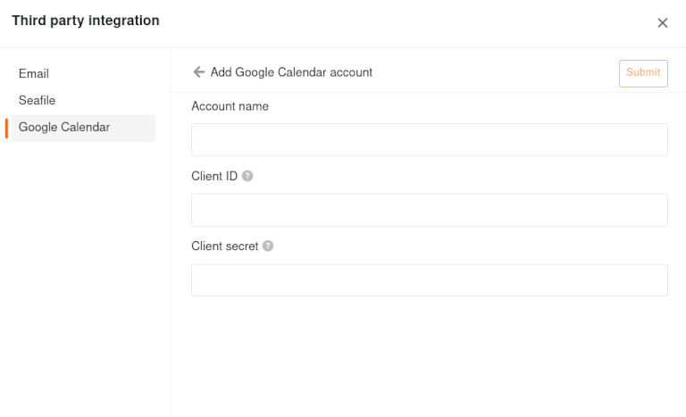

Dates in a SeaTable Base can be automatically synchronized with one or more **Google calendars**. So you always have your current appointments available in your Google Calendar on your PC and your mobile devices.

Before you configure the synchronization, you must set up the **Google account** of the calendar to which you want to transfer appointments from SeaTable. This is done in two steps: First, create **OAuth credentials** in the Google Cloud Console. Then create a third-party account in SeaTable with the access data and connect it to Google. This is very easy with these step-by-step instructions.

## Creation of the access data in the Google Cloud Console

As a platform for developers, the Google Cloud Console initially seems confusing for normal users. Don't let this impress you. The following step-by-step guide will help you set it up without any headaches.

1. Open the [Google Cloud Console](https://console.cloud.google.com/) and log in to your **Google account** when prompted.
2. Click on **Select project** at the top next to the Google Cloud logo and create a **New project**. All the settings explained below are made in this project.
   
3. Enter a **Project name** (e.g. SeaTable Base XY) and select the **Parent resource**. If no organizations are defined, keep "No organization". Confirm with **Create**.
   
4. Allow the created project to use the Google Calendar API. To do this, click with the mouse in the **search field** at the top of the page, enter **Google Calendar API** and click on the corresponding search result. Then activate the Google Calendar API.
   
5. Click on the burger menu icon in the top left-hand corner to display the navigation and then select the **All products** option in the "Solutions" section. On the product page, click on **Google Auth Platform**.
   
6. Make the necessary configurations on the Google Auth Platform by clicking on **First steps**: Enter an **Application name** and a **Support e-mail address** (e.g. your Gmail address). Select **External** as the target group. Enter a **Contact e-mail address** (e.g. your Gmail address). Accept the **Terms of use** and complete the configuration.
7. Click on **Target group** in the side navigation of the Google Auth Platform. Add your Google e-mail address as a **test user**.
8. Click on **Clients** in the side navigation of the Google Auth Platform and create an OAuth 2.0 client. Select the option "Web application" as **Application type** for the OAuth client and enter a **Name** (e.g. SeaTable). Skip "Authorized JavaScript sources" and insert the following URI as **Authorized redirect URI** before clicking **Create**:

    ```
    https://cloud.seatable.io/oauth/google-calendar/callback/
    ```

    If you are using your own system instead of SeaTable Cloud, replace cloud.seatable.io with the hostname of your SeaTable instance.

   

9. The newly created client is now displayed in the list of OAuth 2.0 clients. The settings of the client can be displayed by clicking on its name. The displayed **client ID** and **client key** are essential for the following setup in SeaTable.



## Creating the Google account in SeaTable

Now you need to add your Google account as a **third party account in your SeaTable Base**. The following steps are necessary for this:

1. Open the advanced base options by clicking on the **three-dot icon**  in the top right corner.
   
2. Select the **Third-party integration** option.
3. Click on **Google Calendar** in the navigation on the left and then on **Add Google Calendar account** in the top right corner.
   
4. Enter the following information:
    - **Account Name**: any name for the account, e.g. Google
    - **Client ID**: the client ID of the OAuth client created
    - **Client key**: the client key of the OAuth client created
5. After you have clicked on **Submit**, a browser window will open. Click **Next** if you are informed that this app has not been verified and allow access to the Google account.
6. You can find the created account in the same way under **Google Calendar Accounts**.

## Automatically transfer appointments to Google Calendar

If you have set up the Google account, you can automatically transfer and update appointments from SeaTable to your Google Cloud Calendar. The configuration of the data transfer from SeaTable to Google Calendar is done via a corresponding [action]() in an automation rule.
