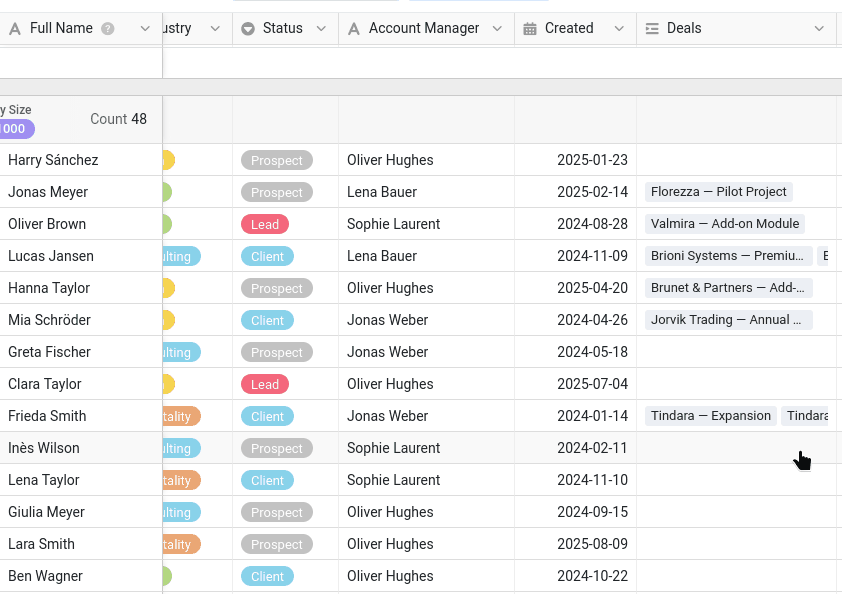
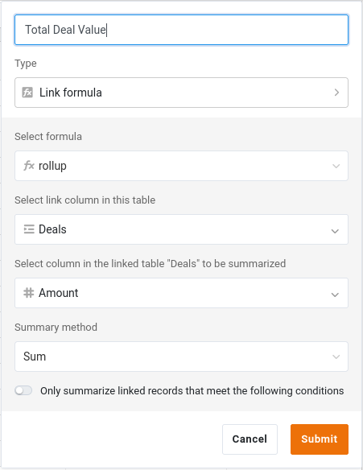

Before you can collaborate on data, you need some data to collaborate on! Throughout this course you work on the Commercial team, and you own the company's customer list. So we start where every collaboration starts: with the base that holds the shared data.

In Course 1 you already learned how to build a base from scratch, and in Course 2 you imported a ready-made one. We will do the same here and start directly with a prepared base, so we can spend our time on collaboration rather than on data entry.

Everything in this step happens in your main window 🌐, signed in as your own Commercial account. Your colleague, Malika, joins in the next step.

Download the following file to your computer and import it as a new base **into your `Commercial` group** — the group you set up in the introduction:

[SeaTable Course 3 - Sales CRM.dtable](/SeaTable-Course-3-Sales-CRM.dtable)

Importing into the `Commercial` group, rather than your personal workspace, matters for later: in Step 5 you will publish a common dataset, which only works from a base that lives in a group. If you were not able to create groups, you can still follow this step and most of the course with the base in your personal workspace — only Step 5 will be out of reach.

Even though you do not have to build the base yourself, take the time to get to know it well. The course refers back to these tables, columns and views in every later step, and a few of the column types may be new to you.

## The components of the base

The base is called `Sales CRM` — the system the Commercial team uses to manage its customers and sales. At first glance it is compact:

- 2 tables
- around 350 customer records / 90 companies, and roughly 290 deals
- 3 views
- a link, a rollup and a formula column

This structure is intentionally simpler than a real-world database, but it is sufficient to cover all the collaboration scenarios addressed in the course; this allows us to focus on the essentials for now. Below we walk through it piece by piece.

### Your customer master

The table `Customers` is the heart of the base. Each row is one contact at one company, identified by the first column, `Full Name`. Alongside it you will find the columns you would expect of a customer list — company, industry and size, contact details, and the `Status` of the relationship (`Client`, `Prospect`, `Lead` or `Churned`), which we will come back to later. One column is worth flagging: `Account Manager` records who owns each customer. To represent the variety of data in a real-world scenario, we used a plain text column, but in an actual database, it is best to store this data in a ` Collaborator` column that links to the actual SeaTable user.

The table opens on a view that is **grouped by ` Company Size`**, so contacts are gathered under headings like `11–50`, `201–500` or `1000+`. A single-select column makes a natural grouping key — its fixed set of options becomes the groups — and grouping turns a long flat list into something you can scan by segment at a glance, useful the moment more than one team starts working from the same list.





### The deals behind each customer

A customer is more than a contact card; it is the deals you are working on with them. The second table, `Deals`, holds the sales pipeline. Each row is one opportunity:

- `Deal Name` and `Amount` — what the deal is and what it is worth.
- `Stage` — how far along it is (`Qualification`, `Proposal`, `Negotiation`, `Won` or `Lost`).
- `Close Date` — when it was won or lost.



## How the two tables work together

A customer list and a deal list are far more powerful once they are connected. Three columns do that work, and they are worth understanding before you go further.

### The link between customers and deals

The `Customers` table has a ` Deals` column that links each contact to their opportunities in the `Deals` table. Click a cell in that column and you can see, open and add the deals that belong to that customer, without leaving the row. On the `Deals` side, the matching ` Customer` column points back the other way.

This is the same link column you met in Course 2, and it is what makes the next column possible.

### A rollup that sums each customer's value

Because customers and deals are linked, the `Customers` table can summarize the linked deals automatically. The ` Total Deal Value` column is a **link formula** that rolls up the linked deals: for each customer it adds up the `Amount` of all of them. You never type into it — it recalculates whenever a deal changes or a new deal is linked to the customer.

### A formula that weights the pipeline

In the `Deals` table, ` Weighted Value` is a **formula** column that multiplies each deal's `Amount` by a probability based on its `Stage`:

`switch({Stage}, "Qualification", 0.2, "Proposal", 0.4, "Negotiation", 0.6, "Won", 1, "Lost", 0) * {Amount}`

So a deal in `Negotiation` counts for more than one still in `Qualification`, giving a more representative, weighted view of the pipeline than a raw total.

` Total Deal Value` and ` Weighted Value` are exactly the kind of numbers a team treats as **confidential** — revenue and forecast figures you would not hand to everyone who needs a contact's phone number. Keep that in mind; it becomes important the moment you start sharing this base.

## Two views for two audiences

The `Customers` table comes with two purpose-built views.

- ` All Customers` shows everything, including the confidential `Total Deal Value`. This is the internal, full-detail view for the Commercial team.
- ` Active Customers` is a slimmed-down view: it focuses on current customer data and hides the confidential figures. This is the version that is safe to share with another team.
    - Filter: ` Status` is None of `Churned`
    - Hidden columns: ` Created`, ` Deals`, ` Total Deal Value`

A view in SeaTable is just a lens on the same underlying data — the rows live in one place, and each view decides what to show, hide, filter and group. You will lean on this distinction in the next steps: you share a *view*, not raw access to everything, and later you will publish `Active Customers` to another team as a live dataset.

The `Created` column in `Customers` is an ordinary `Date` column, so we could fill it with realistic past dates for this course. In your own bases, when you want to record when a row was created or last changed, prefer the `Created time` and `Last modified time` column types instead. They are filled in automatically by SeaTable, so there is no risk of forgetting to set them, mistyping a date, or backdating a change.

## Try it yourself

Open the `Active Customers` view and work out which columns it hides compared with `All Customers` — and, for each one, why Marketing should not see it. This is the exact view you will hand to another team in Step 5, so the columns missing here are the ones that will stay private then. While you are exploring, open `James Bennett`: you will meet this record again in Step 4.

When the base feels familiar, you are ready to bring in your colleague.

## Help article with further information

- [Creating a base from a DTABLE file]()
- [Linking records across tables]()
- [Link formula column]()
- [Basics of SeaTable formulas]()
- [Grouping, sorting, and filtering]()
