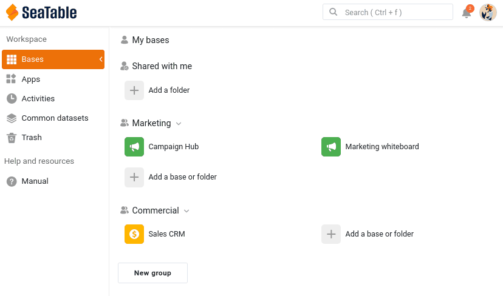

You have a base full of valuable data. Collaboration begins the moment someone else needs to work with it. In this step you bring in your colleague Thomas from Marketing and decide, deliberately, how much of your base he is allowed to see and change.

This is where your two windows come into play. You act as the owner of the base in your main window 🌐, and you check the result through Thomas's eyes in his private window 🕶. From here on, every instruction is tagged with the window it belongs to.

## Team membership is not the same as base access

In the introduction you added Thomas to your team. It is worth being clear about what that did and did not do. Being a team member means Thomas exists in your team — you can share bases with him, @mention him, and add him to groups. It does **not** give him access to any of your bases. Each base is shared separately and on purpose, so nothing is exposed until you decide to share it.

So Thomas is in the team, but looking at his home page right now, your `Sales CRM` base is nowhere to be seen. Let's change that.

## Sharing your base with a colleague

Thomas needs to work in your base, so you will share it with him. Because Thomas is in Marketing and your base lives with Commercial, the right tool here is a direct **user share** — you hand access to one named person.

In your window 🌐, on the SeaTable home page, open the `Sales CRM` tile's menu and choose `Share`. Under `Share to user`, select Thomas, set the permission to `read and write`, and submit.

You can also open this dialog from inside the base, through the share icon  in the top-right base options.

Please note that you'll have to type the **whole user email address** for the system to find the corresponding user.

You can also share a base with a whole **group**, but only a group you are a member of — and then everyone in it sees the base. That makes group sharing the way to give the rest of *your own* Commercial team access, not a way to reach another department. To get data to a separate team like Marketing without adding yourself to their group, you use a common dataset — which is exactly what Step 5 is about.

Now switch to Thomas's window 🕶. The first thing he sees is the **notification bell**  at the top right of his home page showing a new alert: SeaTable has told him that a base was shared with him. Refresh the page and the `Sales CRM` base also appears in his workspace, in the ` Shared with me` section. Open it, and you can read and edit the data — Thomas is now collaborating on your base.

{{< warning headline="Two places notifications show up" text="The bell at the top right is the notification center, and you can open it both from the home page and from inside a base. Where a notification appears depends on what it is about. Account-wide events, like a base being shared with you, always land on the home page. Events that happen inside a base — comments, mentions, automations — show up in that base instead. That is why Thomas received this share notification on his home page, while the comment notifications you send in the next step will be waiting for him inside the base." />}}

## Choosing the right permission level

When you share a base, there is an important decision to make. SeaTable offers three ways to share a base, from the simplest to the most precise.

| Permission | What the colleague can do | When to use it |
|---|---|---|
| Read only | See every table, view and value, but change no data. They can still add comments and be @mentioned, so they can take part in the discussion — read-only locks the data, not the conversation. They can also make their own private copy of the base, which is not connected to yours. | The colleague only needs to consult the data, but can still discuss it. |
| Read and write | See and edit the whole base. They cannot rename the base, install plugins, or re-share it — those stay with the owner. | The colleague is a full working partner on all of the data. |
| Custom sharing | See and edit only the specific tables and views you pick, each set individually to read-write, read-only, or no access at all. | The colleague should work with part of the base but be kept out of the rest. |

For this course you chose `read and write`, so that Thomas can take a full part in the steps that follow — commenting, editing, and showing up in the activity log. It also means he can change your data, and even get something wrong, as you will see in Step 4. Keep that share in place.



## When a colleague should see only part of the base

Read and write gave Thomas the whole base — including the `Deals` table and the confidential ` Total Deal Value` and ` Weighted Value` figures you flagged in Step 1. For a close working partner that may be fine. But Thomas is in Marketing, and the sales pipeline is need-to-know. This is exactly what **Custom sharing** is for.

With a custom share you build one permission that bundles several tables and views, each with its own level. For Thomas you could, for example:

- give read-write access to the `Customers` table, so he can still work with the contact list.
- give no access at all to the `Deals` table, keeping the whole pipeline out of his hands.
- or, more finely, share only the ` Active Customers` view rather than ` All Customers`, so the confidential columns hidden in that view never reach him.

This is the precise tool for "work with these contacts, but the revenue figures are not yours to see."



Custom sharing is not the only way to narrow down what someone sees. You can also share an individual view on its own — directly with a team member or a group, or as a read-only **external link** for people who have no SeaTable account at all. Because a view already carries its own filter and hidden columns, sharing just the ` Active Customers` view hands over exactly that slice and nothing more. Like custom sharing, sharing a view is a Plus and Enterprise feature.

A different route avoids base sharing altogether: build an **app** on top of the base. In an app you design pages of several types, and table pages can use preset filters, sorting and hidden columns, so the people who use the app only ever see the slice you chose to expose — never the underlying base. This suits a wider audience of data consumers rather than collaborators working inside your team.

## Taking access away again

Sharing is not permanent. To stop sharing, open the share dialog again and remove Thomas — click the x next to his name (for a custom share, the same dialog lets you edit or delete the permission).

It is worth seeing this from the other side. While Thomas has the base open in his window 🕶, revoke his share from your window 🌐. Back in Thomas's window, refresh or click into the base, and SeaTable tells you the permission was denied — the access is gone the moment you remove it. This is the safety net behind sharing: access is something you grant and can withdraw at any time. For the rest of the course, share the base with Thomas again as `read and write` so he can keep working alongside you.

## Try it yourself

If you are on a Plus or Enterprise plan, go further than the whole-base share you just set up: build a custom share that gives Thomas the `Customers` table but no access to `Deals`, and confirm in his window 🕶 that `Deals` has vanished entirely. That is the precise table-level control the free plan does not offer — and the reason Step 5's common dataset exists as the free way to share only part of your data. Switch back to a plain read-write share afterwards, so Thomas keeps full access for the next steps.

Thomas can now see and edit your data. But editing in silence is a recipe for confusion — next you will learn how to discuss specific records in context.

## Help article with further information

- [Base and view shares at a glance]()
- [Set table permissions]()
- [Access to the notifications]()
- [Table pages in SeaTable apps]()
