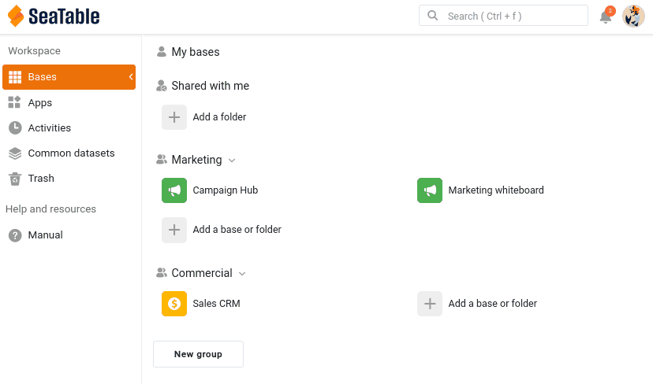

You have a base full of valuable data. Collaboration begins the moment someone else needs to work with it. In this step you bring in your colleague Malika from Marketing and decide, deliberately, how much of your base she is allowed to see and change.

## Bringing Malika into your team

Malika needs an account of her own in your team. In SeaTable, bringing someone into a team is called adding a team member: a team administrator invites the person by email, and once they accept, bases can be shared with them, they can be @mentioned, and they can be added to groups.

From your [team administration](https://account.seatable.com), invite a second email address — a free address from any provider is enough to stand in for your colleague — and accept the invitation from that address. When you set up the account, name it **Malika**, so that the names you later see in comments, @mentions and the activity log match the ones in this course.

One last thing while you are signed in as her: open her `Personal settings` and copy her account token. Then open the online courses plugin in your `Sales CRM` base, select **Step 2a**, and paste the token there. The plugin checks it and greets Malika by name and avatar, so you know you pasted hers and not your own. From now on, the plugin shows you what Malika sees, and later acts for her — you will not need to sign in as her again.



## Team membership is not the same as base access

You have just added Malika to your team. It is worth being clear about what that did and did not do. Being a team member means Malika exists in your team — you can share bases with her, @mention her, and add her to groups. It does **not** give her access to any of your bases. Each base is shared separately and on purpose, so nothing is exposed until you decide to share it.

Move on to **Step 2b** in the plugin: it shows Malika's home page as she sees it right now — and there is no `Sales CRM` anywhere. Let's change that.

## Sharing your base with a colleague

Malika needs to work in your base, so you will share it with her. Because Malika is in Marketing and your base belongs to Commercial, the right tool here is a direct **user share** — you hand access to one named person.

On the SeaTable home page, open the `Sales CRM` tile's menu and choose `Share`. Under `Share to user`, select Malika, set the permission to `Read-Write`, and submit.

You can also open this dialog from inside the base, through the share icon  in the top-right base options.

Please note that you'll have to type either the username or the **whole user email address** for the system to find the corresponding user.

You can also share a base with a whole **group**, but only a group you are a member of — and then everyone in it sees the base. That makes group sharing the way to give the rest of **your own** Commercial team access, not a way to reach another department. To get data to a separate team like Marketing without opening your whole base to them, you use a common dataset — which is exactly what Step 5 is about.

Now look at Malika's side: in the plugin, press `Refresh`, as she would reload her page. The **notification bell**  at the top right of her home page shows a new alert; open it, and it tells her that you shared a base with her. And `Sales CRM` now appears in her ` Shared with me` section, labeled with the group it belongs to, `Commercial`. Her home page does not say what she may do with it, so the plugin tells you: `Read-Write`. Malika is now collaborating on your base.

{{< warning headline="Where notifications show up" text="The bell at the top right is the notification center, and you can open it both from the home page and from inside a base. Where a notification appears depends on what it is about. Account-wide events, like a base being shared with you, are listed under General on the home page. Events that happen inside a base — comments, mentions, automations — show up in that base's own bell, and also under Bases in the home page's notification center. That is why Malika found this share under General, while the comment notifications you send in the next step reach her inside the base." />}}

## Choosing the right permission level

When you share a base, there is an important decision to make. SeaTable offers three ways to share a base, from the simplest to the most precise.

| Permission | What the colleague can do | When to use it |
|---|---|---|
| Read-Only | See every table, view and value, but change no data. They can still add comments and be @mentioned, so they can take part in the discussion — read-only locks the data, not the conversation. They can also make their own private copy of the base, which is not connected to yours. | The colleague only needs to consult the data, but can still discuss it. |
| Read-Write | See and edit the whole base. They cannot rename the base, install plugins, or re-share it — those stay with the owner. | The colleague is a full working partner on all of the data. |
| Custom sharing | See and edit only the specific tables and views you pick, each set individually to read-write, read-only, or no access at all. | The colleague should work with part of the base but be kept out of the rest. |

For this course you chose `Read-Write`, so that Malika can take a full part in the steps that follow — commenting, editing, and showing up in the activity log. It also means she can change your data, and even get something wrong, as you will see in Step 4. Keep that share in place.



## When a colleague should see only part of the base

Read-Write gave Malika the whole base — including the `Deals` table and the confidential ` Total Deal Value` and ` Weighted Value` figures you flagged in Step 1. For a close working partner that may be fine. But Malika is in Marketing, and the sales pipeline is need-to-know. This is exactly what **Custom sharing** is for.

With a custom share you build one permission that bundles several tables and views, each with its own level. For Malika you could, for example:

- give Read-Write access to the `Customers` table, so she can still work with the contact list.
- give no access at all to the `Deals` table, keeping the whole pipeline out of her hands.
- or, more finely, share only the ` Active customers` view rather than ` All customers`, so the confidential columns hidden in that view never reach her.

This is the precise tool for "work with these contacts, but the revenue figures are not yours to see."



Custom sharing is not the only way to narrow down what someone sees. You can also share an individual view on its own — directly with a team member or a group, or as a Read-Only **external link** for people who have no SeaTable account at all. Because a view already carries its own filter and hidden columns, sharing just the ` Active customers` view hands over exactly that slice and nothing more. Like custom sharing, sharing a view is a Plus and Enterprise feature.

A different route avoids base sharing altogether: build a **Universal App** on top of the base. In an app you design pages of several types, and table pages can use preset filters, sorting and hidden columns, so the people who use the app only ever see the slice you chose to expose — never the underlying base. This suits a wider audience of data consumers rather than collaborators working inside your team.

## Taking access away again

Sharing is not permanent. To stop sharing, open the share dialog again and remove Malika.

Then press `Refresh` in the plugin again: `Sales CRM` has gone from her `Shared with me` section, and the plugin can no longer act for her in this base — the access is gone the moment you remove it. This is the safety net behind sharing: access is something you grant and can withdraw at any time.

For the rest of the course, share the base with Malika again as `Read-Write`. She needs it to keep working alongside you — and so does the plugin, which can only act for her in a base she has access to.

Malika can now see and edit your data. But editing in silence is a recipe for confusion — next you will learn how to discuss specific records in context.

## Going further

Try one of the ways to show Malika only part of the base, and check the result from her side. For that you need a second window signed in as her: open a private (incognito) window in your browser and sign in there with her account. A private window keeps the two sessions apart, so you stay signed in as yourself in your usual window.

- **On a Plus or Enterprise plan**: build a custom share that gives Malika the `Customers` table but no access to `Deals`. In her window, open `Sales CRM` and confirm that `Deals` has vanished entirely. Switch back to a plain Read-Write share afterwards, so Malika keeps full access for the next steps.
- **On any plan, including the free one**: build a Universal App on `Sales CRM` with a single table page on `Customers`, and hide `Total Deal Value` and `Deals` in the page settings. Add Malika to the app with `Import User`, in its user and role management, then open the app in her window: she sees the customers, but not the figures you left out. Keep in mind that she can still open the base itself, since you shared it with her as Read-Write; the app shows what she would get if you gave her the app instead of the base.

## Help article with further information

- [Add a team member]()
- [Base and view shares at a glance]()
- [Set table permissions]()
- [Access to the notifications]()
- [Table pages in SeaTable apps]()
- [User and role management in an app]()
