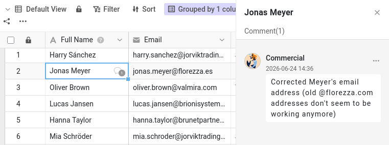

Malika can now read and edit your base. But data on its own rarely tells the whole story. "Why is this customer still a prospect?" "Can you double-check this phone number?" Those conversations used to happen by email or chat, far away from the data they are about — and a week later nobody can find them. SeaTable keeps the discussion exactly where it belongs: on the row itself.

In this step you will run a full collaboration loop on your own, playing both sides: ask a colleague for something on a record, hand it over, and watch them act on it. Because you drive both windows, you can follow the whole exchange end to end.

## Commenting on a record

Every row has its own comment thread. There are two ways to open its comments:

- Right-click the row and choose `Comment row`, or
- open the row's details (click the double-arrow icon  on its row number) and switch to the comments panel (you may need to toggle the display of the comments/logs panel using the  comment icon).

A comment column opens on the right.

In your window 🌐, open the `Customers` table and pick the customer `James Bennett` to talk about. Type a message — for example, asking a colleague to confirm `James Bennett`'s `Industry` — and click `Submit`. A small speech-bubble icon now appears in the first column of that row, so anyone scanning the table can see a conversation is in progress.

## A comment alone does not reach anyone

Note that a comment, on its own, reaches no one. Switch to Malika's window 🕶 and look at her notification bell. Nothing. The comment you just wrote is sitting on the row, perfectly visible if Malika happens to open it, but SeaTable did not tell her it exists.

A comment is a note left on the data. By itself it notifies no one. To actually pull a colleague's attention to it, you have to mention them by name.

## @mentioning a colleague

Back in your window 🌐, write a second comment on the same row, and this time mention Malika directly: type  followed by her name, `Malika`, and pick her from the list that appears. (You can also use the plus icon above the comment field to add her.) Phrase it as a real request — for instance, asking her to update `James Bennett`'s `Industry` and let you know when it is done. Submit the comment.



## The other side of the conversation

Now switch to Malika's window 🕶. This time her notification bell shows a new alert — and because this one comes from inside the base, it is waiting for her there, not on the home page where her share notification appeared in Step 2. Open it, and you land straight on your comment and the row it belongs to. The mention is what made the difference: an @mention sends a notification, a plain comment does not.

Now act on the request. Because Malika has read-write access, you can update `James Bennett`'s `Industry` right there, then reply in the same thread to say it is done. The whole discussion stays attached to the record — the question, the change, and the confirmation, all in one place.

{{< warning headline="Some data describes the company, not the contact" text="Industry describes the company, Indelo, rather than James Bennett himself — yet here it sits on each customer row. Indelo has another contact in this base, Lena de Vries, so correcting Indelo's industry on one row means you should correct it on the others too. A quick filter on the Company column (filtering rule: `Company` is Indelo) finds them all before you edit. A cleaner design would store each company once in its own table and link the customers to it, so a company's details live in a single place — more powerful, but more complex, which is why this course keeps everything in one table." />}}

## Closing the loop

When a request has been dealt with, you don't delete the conversation — you mark it as resolved. Anyone with access can do this: open the comment's menu and choose to mark it resolved, and it turns green to show the matter is settled. The thread stays on the record as a history of what was discussed.

Switch back to your window 🌐 to see Malika's reply and the resolved marker. You have just run a complete loop — ask, notify, act, confirm, resolve — without ever leaving the data.



## Try it yourself

Test the rule that you can only mention collaborators: start a comment, type `@`, and look at who appears. Malika is there because you shared the base with her in Step 2 — but a teammate you have *not* shared this base with will not appear, however much they belong to your team. It is the quickest way to see why sharing had to come first.

You can now discuss any record with a colleague and be sure they hear about it. But conversations explain intentions — they do not, by themselves, record what actually changed in the data. For that, SeaTable keeps a complete history, which is the subject of the next step.

## Help article with further information

- [Comment on rows]()
- [Purpose of notifications in SeaTable]()
