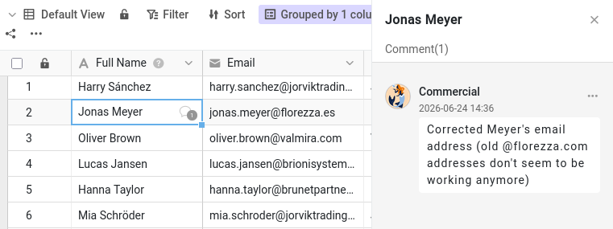

Malika can now read and edit your base. But data on its own rarely tells the whole story. "Why is this customer still a prospect?" "Can you double-check this phone number?" Those conversations used to happen by email or chat, far away from the data they are about — and a week later nobody can find them. SeaTable keeps the discussion exactly where it belongs: on the row itself.

In this step you run a full collaboration loop with Malika: you ask her for something on a record, she hears about it, acts on it and tells you it is done. The plugin shows you her side of the exchange, and acts for her when it is her turn.

## Commenting on a record

Every row has its own comment thread. There are two ways to open its comments:

- Right-click the row and choose `Comment row`, or
- open the row's details (click the double-arrow icon  on its row number) and switch to the comments panel (you may need to toggle the display of the comments/logs panel using the  comment icon).

A comment column opens on the right.

Open the `Customers` table and pick the customer `James Bennett` to talk about. Type a message — for example, asking a colleague to confirm `James Bennett`'s `Industry` — and click `Submit`. A small speech-bubble icon now appears in the first column of that row, so anyone scanning the table can see a conversation is in progress.

## A comment reaches only the conversation

Open the plugin at **Step 3a**: it shows Malika's window inside this base. Press `Refresh` and look at her notification bell. Nothing. The comment you just wrote is sitting on the row, perfectly visible if Malika happens to open it, but SeaTable did not tell her it exists.

That is because a comment notifies only the people taking part in that row's conversation. Writing a comment makes you one of them — and so far, you are the only one. To pull a colleague in, you have to add them to the conversation.

## Adding a colleague to the conversation

Back in the base, write a second comment on the same row, and this time mention Malika directly: type  followed by her name, `Malika`, and pick her from the list that appears. Phrase it as a real request — for instance, asking her to update `James Bennett`'s `Industry` and let you know when it is done. Submit the comment.

Mentioning her does more than catch her attention once: it adds her to the conversation on this row. The plus icon above the comment field does the same, without writing her name.



## The other side of the conversation

Press `Refresh` in the plugin again. This time her notification bell shows a new alert, naming the row your comment is on. Because this one comes from inside the base, it is waiting for her there — and on her home page it is listed under Bases, not under General with the share from Step 2.

Now write one more comment on the row, without mentioning her — a quick "Thanks in advance", say — and refresh again. She is notified once more. Malika is part of the conversation now, so every new comment on this row reaches her, whether it names her or not.

Now it is Malika's turn. Move on to **Step 3b** in the plugin and let her answer. Because she has read-write access, she updates `James Bennett`'s `Industry` from `Manufacturing` to `Technology`, then replies in the same thread to say it is done. While she is in the base, she also updates a few other customers of her own — you will come across those changes in Step 4. Her reply does not mention you, yet your own bell lights up, inside the base: you started this conversation, so you are part of it too. The whole discussion stays attached to the record — the question, the change, and the confirmation, all in one place.

{{< warning headline="Some data describes the company, not the contact" text="Industry describes the company, Indelo, rather than James Bennett himself — yet here it sits on each customer row. Indelo has another contact in this base, Lena de Vries, so correcting Indelo's industry on one row means you should correct it on the others too. A quick filter on the Company column (filtering rule: `Company` is Indelo) finds them all before you edit. A cleaner design would store each company once in its own table and link the customers to it, so a company's details are stored in a single place — more powerful, but more complex, which is why this course keeps everything in one table." />}}

## Closing the loop

When a request has been dealt with, you can delete the conversation — or, if you want to keep a trace of it, mark it as resolved. Anyone with access to the base can resolve a comment. Open the thread on `James Bennett` — from your bell, or from the row — and read Malika's reply. Then open your request's menu and choose to mark it resolved: it turns green to show the matter is settled. The thread stays on the record as a history of what was discussed.

You have just run a complete loop — ask, notify, act, confirm, resolve — without ever leaving the data.



You can now discuss any record with a colleague and be sure they hear about it. But conversations explain intentions — they do not, by themselves, record what actually changed in the data. For that, SeaTable keeps a complete history, which is the subject of the next step.

## Going further

Test the rule that you can only add collaborators: start a comment, type `@`, and look at who appears. Malika is there because you shared the base with her in Step 2. If your team has other members you have **not** shared this base with, you will see that they do not appear, however much they belong to your team. It is the quickest way to see why sharing had to come first.

You can also take someone out of a conversation. Open the plus icon above the comment field on `James Bennett` and uncheck Malika, then write another comment and press `Refresh` in the plugin's Step 3a: this time nothing reaches her. She can still read the thread whenever she opens the row; she is simply no longer told about new comments.

## Help article with further information

- [Comment on rows]()
- [Purpose of notifications in SeaTable]()
