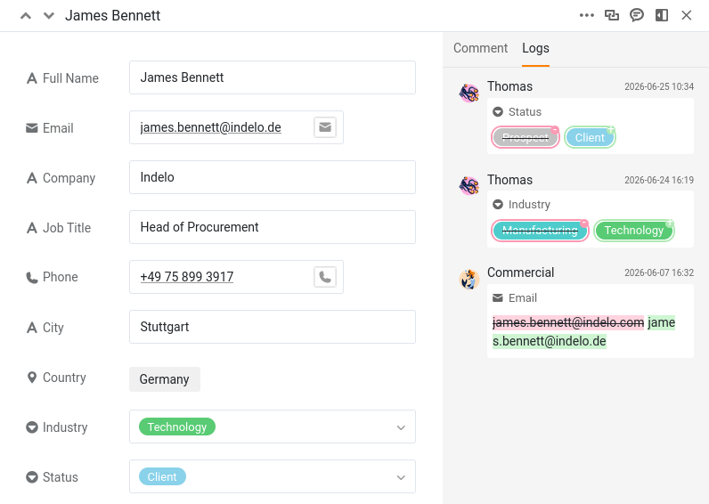
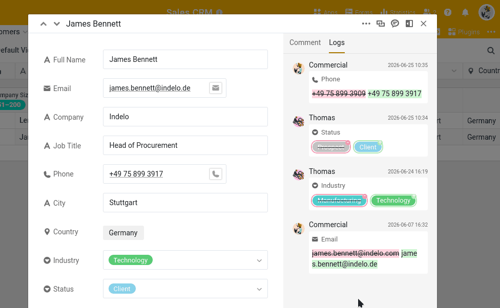

Once several people can edit the same base, a new question appears: who changed what, and when? And the follow-up: if a change was wrong, how do you undo exactly that change without disturbing everything else? SeaTable answers both. It quietly records every edit, and it lets you reverse a single one of them. In this step a colleague's change goes wrong, and you set it right.

You will work mostly in your window 🌐, but the history you read shows both of you, because you and Thomas have both been editing this base since Step 2.

## Where SeaTable keeps the history

SeaTable records changes in three places, each answering a different question.

- **The activity log** on the home page answers "what happened across all my bases lately?" It lists changes from you, your team members and automations, but only for the **last 7 days**.
- **The base log** answers "what happened in this base?" You open it from the versions icon in the base's top-right corner. It holds the most recent changes (up to the last 1,000 entries), newest first, and you can filter it by who made the change, which table, and when. This is the only one of the three from which you can **restore**.
- **The row log** answers "what happened to this one record?" You open a row's details and switch to its log. It is a focused, read-only timeline for that single row.

Each entry, wherever you read it, tells you the same essentials: who made the change, when, which column, and what changed.

## A colleague changes your data

Let's create the situation. Thomas had understood that the customer `James Bennett` just signed a contract. Because you gave him read-write access back in Step 2, he did not need to ask you — he marked it himself.

In Thomas's window 🕶, open `James Bennett` in the `Customers` table and change his `Status` from `Prospect` to `Client`.

Now switch back to your window 🌐 and open that row's log to see what happened: click the double-arrow icon  on its row number to open the row, then switch to the log. There it is — `Status` changed from `Prospect` to `Client`, stamped with Thomas's name and the time. Scroll a little and you will also see the `Industry` change Thomas made on this row back in Step 3. With two real accounts at work, the history names each of you correctly, so it is always clear who did what.



## A later, unrelated edit

While you have the record open, you notice that `James Bennett`'s `Phone` number is out of date. In your window 🌐, correct it — set it to `+49 75 899 3917`. This is a separate, deliberate change — and, importantly, it happens *after* Thomas changed the `Status`. Keep that order in mind; it matters in a moment.

## The mistake

The phone was easy. The `Status` is the real problem: `James Bennett` never signed, so it has to go back to its previous value.

You could just retype it. But was he a `Prospect` before, or a `Lead`? The change was Thomas's, not yours, so you may not even be sure what he overwrote — and re-keying a value you are not certain of is how small errors creep in. The history removes the doubt: it holds the exact value that was there before, and it can put it back for you.

## Restoring a single change

Open the **base log** from the versions icon in the top-right corner of the base. The list can be long, so narrow it down with the filters — filter by the `Customers` table, or by Thomas's name, until you find the entry where `James Bennett`'s `Status` changed from `Prospect` to `Client`.

Open that entry's menu and choose ` Restore`. SeaTable immediately sets the `Status` back to `Prospect` and confirms with a short message. Open `James Bennett` again to check: he is a `Prospect` once more.

## What Restore really does

Restore is not a time machine that rewinds the whole row to how it looked on a past date. It **undoes one specific change** — it reverts the value that entry altered, and leaves everything else exactly as it is.

This is easiest to see with the `Phone` number. You corrected it *after* Thomas changed the `Status`. A time-machine rollback to before the `Status` change would have wiped that later correction too — but it stays, because Restore only touches the one change you picked. The `Industry` value Thomas updated back in Step 3 stays as well; only the `Status` returns to its previous value. You reversed precisely the one mistake and nothing more. That precision is what makes restoring from the log safe to use on a live base that other people are working in.

{{< warning headline="Not everything can be restored" text="Restore works on changed values, and also on deleted rows, columns and tables. It does not work on everything, though: a newly inserted row or column cannot be undone from the log — it appears there, but its menu shows No Options instead of Restore. Comments are not covered at all, as they never appear in the history log in the first place. And note that restoring is itself a change: the entry you undid stays listed, and the restore adds a new event of its own to the log." />}}

For deeper recovery — rolling an entire base back to an earlier point, or recovering from a serious accident — SeaTable also offers snapshots and other tools, which are a topic of their own and will belong to a later course on maintenance.

## Try it yourself

Find the edge of what the log can undo: add a brand-new row to `Customers`, then open the base log, find that insertion, and open its menu. Instead of ` Restore` you will see `No Options` — new rows, new columns and comments cannot be rolled back from the log; only changed and deleted values can. Knowing where Restore stops is as useful as knowing what it does.

You can now trace and reverse changes with confidence. So far, though, everything has happened inside one base. The next step opens up the most powerful collaboration tool in the course: sharing live data with a whole other team.

## Help article with further information

- [History and logs]()
- [Options for data recovery]()
