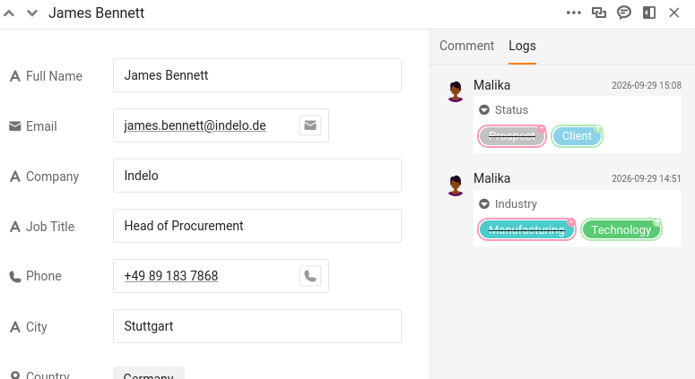

Once several people can edit the same base, a new question appears: who changed what, and when? And the follow-up: if a change was wrong, how do you undo exactly that change without disturbing everything else? SeaTable answers both. It quietly records every edit, and it lets you reverse a single one of them. In this step a colleague's change goes wrong, and you set it right.

The history you read shows both of you, because Malika has been editing this base too.

## Where SeaTable keeps the history

SeaTable records changes in three places, each answering a different question.

- **The activity log** on the home page answers "what happened across all my bases lately?" It lists changes from you, your team members and automations, but only for the **last 7 days**.
- **The base log** answers "what happened in this base?" You open it from the versions icon within the history dropdown in the base's top-right corner. It holds the most recent changes (up to the last 1,000 entries), newest first, and you can filter it by who made the change, which table, and when. This is the only one of the three from which you can **restore**.
- **The row log** answers "what happened to this one record?" You open a row's details and switch to its log. It is a focused, read-only timeline for that single row.

The three do not go into the same detail, and that difference shapes the rest of this step. The row log is the precise one: for each change it names the column and puts the value that was replaced next to the one that replaced it. The base log works at the level of the record — who changed which row, in which table, and when — but not which value changed, nor what it was before. So you read a change in the row log, and you undo it in the base log. This step uses both, in that order.

## A colleague changes your data

Let's create the situation. Malika had understood that the customer `James Bennett` just signed a contract. Because you gave her read-write access back in Step 2, she did not need to ask you — she marked it herself.

Open the plugin at **Step 4** and let Malika get to work: among a few other updates to your customers, she sets `James Bennett`'s `Status` from `Prospect` to `Client`.

Now open that row's log to see what happened: click the double-arrow icon  on its row number to open the row, then switch to the log. There it is — `Status` changed from `Prospect` to `Client`, stamped with Malika's name and the time. Note that time; you will need it shortly. Just below, you will also see the `Industry` change Malika made on this row back in Step 3. With two real accounts at work, the history names each of you correctly, so it is always clear who did what.



## A later, unrelated edit

While you have the record open, you notice that `James Bennett`'s `Phone` number is out of date. Correct it — set it to `+49 75 899 3917`. This is a separate, deliberate change — and, importantly, it happens **after** Malika changed the `Status`. Keep that order in mind; it matters in a moment. If you want to see this edit in the row log, reload the page first: a row log that is already open does not show a change you have just made.

## The mistake

The phone was easy. The `Status` is the real problem: `James Bennett` never signed, so it has to go back to its previous value.

The row log has already told you what that value was: `Prospect`. So you could retype it and be done. But retyping is not undoing — it is a second change stacked on the first, and it only works here because a single cell is at stake and you had the log open. Restore reverses the change itself, and it reaches where retyping cannot: a deleted row, a deleted column, a whole deleted table. Learn it on the easy case and it is there for you on the hard one.

## Restoring a single change

Open the **base log** from the versions icon within the history dropdown in the top-right corner of the base. It lists every change made in the base, newest first, so narrow it down with the filters along the top: the `Customers` table, and Malika as the creator.

What is left is a run of entries that all read much the same — `Malika modified table Customers`, then `Row … modified` — because the base log records which row changed, not which value changed in it. The row name narrows the search to `James Bennett`, but he appears more than once: Malika also changed his `Industry` in Step 3. This is where the time you noted earlier earns its keep: the entry stamped with the moment of the `Status` change is the one to act on.

Open that entry's menu and choose ` Restore`. SeaTable immediately sets the `Status` back to `Prospect` and confirms with a brief pop-up notification. Open `James Bennett` again to check: he is a `Prospect` once more.



## What Restore really does

Restore is not a time machine that rewinds the whole row to how it looked on a past date. It **undoes one specific change** — it reverts the value that entry altered, and leaves everything else exactly as it is.

This is easiest to see with the `Phone` number. You corrected it **after** Malika changed the `Status`. A time-machine rollback to before the `Status` change would have wiped that later correction too — but it stays, because Restore only touches the one change you picked. The `Industry` value Malika updated back in Step 3 stays as well; only the `Status` returns to its previous value. You reversed precisely the one mistake and nothing more. That precision is what makes restoring from the log safe to use on a live base that other people are working in.

{{< warning headline="Not everything can be restored" text="Restore works on changed values, and also on deleted rows, columns and tables. It does not work on everything, though: a newly inserted row or column cannot be undone from the log — it appears there, but its menu shows No Options instead of Restore. Comments are not covered at all, as they never appear in the history log in the first place. And note that restoring is itself a change: the entry you undid stays listed, and the restore adds a new event of its own to the log." />}}

For deeper recovery — rolling an entire base back to an earlier point, or recovering from a serious accident — SeaTable also offers snapshots and other tools, which are a topic of their own and will belong to a later course on maintenance.

You can now trace and reverse changes with confidence. So far, though, everything has happened inside one base. The next step opens up the most powerful collaboration tool in the course: sharing live data with a whole other team.

## Going further

Find the edge of what the log can undo: add a brand-new row to `Customers`, then open the base log, find that insertion, and open its menu. Instead of ` Restore` you will see `No Options` — new rows, new columns and comments cannot be rolled back from the log; only changed and deleted values can. Knowing where Restore stops is as useful as knowing what it does.

**Delete that test row afterwards**, so your customer list is back to the one the rest of the course expects: you will need it exactly as it was later on.

## Help article with further information

- [History and logs]()
- [Options for data recovery]()
