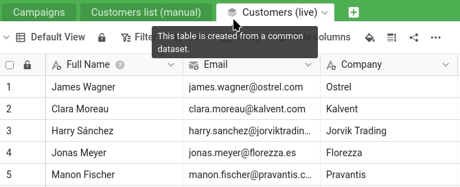

Many companies run into a problem like this one. Marketing needs the customer list too — but they are not allowed to touch the sales pipeline, and they certainly should not be editing your master. So at some point someone exported the customers into a separate Marketing copy. That copy was accurate for only a very short time. Ever since, it has been drifting: new customers missing, old segments wrong, etc.

Common datasets are a central feature for collaboration, because they solve exactly this problem. They let you share a live, always-up-to-date version of your data with another team, and let that team build on top of it — without giving them any access to your confidential figures, and without any risk of them changing your source data.

## Why not just make Thomas read-only?

After Step 4 you might draw a simple conclusion: if read-write let Thomas change your master by mistake, just switch him to read-only. That does keep your data safe — but it does not give Marketing what they need. A read-only colleague can look at your customers, but he cannot build anything on them: no campaign segment, no link, no column of his own. His only way to work with the data is to make his own copy of it — and a static copy is exactly the stale `Customer list (manual)` we are about to retire. Read-only would send Marketing straight back to where they started.

What Marketing needs is a third option: data that is as safe as a read-only share, but that they can build on like their own base. That is a common dataset. It gives Thomas a live copy of your customer list inside `Campaign Hub` — one he can extend with his own columns, link to his `Campaigns`, and refresh whenever he likes — while your master stays untouched and your confidential figures never leave. Safe and productive at once.

## Setting the scene: the Marketing base

First, give Thomas a base of his own to work in. In Thomas's window 🕶, download the following file and import it as a new base **into the `Marketing` group**, just as you imported `Sales CRM` into the `Commercial` group in Step 1:

[SeaTable Course 3 - Campaign Hub.dtable](/SeaTable-Course-3-Campaign-Hub.dtable)

`Campaign Hub` is Marketing's own small base. It has a `Campaigns` table and — the part that matters here — a table called `Customer list (manual)`. Open it and look closely: it holds about 150 customers where your master has 350, the newest customers are simply absent, the segment labels are out of date, and the "last updated" dates all go back a few years. This is the stale copy we are going to retire.

## Common datasets live in groups

A common dataset flows from one group to another — which is why you set the groups up back in the introduction. Your `Sales CRM` base lives in the `Commercial` group, and Thomas's `Campaign Hub` lives in the `Marketing` group that he belongs to. Publishing from `Commercial` and making the dataset available to `Marketing` is what connects the two.



## Publishing the dataset

Remember the two views from Step 1. ` All Customers` shows everything, including the confidential `Total Deal Value`; ` Active Customers` is the slimmed-down, safe-to-share view that hides the confidential figures. You will publish the safe one — and because a common dataset carries its view's filter and hidden columns with it, the confidential data never leaves your base.

In your window 🌐, open the `Active Customers` view of the `Customers` table — the safe one — and choose ` Publish as common dataset` from its menu. Give the dataset a clear name, for example `Customers (live)`, and confirm.

The dataset now exists, built from the safe view. Notice what you did and did not include: the current customers and the safe columns, and nothing of the pipeline or the revenue figures. So far, though, it lives only in your `Commercial` group — Marketing cannot see it yet.

## Granting access to the dataset to another group

To put your list in Marketing's hands, grant their group access. Unlike sharing a base, this happens from the home page: open the ` Common datasets` tab, find `Customers (live)`, and give the `Marketing` group access through its `Access permissions`. Your live customer list is now available to Marketing, while everything you left out stays in your base.

{{< warning headline="Sharing across groups needs membership" text="To share a common dataset with another group you must be a member of that group, not only the owner of the source base. Here you created the Marketing group yourself, so you already qualify and the share works straight away. One subtlety is worth knowing: it is the publisher who has to reach into the other group, while the subscriber does not — Thomas never needs access to your Commercial group to receive the data. In a real organisation, where the owner of the customer list is not part of Marketing, this cross-group sharing is usually set up by a team administrator, who belongs to every group and can connect the two without either department stepping into the other." />}}

## Subscribing from the other side

Switch to Thomas's window 🕶. In `Campaign Hub`, add a new table and choose ` Import common dataset`, then pick `Customers (live)`.

A new table appears, marked with a small stack icon to show it comes from a Common dataset. It contains all 350 current customers — the complete, up-to-date list — and only the safe columns. Next to the outdated `Customer list (manual)`, the difference is immediately clear.

Please note that every synced column is displayed with a ` sync` icon on top of its usual type icon.

## Making it Marketing's own

The synced table is not frozen — Thomas can build on it. Still in his window 🕶, add a column of your own to the synced table, for example a `Segment` column to tag customers for campaigns. This is Marketing's annotation, sitting alongside the synced data. Notice that your new column carries no ` sync` icon, unlike the synced columns beside it — that badge is exactly how you tell the two apart at a glance: synced columns come from the source and are refreshed on every sync, while un-badged columns are Marketing's own and stay put.

This is where the one-way nature of a Common dataset becomes something you can see. Switch back to your window 🌐 and look at the `Active Customers` view in your `Sales CRM` base (the source of the common dataset). Thomas's `Segment` column is not there. It never will be. The data flows in one direction only: from your source down to Marketing's copy. What Marketing adds on their side stays on their side.

## Bringing the old data across

The new `Segment` column starts empty — but Marketing's work on these customers was not nothing. The old `Customer list (manual)` held it: the segment for each customer, and an `Acquired via` campaign — the one that first brought them in. Add an `Acquired via` column to `Customers (live)` alongside `Segment`, then let SeaTable carry both across in a single step, matched by email.

In Thomas's window 🕶, create a `Compare and copy` operation from ` Data processing` in the `Customers (live)` table menu:

- from `Customer list (manual)` to `Customers (live)`,
- matching rows where `Email` equals `Email`,
- copying `Segment` to `Segment` and `Acquired via` to `Acquired via`.

Run it, and every customer that existed in the old list gets its segment and its acquisition campaign back on the live table — SeaTable recreates the labels as it copies. Customers who were not in the old list, the newer ones your master added, simply stay blank, ready to be filled in.



## Linking campaigns the right way

`Acquired via` is the best the old list could do: a single campaign name typed into a field. The flat manual copy was never connected to the real `Campaigns` records, so it could not say that a customer belongs to *several* campaigns, or follow a campaign to its customers. Rebuilding the table is the moment to fix that.

In `Campaign Hub`, add an ` Audience` link column on `Campaigns`, pointing to `Customers (live)`. From now on, when Marketing launches a campaign, they pick its target customers right there — a proper, many-to-many link, not a single label.



## Watching it stay in sync

Now the payoff. In your window 🌐, make a change to the source — edit a customer's value, or add a brand-new customer to the `Active Customers` view. Then, in Thomas's window 🕶, synchronise the dataset. Clicking ` Sync with dataset` in the `Customers (live)` table menu, you can either sync on demand or turn on periodic sync to let SeaTable sync automatically. (If you get an error because the last sync was too recent, you can still force the sync from your window 🌐, through the dataset's menu in the ` Common datasets` tab on the home page.)

Thomas's table updates to match yours — the edit appears, the new customer shows up. And the `Segment` column you added is untouched: the customers you already tagged keep their tags. The live data refreshes from your master; Marketing's own work on top of it is preserved.



## Retiring the stale copy

`Campaign Hub` now has a live, accurate customer list, with the old segments copied into it. The `Customer list (manual)` table has nothing left to offer. In Thomas's window 🕶, delete it. Nothing breaks, because that table was a standalone manual copy — nothing else in the base depended on it. Marketing has gone from a copy that was wrong the day after it was made to a list that is never out of date.



## Try it yourself

See the one-way rule bite: in Thomas's window 🕶, edit one of the *synced* cells in `Customers (live)` — change a customer's name, say. Then synchronise and watch your source value wipe his edit out, while his own `Segment` column stays untouched. That is the difference between borrowed data and your own, made visible: the synced columns are not Marketing's to change, but the columns they add are theirs to keep.

You have now distributed live data across teams while keeping your master private and authoritative — the heart of collaboration in SeaTable. One light, enjoyable tool remains before we wrap up.

## Help article with further information

- [How common datasets work]()
- [Data processing: Compare and copy]()
- [Export and import single-select options]()
