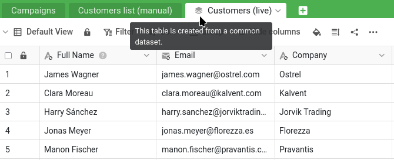

Many companies run into a problem like this one. Marketing needs the customer list too — but they are not allowed to touch the sales pipeline, and they certainly should not be editing your master. So at some point someone exported the customers into a separate Marketing copy. That copy was accurate for only a very short time. Ever since, it has been drifting: new customers missing, old segments wrong, etc.

Common datasets are a central feature for collaboration, because they solve exactly this problem. They let you share a live, always-up-to-date version of your data with another team, and let that team build on top of it — without giving them any access to your confidential figures, and without any risk of them changing your source data.

## Setting the scene: the Marketing base

First, Marketing needs a group and a base of its own. Create a group named `Marketing` — Malika's department — and add Malika to it as a member. Then download the following file and import it as a new base **into the `Marketing` group**, just as you imported `Sales CRM` into the `Commercial` group in Step 1:

[SeaTable Course 3 - Campaign Hub.dtable](/SeaTable-Course-3-Campaign-Hub.dtable)

You can do this because you created the group, which makes you its owner. Putting a base into a group is reserved to its owner and its administrators: a plain member can work in the bases that are already there, but cannot add one. In a real organization Malika would do it herself, as the administrator of her department's group; here you set up Marketing's side for her.

`Campaign Hub` is Marketing's own small base. It has a `Campaigns` table and — the part that matters here — a table called `Customers list (manual)`. Open it and look closely: it holds about 150 customers where your master has 350, the newest customers are simply absent, the segment labels are out of date, and the "last updated" dates all go back a few years. This is the stale copy we are going to retire. (Its plugin area also holds a whiteboard of Marketing's; leave it for now, it comes back in Step 6.)

## Why not just make Malika Read-Only?

After Step 4 you might draw a simple conclusion: if Read-Write let Malika change your master by mistake, just switch her to Read-Only. That does keep your data safe — but it does not give Marketing what they need. A Read-Only colleague can look at your customers, but she cannot build anything on them: no campaign segment, no link, no column of her own. Her only way to work with the data is to make her own copy of it — and a static copy is exactly the stale `Customers list (manual)` you have just looked at in `Campaign Hub`. Read-Only would send Marketing straight back to where they started.

What Marketing needs is a third option: data that is as safe as a Read-Only share, but that they can build on like their own base. That is a common dataset. It gives Malika a live copy of your customer list inside `Campaign Hub` — one she can extend with her own columns, link to her `Campaigns`, and refresh whenever she likes — while your master stays untouched and your confidential figures never leave. Safe and productive at once.

## Common datasets require groups

A common dataset flows from one group to another — which is why `Sales CRM` went into a group back in Step 1. Your `Sales CRM` base is in the `Commercial` group, and Marketing's `Campaign Hub` is in the `Marketing` group. Publishing from `Commercial` and making the dataset available to `Marketing` is what connects the two.



## Publishing the dataset

Remember the two views from Step 1. ` All customers` shows everything, including the confidential `Total Deal Value`; ` Active customers` is the slimmed-down, safe-to-share view that hides the confidential figures. You will publish the safe one — and because a common dataset carries its view's filter and hidden columns with it, the confidential data never leaves your base.

Open the `Active customers` view of the `Customers` table — the safe one — and choose ` Publish as common dataset` from its menu. Give the dataset a clear name, for example `Customers (live)`, and confirm.

The dataset now exists, built from the safe view. Notice what you did and did not include: the current customers and the safe columns, and nothing of the pipeline or the revenue figures. So far, though, it exists only in your `Commercial` group — Marketing cannot see it yet.

## Granting access to the dataset to another group

To put your list in Marketing's hands, grant their group access. Unlike sharing a base, this happens from the home page: open the ` Common datasets` tab, find `Customers (live)`, and give the `Marketing` group access through its `Access permissions`. Your live customer list is now available to Marketing, while everything you left out stays in your base.

{{< warning headline="Sharing across groups needs membership" text="To share a common dataset with another group you must be a member of that group, not only the owner of the source base. Here you created the Marketing group yourself, so you already qualify and the share works straight away. One subtlety is worth knowing: it is the publisher who has to reach into the other group, while the subscriber does not — Malika never needs access to your Commercial group to receive the data. In a real organization, where the owner of the customer list is not part of Marketing, this cross-group sharing is usually set up by a team administrator, who belongs to every group and can connect the two without either department stepping into the other." />}}

## Subscribing from the other side

Now take Marketing's side. From here on you work in `Campaign Hub`, doing what Malika would do for her team — as a member of the `Marketing` group, the base is open to you too. In `Campaign Hub`, add a new table and choose ` Import common dataset`, then pick `Customers (live)`.

A new table appears, marked with a small stack icon to show it comes from a Common dataset. It contains your current customers — the complete, up-to-date list, minus the churned ones the view filters out — and only the safe columns. Next to the outdated `Customers list (manual)`, the difference is immediately clear.

Please note that every synced column is displayed with a ` sync` icon on top of its usual type icon.

## Making it Marketing's own

The synced table is not frozen — Marketing can build on it. Add a column of your own to the synced table, for example a ` Segment` single-select column to tag customers for campaigns. This is Marketing's annotation, sitting alongside the synced data. Notice that your new column carries no ` sync` icon, unlike the synced columns beside it — that badge is exactly how you tell the two apart at a glance: synced columns come from the source and are refreshed on every sync, while un-badged columns are Marketing's own and stay put.

This is where the one-way nature of a Common dataset becomes something you can see. Go back to your `Sales CRM` base and look at the `Active customers` view (the source of the common dataset). Marketing's `Segment` column is not there. It never will be. The data flows in one direction only: from your source down to Marketing's copy. What Marketing adds on their side stays on their side.

## Bringing the old data across

The new `Segment` column starts empty — but Marketing's work on these customers was not nothing. The old `Customers list (manual)` held it: the segment for each customer, and an ` Acquired via` campaign — the one that first brought them in. Add an `Acquired via` single-select column to `Customers (live)` alongside `Segment`, then let SeaTable carry both across in a single step, matched by email.

Create a `Compare and copy` operation from ` Data processing` in the `Customers (live)` table menu:

- from `Customers list (manual)` to `Customers (live)`,
- matching rows where `Email` equals `Email`,
- copying `Segment` to `Segment` and `Acquired via` to `Acquired via`.

Run it, and every customer that existed in the old list gets its segment and its acquisition campaign back on the live table — SeaTable recreates the labels as it copies. Customers who were not in the old list, the newer ones your master added, simply stay blank, ready to be filled in.



## Watching it stay in sync

Now the payoff. In `Sales CRM`, make a change to the source — edit a value of a customer in the `Active customers` view, their job title for instance. Then, back in `Campaign Hub`, synchronize the dataset. Clicking ` Sync with dataset` in the `Customers (live)` table menu, you can either sync on demand or turn on periodic sync to let SeaTable sync automatically. (If you get an error because the last sync was too recent, you can still force the sync from the source side, through the dataset's menu in the ` Common datasets` tab on the home page.)

The synced table updates to match your source — the edit appears, just as a new customer added to the view would. And the `Segment` column Marketing added is untouched: the customers already tagged keep their tags. The live data refreshes from your master; Marketing's own work on top of it is preserved.



## Retiring the stale copy

`Campaign Hub` now has a live, accurate customer list, with the old segments copied into it. The `Customers list (manual)` table has nothing left to offer. Delete it. Nothing breaks, because that table was a standalone manual copy — nothing else in the base depended on it. Marketing has gone from a copy that was wrong the day after it was made to a list that is never out of date.



You have now distributed live data across teams while keeping your master private and authoritative — the heart of collaboration in SeaTable. One light, enjoyable tool remains before we wrap up.

## Going further

`Acquired via` is the best the old list could do: a single campaign name typed into a field. The flat manual copy was never connected to the real `Campaigns` records, so it could not say that a customer belongs to **several** campaigns, or follow a campaign to its customers. Rebuilding the table is the moment to fix that.

In `Campaign Hub`, add an ` Audience` link column on `Campaigns`, pointing to `Customers (live)`. From now on, when Marketing launches a campaign, they pick its target customers right there — a proper, many-to-many link, not a single label.



## Help article with further information

- [Create a new group]()
- [Add a team member to a group]()
- [How common datasets work]()
- [Data processing: Compare and copy]()
- [Export and import single-select options]()
