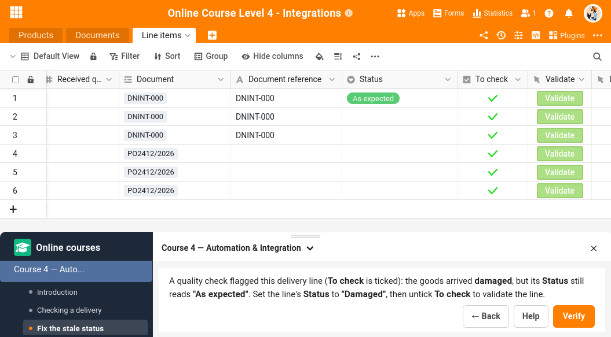

Bienvenue dans le cours en ligne SeaTable niveau 4 !

Dans les cours précédents, vous avez appris les bases (niveau 1), construit un processus métier complet (niveau 2) et travaillé à plusieurs sur des données partagées (niveau 3). Jusqu'ici, chaque action passait par vos mains : vous saisissiez, vous cliquiez, vous mettiez à jour. Ce cours change de registre : vous allez apprendre à faire travailler SeaTable à votre place, puis à le connecter au reste de vos outils. C'est tout le sujet de ce niveau — l'automatisation et l'intégration.

Pour rendre cela concret, vous tenez un entrepôt qui réceptionne les livraisons de ses fournisseurs. À chaque livraison, il faut vérifier ce qui arrive, le comparer à ce qui était annoncé, mettre le stock à jour et prévenir la bonne personne. Un enchaînement idéal pour découvrir, une brique après l'autre, tout ce que SeaTable sait automatiser et connecter.

## Est-ce que ce cours est fait pour moi ?

Ce cours est idéal pour vous si vous :

<!-- Le cours 3 est EN-only : lien direct vers son URL publiée (un relref casserait le build FR). À basculer en relref quand une version FR existera, ou dans la version .en.md. -->
- avez suivi les cours en ligne de [niveau 1](), [niveau 2]() et [niveau 3](/help/level-three-introduction) et souhaitez aller plus loin.
- passez trop de temps sur des tâches répétitives que SeaTable pourrait prendre en charge tout seul.
- voulez relier SeaTable à vos autres outils — un logiciel de gestion, un service de notification, un espace de stockage.
- n'avez pas peur d'un peu de code : quelques scripts Python apparaissent au fil du cours, mais ils vous sont toujours fournis.

## Qu'est-ce que je vais apprendre dans ce cours en ligne ?

Le fil rouge est une opération d'entrepôt : réceptionner une livraison fournisseur, la valider, mettre le stock à jour et être notifié. Vous partez d'une base qui contient déjà vos produits et une livraison à traiter, et vous l'outillez étape par étape.

Au fil du cours, vous apprendrez à :

- automatiser une action sans écrire la moindre ligne de code — un déclencheur, une condition, une action.
- écrire un court script Python pour ce que l'automatisation seule ne sait pas faire.
- appeler l'API de SeaTable, et laisser un outil extérieur y écrire à son tour.
- envoyer une notification vers l'extérieur à l'aide d'un webhook.
- orchestrer un petit workflow avec n8n pour archiver un document.
- laisser l'intelligence artificielle lire un bon de livraison et en extraire les lignes toute seule.

À la fin, vous disposerez d'une boîte à outils complète pour automatiser vos processus et les relier au monde extérieur.

## Un cours interactif

Comme les cours précédents, vous suivez celui-ci ici, sur le site. La nouveauté, c'est un compagnon : un plugin que vous ajoutez à votre base et vers lequel vous basculez à certains moments — pour découvrir une fonctionnalité, ou pour faire vérifier ce que vous venez de mettre en place. Vous montez une automatisation ou un script en suivant le cours, vous ouvrez le plugin, vous cliquez sur `Verify`, et il regarde si l'effet attendu est bien présent dans vos données.

Certaines étapes, en revanche, vous font sortir de SeaTable pour de bon — envoyer une vraie notification sur votre téléphone, archiver un vrai fichier dans un autre service. Pour celles-là, le plugin ne note rien : il vous dit simplement de déclencher l'action puis d'aller voir le résultat de l'autre côté. Cette vérification à la main fait partie de la leçon.

## Quelles sont les conditions préalables ?

Pour suivre ce cours avec succès, il vous faut :

1. **SeaTable**: n'importe quel système SeaTable convient. Le plus simple est un [compte SeaTable Cloud gratuit](). Tout ce que le cours utilise est disponible dans l'offre gratuite, aussi bien sur le cloud qu'en auto-hébergé.
2. **Le plugin du cours**: le plugin des cours en ligne, à ajouter à votre base. Nous expliquons comment l'installer juste avant la première étape. <!-- TODO: procédure / lien d'installation du plugin -->
3. **Un forum**: un [compte sur notre forum communautaire](https://forum.seatable.com/) si vous souhaitez obtenir un badge à la fin du cours.
4. **Facultatif, pour l'étape webhook**: vous enverrez une notification externe en utilisant [ntfy](https://ntfy.sh/). Vous n'avez pas besoin de compte et vous pouvez valider la réception dans votre navigateur, mais si vous souhaitez la recevoir sur votre téléphone, il vous faudra installer l'application ntfy depuis votre App store.
5. **Facultatif, pour l'étape n8n**: cette étape se suit très bien en simple démonstration, sans rien installer. Mais si vous voulez la réaliser vous-même, il vous faudra un compte [n8n](https://n8n.io/) et un compte [Seafile](https://www.seafile.com/en/home/) — deux services proposant un essai gratuit sans carte bancaire (Seafile est de la même famille que SeaTable). Rien à créer d'avance : vous ne les ouvrirez que si, arrivé là, vous décidez de mettre les mains dedans.
6. **Navigateur**: nous recommandons Google Chrome.
7. **Langue**: le cours est disponible en plusieurs langues, mais le quiz, les captures d'écran et les données d'exemple sont en anglais.

## Combien de temps dure le cours ?

Le cours dure **environ une heure et demie**, mais vous avancez à votre propre rythme. Des pauses sont possibles à tout moment, et c'est vous qui décidez jusqu'où pousser les sections « pour aller plus loin » disséminées le long du parcours.

## Comment terminer le cours ?

À la fin de ce cours, vous pourrez vérifier vos connaissances avec un quiz :

- Le [quiz](https://cloud.seatable.io/dtable/forms/custom/seatable-quiz-level-4) est en anglais et mêle des questions à choix multiples et des tâches portant sur la base que vous aurez outillée tout au long du cours. <!-- TODO: URL quiz Tally -->
- Si vous réussissez, vous recevez un badge pour votre profil sur le forum, qui rend vos compétences visibles. <!-- TODO: URL badge forum -->

Qu'est-ce qu'on attend ? C'est parti !
