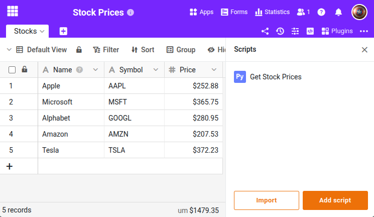

Este script obtém cotações de ações atuais da API Twelve Data e escreve os preços numa tabela SeaTable. Demonstra como chamar APIs externas a partir de um script Python do SeaTable. O script percorre todas as linhas e é adequado para execução manual ou como automação agendada.





## Pré-requisitos

- Uma chave API gratuita do [Twelve Data](https://twelvedata.com/)
- Uma tabela com as colunas `Symbol` (texto) e `Price` (número)

## O script

Introduza a sua chave API em `API_KEY`. O script verifica se uma chave válida está definida e interrompe imediatamente em caso de erro da API.

```python
from seatable_api import Base, context
import requests

base = Base(context.api_token, context.server_url)
base.auth()

TABLE_NAME = "Stocks"
API_KEY = "your-api-key"

if API_KEY == "your-api-key":
    print("ERROR: Please set your Twelve Data API key first.")
    print("Get a free key at https://twelvedata.com/")
else:
    rows = base.list_rows(TABLE_NAME)
    for row in rows:
        symbol = row.get('Symbol')
        if not symbol:
            continue

        url = f"https://api.twelvedata.com/price?symbol={symbol}&apikey={API_KEY}"
        response = requests.get(url)
        data = response.json()

        if 'price' in data:
            base.update_row(TABLE_NAME, row['_id'], {
                'Price': float(data['price'])
            })
            print(f"{symbol}: {data['price']}")
        else:
            print(f"API error: {data.get('message', 'unknown error')}")
            break

    print("---")
    print("Stock prices updated.")
```

Pode substituir a API do Twelve Data por qualquer outro fornecedor de dados financeiros. Adapte o URL e o processamento da resposta em conformidade.

Para a referência completa das funções, visite o [SeaTable Developer Manual](https://developer.seatable.com/python/objects/).
