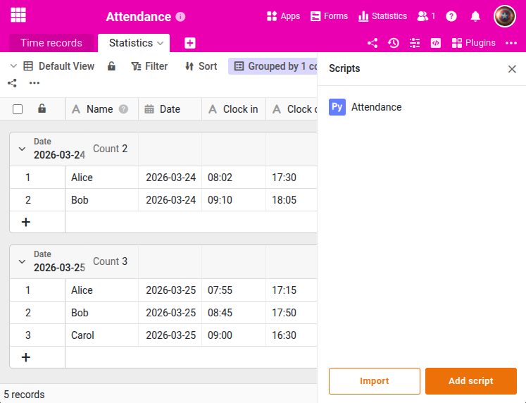

Dieses Skript verarbeitet Zeiterfassungsdaten und erstellt eine tägliche Anwesenheitsstatistik. Für jeden Mitarbeiter und Tag wird der früheste Eintrag (Kommen) und der späteste Eintrag (Gehen) ermittelt und in eine separate Statistik-Tabelle geschrieben. Die Statistik-Tabelle wird bei jeder Ausführung geleert und neu befüllt, sodass keine Duplikate entstehen. Das Skript eignet sich für die manuelle Ausführung oder als Automation.





## Voraussetzungen

Sie benötigen zwei Tabellen:

- **Time records**: Enthält die Spalten `Name` (Text), `Date` (Datum) und `Time` (Text) mit den Rohdaten der Zeiterfassung.
- **Statistics**: Enthält die Spalten `Name` (Text), `Date` (Datum), `Clock in` (Text) und `Clock out` (Text) für die Ergebnisse.

## Das Skript

Passen Sie die Tabellennamen am Anfang an Ihre Struktur an.

```python
from seatable_api import Base, context

base = Base(context.api_token, context.server_url)
base.auth()

TIME_RECORDS_TABLE = "Time records"
STATISTICS_TABLE = "Statistics"

# Clear statistics table to avoid duplicates on re-run
for row in base.list_rows(STATISTICS_TABLE):
    base.delete_row(STATISTICS_TABLE, row['_id'])

# Group time records by date and name
rows = base.list_rows(TIME_RECORDS_TABLE)
groups = {}
for row in rows:
    name = row.get('Name', '')
    date = row.get('Date', '')
    time = row.get('Time', '')
    if not name or not date or not time:
        continue
    key = f"{date}_{name}"
    if key not in groups:
        groups[key] = {'name': name, 'date': date, 'times': []}
    groups[key]['times'].append(time)

for key, group in groups.items():
    times = sorted(group['times'])
    clock_in = times[0]
    clock_out = times[-1]
    base.append_row(STATISTICS_TABLE, {
        'Name': group['name'],
        'Date': group['date'],
        'Clock in': clock_in,
        'Clock out': clock_out
    })
    print(f"{group['name']} ({group['date']}): {clock_in} - {clock_out}")

print(f"---\n{len(groups)} entries created.")
```

Die vollständige Funktionsreferenz finden Sie im [SeaTable Developer Manual](https://developer.seatable.com/python/objects/).
