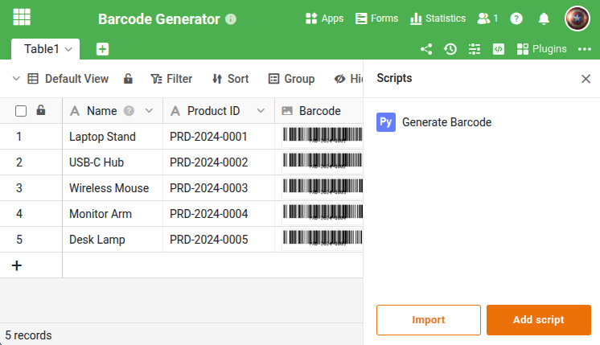

Este script convierte valores de texto (por ej. IDs de producto, números de serie) en imágenes de código de barras en formato Code 128 y las guarda como imágenes en SeaTable. El script recorre todas las filas y omite las que ya tienen un código de barras. Es adecuado para la ejecución manual o como automatización.





## Requisitos

La tabla necesita al menos dos columnas:

- Una **columna de texto** con el valor a codificar como código de barras (por ej. «Product ID»)
- Una **columna de imagen** donde se guardará el código de barras generado (por ej. «Barcode»)

## El script

Adapte las tres variables del inicio a la estructura de su tabla. Puede personalizar la apariencia del código de barras mediante las `options` (ancho, alto, tamaño de fuente, etc.).

```python
from seatable_api import Base, context
import barcode
from barcode.writer import ImageWriter
from io import BytesIO

base = Base(context.api_token, context.server_url)
base.auth()

TABLE_NAME = "Table1"
TEXT_COLUMN = "Product ID"
IMAGE_COLUMN = "Barcode"

rows = base.list_rows(TABLE_NAME)
for row in rows:
    text = row.get(TEXT_COLUMN)
    existing = row.get(IMAGE_COLUMN)
    if not text or existing:
        continue

    code128 = barcode.get_barcode_class('code128')
    rv = code128(str(text), writer=ImageWriter())

    buf = BytesIO()
    rv.write(buf, options={"module_width": 0.4, "module_height": 10, "quiet_zone": 1, "font_size": 10, "text_distance": 2})
    buf.seek(0)

    info = base.upload_bytes_file(str(text) + '.png', buf.read(), file_type='image')
    base.update_row(TABLE_NAME, row['_id'], {IMAGE_COLUMN: [info.get('url')]})

print("Barcodes generated.")
```

## Ejecución

El script se puede iniciar de tres formas:

- **Manualmente** en el editor Python de la base
- **Por automatización** (por ej. programada o al crear nuevas filas)
- **Por botón** — para ello el script debería adaptarse para procesar solo la fila actual

Más información [aquí]().

Para la referencia completa de funciones, visite el [SeaTable Developer Manual](https://developer.seatable.com/python/objects/).
