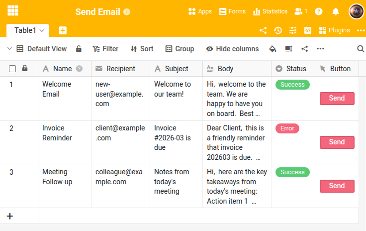

Dieses Skript versendet eine E-Mail per SMTP basierend auf den Daten der aktuellen Zeile. Es ist als **Button-Skript** konzipiert: Sie klicken auf einen Button in einer Zeile und das Skript liest Empfänger, Betreff und Text aus den entsprechenden Spalten. Der Sendestatus wird in einer Einfachauswahl-Spalte zurückgeschrieben.







Die meisten E-Mail-Anbieter blockieren den Zugriff durch Drittanwendungen standardmäßig. Sie müssen den SMTP-Zugang erst freischalten:

- **Gmail**: [App-Passwort erstellen](https://myaccount.google.com/apppasswords) (2FA muss aktiviert sein)
- **Microsoft 365 / Outlook**: App-Passwort in den Sicherheitseinstellungen erstellen
- **Andere Anbieter**: Prüfen Sie die Einstellungen unter "Sicherheit" oder "Drittanbieter-Apps"

Verwenden Sie immer ein App-Passwort, nicht Ihr normales Passwort.



## Voraussetzungen

Die Tabelle benötigt folgende Spalten:

- **Recipient** (E-Mail) — Empfängeradresse
- **Subject** (Text) — Betreff der E-Mail
- **Body** (Langtext) — Inhalt der E-Mail
- **Status** (Einfachauswahl) — wird vom Skript auf "Success" oder "Error" gesetzt

Außerdem muss eine **Button-Spalte** eingerichtet werden, die das Skript ausführt.

## Das Skript

Passen Sie die SMTP-Zugangsdaten und Spaltennamen an Ihre Konfiguration an. Das Skript nutzt `context.current_row`, um die Daten der Zeile zu lesen, in der der Button geklickt wurde.

```python
from seatable_api import Base, context
import smtplib
from email.mime.text import MIMEText
from email.mime.multipart import MIMEMultipart

base = Base(context.api_token, context.server_url)
base.auth()

# SMTP configuration
SMTP_SERVER = "smtp.example.com"
SMTP_PORT = 587
SMTP_USER = "your-email@example.com"
SMTP_PASSWORD = "your-app-password"

TABLE_NAME = "Table1"

# Read data from current row
row = context.current_row
if not row:
    print("ERROR: This script must be run via a button.")
else:
    recipient = row.get('Recipient', '')
    subject = row.get('Subject', '')
    body = row.get('Body', '')

    if not recipient:
        print("ERROR: No recipient specified.")
    elif not subject:
        print("ERROR: No subject specified.")
    else:
        msg = MIMEMultipart()
        msg['From'] = SMTP_USER
        msg['To'] = recipient
        msg['Subject'] = subject
        msg.attach(MIMEText(body or '', 'plain'))

        try:
            with smtplib.SMTP(SMTP_SERVER, SMTP_PORT) as server:
                server.starttls()
                server.login(SMTP_USER, SMTP_PASSWORD)
                server.send_message(msg)
            base.update_row(TABLE_NAME, row['_id'], {'Status': 'Success'})
            print(f"Email sent to {recipient}")
        except Exception as e:
            base.update_row(TABLE_NAME, row['_id'], {'Status': 'Error'})
            print(f"Failed: {e}")
```

## SMTP-Server

Gängige SMTP-Einstellungen:

| Anbieter | Server | Port |
|---|---|---|
| Gmail | smtp.gmail.com | 587 |
| Outlook / Microsoft 365 | smtp-mail.outlook.com | 587 |
| Eigener Server | Ihr SMTP-Server | 587 oder 465 |



Für HTML-E-Mails ersetzen Sie `'plain'` durch `'html'` im `MIMEText`-Aufruf.

Die vollständige Funktionsreferenz finden Sie im [SeaTable Developer Manual](https://developer.seatable.com/python/objects/).
