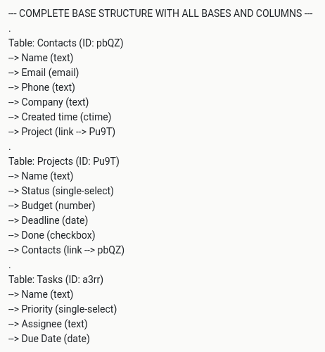

Dieser Artikel stellt Ihnen ein Python-Skript vor, welches die komplette Metastruktur einer Base ausgibt. Dies ist z. B. hilfreich, wenn Sie im [Community-Forum](https://forum.seatable.com/) eine Frage zu einer Base haben und die Struktur Ihrer Base ohne Screenshots einfach und schnell beschreiben wollen.





## Die Metastruktur einer Base

Die Metastruktur einer Base beschreibt die Tabellen, Spalten und Ansichten einer Base. Die Einträge und Datensätze in den Zeilen sind in der Metastruktur nicht enthalten. Die folgende JSON-Struktur beschreibt eine vergleichsweise simple Base mit nur einer Tabelle, zwei Spalten und einer Ansicht.

```json
{
    "metadata": {
        "tables": [
            {
                "_id": "0000",
                "name": "Table1",
                "columns": [
                    {
                        "key": "0000",
                        "name": "Name",
                        "type": "text",
                        "width": 200,
                        "editable": true,
                        "resizable": true
                    },
                    {
                        "key": "BydO",
                        "type": "date",
                        "name": "Date",
                        "editable": true,
                        "width": 200,
                        "resizable": true,
                        "draggable": true,
                        "data": {
                            "format": "YYYY-MM-DD"
                        },
                        "permission_type": "",
                        "permitted_users": []
                    }
                ],
                "views": [
                    {
                        "_id": "0000",
                        "name": "Default View",
                        "type": "table",
                        "is_locked": false,
                        "rows": [],
                        "formula_rows": {},
                        "summaries": [],
                        "filters": [],
                        "sorts": [],
                        "hidden_columns": [],
                        "groupbys": [],
                        "groups": []
                    }
                ]
            }
        ],
        "version": 482,
        "format_version": 7,
        "settings": {
            "securities": {
                "table_settings": {
                    "can_copy": false,
                    "can_export": false,
                    "can_print": false
                },
                "share_user_settings": {
                    "can_copy": false,
                    "can_export": false,
                    "can_print": false
                }
            }
        }
    }
}
```

Dieser Code ist natürlich unpraktisch, wenn Sie im Community-Forum um Hilfe bitten, deshalb soll die Struktur dieser Tabelle auf die folgenden Zeilen reduziert werden.

```bash
--- COMPLETE BASE STRUCTURE WITH ALL BASES AND COLUMNS ---
Table: Table1 (ID: 0000)
--> Name (text)
```

Wie das genau funktioniert, erfahren Sie in diesem Artikel.



## Der Python-Code zum Auslesen der Metastruktur

In SeaTable genügen nur wenige Zeilen Python-Code, um die Metastruktur einer Base zu bekommen. Konkret reichen wenige Zeilen für die Authentifizierung und eine Zeile für die Metastruktur.

```python
from seatable_api import Base, context
base = Base(context.api_token, context.server_url)
base.auth()
metadata = base.get_metadata()
print(metadata)
```

Das Ergebnis bzw. die Ausgabe der Metastruktur ist jedoch alles andere als anwenderfreundlich.

```python
{'tables': [{'_id': '0000', 'name': 'Table1', 'columns': [{'key': '0000', 'name': 'Name', 'type': 'text', 'width': 200, 'editable': True, 'resizable': True}], 'views': [{'_id': '0000', 'name': 'Default View', 'type': 'table', 'is_locked': False, 'rows': [], 'formula_rows': {}, 'summaries': [], 'filter_conjunction': 'And', 'filters': [], 'sorts': [], 'hidden_columns': [], 'groupbys': [], 'groups': []}]}], 'version': 13, 'format_version': 9, 'scripts': [{'name': 'Untitled', 'url': '/scripts/zkon.py', '_id': 'zkon', 'type': 'Python'}]}
```

## Die Metastruktur in eine andere Form bringen

In der Variable **metadata** ist nun die gesamte Metastruktur mit all ihren Elementen im JSON-Format gespeichert. SeaTable bzw. Python bieten selbstverständlich Möglichkeiten, um diese Strukturen zu durchlaufen und damit zu interagieren. Mit den folgenden Zeilen lässt sich die Metastruktur in die gewünschte Form bringen.

```python
print("--- COMPLETE BASE STRUCTURE WITH ALL BASES AND COLUMNS ---")
for table in metadata['tables']:
  print('.')
  print("Table: "+table['name']+" (ID: "+table['_id']+")")
  for column in table['columns']:
    print("  --> "+column['name']+" ("+column['type']+")")
```

Was passiert hier genau? Als Erstes weisen Sie Python an, sämtliche Tabellen mit einer **for**-Schleife zu durchlaufen. Als Nächstes geben Sie mit **print** den Namen der Tabelle und ihre ID aus. Hier sehen Sie auch, wie Sie mit den eckigen Klammern auf die einzelnen Elemente zugreifen können.

Das Gleiche wiederholen Sie für die Spalten. Durch die **for**-Schleife werden alle Spalten der jeweiligen Tabelle ausgegeben.



## Ergänzung von Verlinkungen

Jetzt sind Sie schon fast am Ziel. Man könnte die Metastruktur bereits so gut verwenden, aber eine Schwäche des bisherigen Skriptes ist, dass bei Verlinkungs-Spalten nicht ersichtlich wird, wohin diese genau verlinken. Deshalb ersetzen Sie die letzten beiden Spalten mit dem folgenden Code:

```python
  for column in table['columns']:
    link_target = ""
    if column['type'] == "link":
      link_target = " --> "+column['data']['other_table_id']
      if column['data']['other_table_id'] == table['_id']:
        link_target = " --> "+column['data']['table_id']
    print("  --> "+column['name']+" ("+column['type']+")")
```

## Das komplette Skript

Das vollständige Skript ist ohne Anpassungen unmittelbar in jeder SeaTable Base lauffähig. Es wird Ihnen gute Dienste erweisen, wenn Sie im Community-Forum die Struktur Ihrer Base beschreiben wollen.

```python
from seatable_api import Base, context
base = Base(context.api_token, context.server_url)
base.auth()

metadata = base.get_metadata()

print("--- COMPLETE BASE STRUCTURE WITH ALL BASES AND COLUMNS ---")
for table in metadata['tables']:
  print('.')
  print("Table: "+table['name']+" (ID: "+table['_id']+")")
  for column in table['columns']:
    link_target = ""
    if column['type'] == "link":
      link_target = " --> "+column['data']['other_table_id']
      if column['data']['other_table_id'] == table['_id']:
        link_target = " --> "+column['data']['table_id']
    print("  --> "+column['name']+" ("+column['type']+link_target+")")
```
