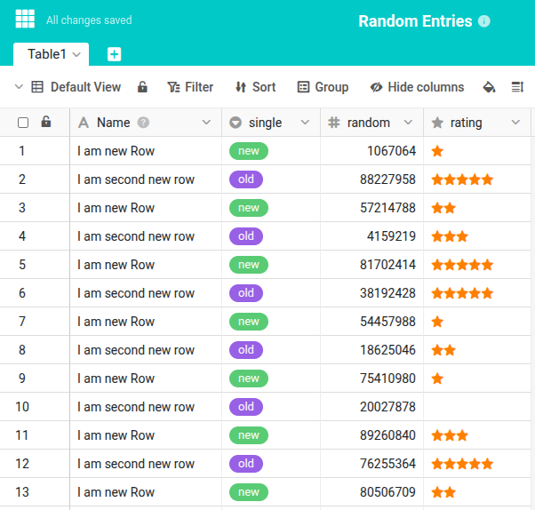

Sometimes you want to generate a few sample entries in a base. With this Python script you can generate from a few to many thousands of entries in no time.





This article will guide you through the different sections of the script so that you can understand how it works and customize it to your needs if necessary. You can find the full script at the end of this article.

## 1) Loading the modules

Every Python script starts with loading the Python modules used, where we will use _base_ and _context_ from the _seatable_api_ class. You only need the module _random_ in the second row if you want to generate random numbers.

```python
from seatable_api import Base, context
import random
```

## 2) Authentication

The next two rows are necessary to establish the connection to the current base. After this authentication we can either read, delete or manipulate information via the _base object_.

```python
base = Base(context.api_token, context.server_url)
base.auth()
```

## 3) Define new row contents

Now that we have access to the current table, we can define the records to create. The following code assumes that you have columns named _Name_, _single_, _random_, _rating_. If your columns are named differently, you will need to adjust the names accordingly.

```python
# define the data for two new rows
rows_data = [
  {
    'Name': "I am new Row",
    'single': "new",
    'random': random.randint(0,100000000),
    'rating': random.randint(0,5)
  },
  {
    'Name': "I am second new row",
    'single': "other value",
    'random': random.randint(0,100000000),
    'rating': random.randint(0,5)
  },
]
```

## 4) Write new rows

With the last code block the contents of the new rows were defined and stored in the variable _rows_data_, but not yet written to Base. We do this now with the following call.

```python
# append the two rows
  base.batch_append_rows(context.current_table, rows_data)
```

## 5) If you want more rows

Of course, you can also write more than two rows . You can do this either by simply defining more line contents or by using a loop to execute the write operation multiple times.

```python
# execute batch append 10 times
for i in range(10):

  # define the data for two new rows
  ...

  # append the two rows
  ...
```



## The complete script

The complete script should be ready to run immediately on your end without any major adjustments. Change the four column names and the script should be able to create new rows in your table.

```python
from seatable_api import Base, context
import random

base = Base(context.api_token, context.server_url)
base.auth()

# execute batch append multiple times
for i in range(10):

  # define the data for two new rows
  rows_data = [
    {
      'Name': "I am new Row",
      'single': "new",
      'random': random.randint(0,100000000),
      'rating': random.randint(0,5)
    },
    {
      'Name': "I am second new row",
      'single': "more than new",
      'random': random.randint(0,100000000),
      'rating': random.randint(0,5)
    },
  ]

  # append the two rows
  base.batch_append_rows(context.current_table, rows_data)
```

The script can be started manually as well as via a button or via automation. You can learn more about this [here]().
