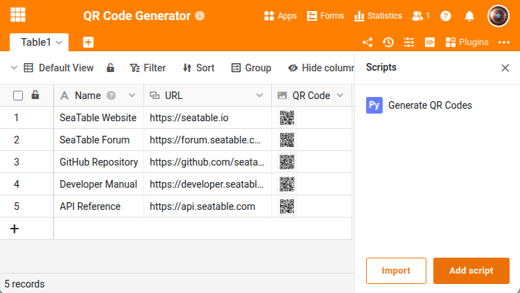

Ce script lit le contenu textuel (par ex. URLs, identifiants de produit) d'une colonne, génère des images de codes QR et les enregistre dans une colonne image. Le script parcourt toutes les lignes de la table et convient donc à une exécution manuelle ou comme automation — pas comme script de bouton.





## Prérequis

La table nécessite au moins deux colonnes :

- Une **colonne texte** ou **URL** avec le contenu à encoder en code QR.
- Une **colonne image** où le code QR généré sera enregistré.

## Le script

Adaptez les quatre variables au début à la structure de votre table. Le script ignore les lignes sans valeur textuelle ou qui contiennent déjà un code QR. Définissez `OVERWRITE = True` pour régénérer les codes QR existants.

```python
from seatable_api import Base, context
import qrcode
from io import BytesIO

base = Base(context.api_token, context.server_url)
base.auth()

TABLE_NAME = "Table1"
TEXT_COLUMN = "URL"
IMAGE_COLUMN = "QR Code"
OVERWRITE = False

rows = base.list_rows(TABLE_NAME)
for row in rows:
    text = row.get(TEXT_COLUMN)
    existing = row.get(IMAGE_COLUMN)
    if not text or (existing and not OVERWRITE):
        continue

    qr = qrcode.QRCode(version=2, error_correction=qrcode.constants.ERROR_CORRECT_M, box_size=10, border=4)
    qr.add_data(text)
    qr.make(fit=True)
    img = qr.make_image(fill_color="black", back_color="white")

    buf = BytesIO()
    img.save(buf, format='PNG')
    buf.seek(0)

    info = base.upload_bytes_file(str(text) + '.png', buf.read(), file_type='image')
    base.update_row(TABLE_NAME, row['_id'], {IMAGE_COLUMN: [info.get('url')]})

print("QR codes generated.")
```

## Exécution

Le script peut être lancé de trois manières :

- **Manuellement** dans l'éditeur Python de la base
- **Par automation** (par ex. planifiée ou lors de nouvelles lignes)
- **Par bouton** — pour cela, le script devrait être adapté pour ne traiter que la ligne actuelle

En savoir plus [ici]().

Pour la référence complète des fonctions, consultez le [SeaTable Developer Manual](https://developer.seatable.com/python/objects/).
