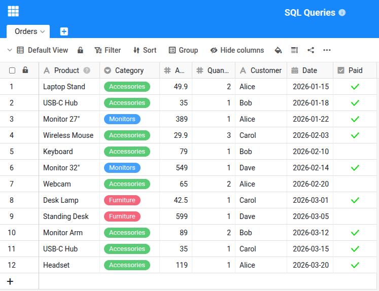
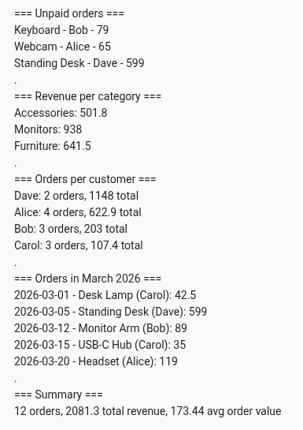

Этот скрипт показывает, как выполнять SQL-запросы в SeaTable с помощью `base.query()`. В отличие от `base.list_rows()`, SQL позволяет целенаправленно фильтровать, группировать и агрегировать данные без загрузки всех строк. Скрипт подходит для ручного выполнения или в качестве автоматизации.





## Преимущества SQL-запросов

| | `base.list_rows()` | `base.query()` |
|---|---|---|
| **Фильтрация** | Только через фильтры представления | Оператор WHERE |
| **Группировка** | Невозможно | GROUP BY |
| **Агрегация** | Невозможно | SUM, COUNT, AVG, MIN, MAX |
| **Стандартный лимит** | 100 строк | 100 строк |
| **Максимальный лимит** | 1 000 строк | 10 000 строк |

## Скрипт

Скрипт выполняет различные SQL-запросы к таблице заказов и выводит результаты. Адаптируйте `TABLE` к структуре вашей таблицы.

```python
from seatable_api import Base, context

base = Base(context.api_token, context.server_url)
base.auth()

TABLE = "Orders"

# 1. Filter: unpaid orders
print("=== Unpaid orders ===")
rows = base.query(f"SELECT Product, Customer, Amount FROM `{TABLE}` WHERE `Paid` = false")
for row in rows:
    print(f"  {row['Product']} - {row['Customer']} - {row['Amount']}")

# 2. Aggregate: total revenue per category
print(".")
print("=== Revenue per category ===")
rows = base.query(f"SELECT Category, SUM(Amount) AS total FROM `{TABLE}` GROUP BY Category")
for row in rows:
    print(f"  {row['Category']}: {row['total']}")

# 3. Aggregate: orders per customer
print(".")
print("=== Orders per customer ===")
rows = base.query(f"SELECT Customer, COUNT(*) AS orders, SUM(Amount) AS total FROM `{TABLE}` GROUP BY Customer ORDER BY total DESC")
for row in rows:
    print(f"  {row['Customer']}: {row['orders']} orders, {row['total']} total")

# 4. Filter with date range
print(".")
print("=== Orders in March 2026 ===")
rows = base.query(f"SELECT Product, Customer, Date, Amount FROM `{TABLE}` WHERE `Date` BETWEEN '2026-03-01' AND '2026-03-31'")
for row in rows:
    print(f"  {row['Date']} - {row['Product']} ({row['Customer']}): {row['Amount']}")

# 5. Summary
print(".")
print("=== Summary ===")
rows = base.query(f"SELECT COUNT(*) AS count, SUM(Amount) AS revenue, AVG(Amount) AS avg_order FROM `{TABLE}`")
r = rows[0]
print(f"  {r['count']} orders, {r['revenue']} total revenue, {r['avg_order']:.2f} avg order value")
```

## Пример вывода



## Синтаксис SQL в SeaTable

SeaTable поддерживает основные SQL-операции:

- **WHERE** — Фильтрация с `=`, `!=`, `LIKE`, `IN`, `BETWEEN`, `IS NULL`
- **GROUP BY** — Группировка с `SUM`, `COUNT`, `AVG`, `MIN`, `MAX`
- **ORDER BY** — Сортировка (ASC/DESC)
- **LIMIT / OFFSET** — Ограничение результатов (макс. 10 000)
- **DISTINCT** — Только уникальные значения

Полная справка по SQL находится в [SeaTable Developer Manual](https://developer.seatable.com/sql/select/).
