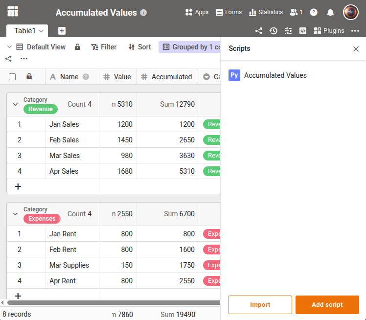

Dieses Skript berechnet kumulierte Werte (laufende Summen) über die Zeilen einer Tabelle. Für jede Zeile wird der aktuelle Wert zur Summe aller vorherigen Zeilen addiert und das Ergebnis in eine Spalte geschrieben. Bei gruppierten Ansichten wird die Akkumulation pro Gruppe separat berechnet. Zeilen ohne Gruppierungswert werden übersprungen. Das Skript durchläuft alle Zeilen und eignet sich für die manuelle Ausführung oder als Automation.





## Voraussetzungen

- Eine **Zahlen-Spalte** mit den Eingabewerten (z.B. "Value")
- Eine **Zahlen-Spalte** für die kumulierten Werte (z.B. "Accumulated")
- Optional: eine **gruppierte Ansicht**, damit die Akkumulation pro Gruppe neu startet

## Das Skript

Passen Sie die vier Variablen am Anfang an Ihre Tabelle an.

```python
from seatable_api import Base, context

base = Base(context.api_token, context.server_url)
base.auth()

TABLE_NAME = "Table1"
VIEW_NAME = "Default View"
COLUMN_CURRENT = "Value"
COLUMN_ACCUMULATED = "Accumulated"

# Look up view and table metadata
metadata = base.get_metadata()
table = None
view = None
for t in metadata['tables']:
    if t['name'] == TABLE_NAME:
        table = t
        for v in t['views']:
            if v['name'] == VIEW_NAME:
                view = v
                break
        break

if not table:
    print(f"Table '{TABLE_NAME}' not found.")
elif not view:
    print(f"View '{VIEW_NAME}' not found.")
else:
    rows = base.list_rows(TABLE_NAME, view_name=VIEW_NAME)

    # Build a mapping from column key to column name
    col_key_to_name = {col['key']: col['name'] for col in table['columns']}
    updated = 0

    if view.get('groupbys') and len(view['groupbys']) > 0:
        # Grouped view: reset accumulated value per group
        group_col_key = view['groupbys'][0]['column_key']
        group_col_name = col_key_to_name.get(group_col_key, '')
        groups = {}
        for row in rows:
            group_val = row.get(group_col_name)
            if not group_val:
                continue
            group_val = str(group_val)
            if group_val not in groups:
                groups[group_val] = []
            groups[group_val].append(row)
        for group_val, group_rows in groups.items():
            accumulated = 0
            for row in group_rows:
                value = row.get(COLUMN_CURRENT, 0) or 0
                accumulated += value
                base.update_row(TABLE_NAME, row['_id'], {COLUMN_ACCUMULATED: accumulated})
                updated += 1
    else:
        # Non-grouped view
        accumulated = 0
        for row in rows:
            value = row.get(COLUMN_CURRENT, 0) or 0
            accumulated += value
            base.update_row(TABLE_NAME, row['_id'], {COLUMN_ACCUMULATED: accumulated})
            updated += 1

    print(f"{updated} rows updated.")
```

Die vollständige Funktionsreferenz finden Sie im [SeaTable Developer Manual](https://developer.seatable.com/python/objects/).
