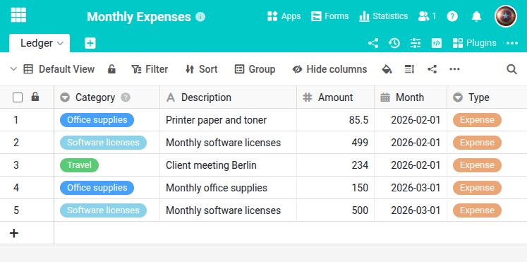

Этот скрипт автоматически создаёт повторяющиеся ежемесячные записи в таблице. Он проверяет с помощью SQL-запроса, существуют ли записи за текущий месяц, и создаёт только отсутствующие. Таким образом, вы можете настроить его как запланированную автоматизацию (например, 1-го числа каждого месяца) без создания дубликатов.





## Предварительные требования

Таблица должна содержать минимум следующие столбцы:

- **Category** (Одиночный выбор) — тип записи
- **Description** (Текст) — описание
- **Amount** (Число) — сумма
- **Month** (Дата) — расчётный месяц
- **Type** (Одиночный выбор) — например, Expense или Income

## Скрипт

Адаптируйте `TABLE_NAME` и записи в `ENTRIES` под структуру вашей таблицы. Значения для столбцов одиночного выбора автоматически создаются как новые варианты, если они ещё не существуют.

```python
from seatable_api import Base, context, dateutils
from datetime import datetime

base = Base(context.api_token, context.server_url)
base.auth()

TABLE_NAME = "Ledger"

today = datetime.today()
this_month = today.month
this_year = today.year
first_of_this_month = dateutils.date(this_year, this_month, 1)

# Define recurring monthly entries
ENTRIES = [
    {"Category": "Office supplies", "Description": "Monthly office supplies", "Amount": 150.00, "Type": "Expense"},
    {"Category": "Software licenses", "Description": "Monthly software licenses", "Amount": 500.00, "Type": "Expense"},
]

for entry in ENTRIES:
    rows = base.query(f"SELECT _id FROM `{TABLE_NAME}` WHERE `Month` = '{first_of_this_month}' AND `Category` = '{entry['Category']}'")
    if len(rows) == 0:
        entry['Month'] = first_of_this_month
        base.append_row(TABLE_NAME, entry)
        print(f"Added: {entry['Category']}")
    else:
        print(f"Skipped (already exists): {entry['Category']}")
```

Полный справочник функций доступен в [SeaTable Developer Manual](https://developer.seatable.com/python/objects/).
