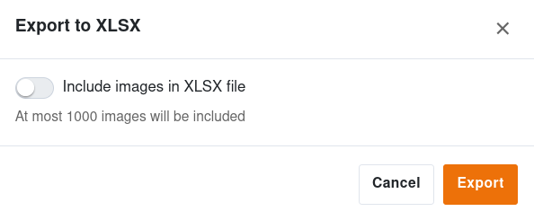
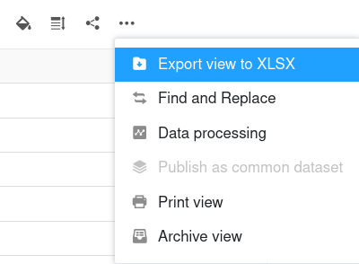

Las funciones de importación de SeaTable permiten cambiar de otras soluciones a SeaTable con poco esfuerzo. Lo mismo se aplica al cambio de un sistema SeaTable a otro, por ejemplo, al migrar de SeaTable Cloud a un sistema autoalojado. Puede seguir trabajando sin problemas en una base que haya importado de otra instancia de SeaTable.

El tema de este artículo es cómo exportar bases y tablas de SeaTable e importarlas a SeaTable.

## Exportar base

Puede exportar el estado actual de tus bases incluyendo todas las tablas, [vistas](), [formularios web]() y plugins. Los [comentários](), las [automatizaciones]() y el [historial de cambios](), así como [los datos del Big Data backend](), **no se exportan**.

SeaTable utiliza el [formato de archivo DTABLE]() para exportar bases. Para más información, consulte el artículo [Guardar una base como archivo]() DTABLE.

## Exportar tabla

Puede **exportar a archivos Excel tablas** individuales de cada base a la que tenga acceso. Los contenidos de las columnas basadas en texto y números se copian como valores en el archivo de destino. Los [comentários](), las [automatizaciones]() y el [historial de cambios]() **no se exportan**.

Inicie la exportación de una tabla desde Base. Haga clic en la flecha desplegable situada a la derecha del nombre de la tabla que desea exportar. A continuación, seleccione **Exportar tabla a un archivo XLSX**.

Decida si desea **incluir imágenes en el archivo de exportación** activando o no el interruptor. Confirme con **Exportar** para iniciar la descarga. Una vez finalizada la exportación, encontrará el archivo XLSX en la ubicación seleccionada de su dispositivo.

## Exportar vista

¿No desea exportar todos los datos de una tabla? ¡Entonces limite la [vista]() con **filtros** y **columnas ocultas**! Si desea exportar una vista de tabla, haga clic en los **tres puntos** en las opciones de vista situadas encima de la tabla y, a continuación, en **Exportar vista a un archivo XLSX**. 

Decida si desea **incluir imágenes en el archivo de exportación** activando o no el interruptor. 

En cuanto haga clic en **Exportar**, se iniciará la descarga. Después encontrará el archivo XLSX en la ubicación seleccionada de su dispositivo.

## Importar base

SeaTable admite la importación de bases desde su propio [formato DTABLE](), desde **archivos Excel** y desde el **formato** genérico **CSV**. Asimismo, puede importar bases de Airtable a SeaTable.

Al importar un archivo **DTABLE**, la base se restablece exactamente con el mismo aspecto que tenía en el momento de la exportación. Al importar un archivo CSV o Excel, los valores del archivo CSV/XLSX se copian en columnas de tabla de una nueva base, y SeaTable intenta interpretar los tipos de columna basándose en los datos.

Lo que hay que tener en cuenta al importar una base depende del tipo de archivo de importación. Sin embargo, el procedimiento es el mismo para todos los tipos de archivo: Vaya a la **página de inicio** y haga clic en **Añadir una base o carpeta** en el área o grupo donde desee tener la nueva base. Encontrará información más detallada en los siguientes artículos:

- [Creación de una base a partir de un archivo DTABLE]()
- [Importar archivos de Excel a SeaTable]()
- [Importación de datos mediante CSV en SeaTable]()
- [Migración de bases de Airtable a SeaTable]()

## Importar tabla

En las bases existentes, puede **rellenar tablas individuales mediante la importación de CSV o Excel**. Tiene las siguientes opciones: Puede importar los datos en una **tabla** existente

o importar los datos a una **nueva tabla**.

La importación se realiza como [archivo CSV]() o [archivo Excel]() en la tabla. Para más información, consulte los artículos enlazados.

Si ya ha creado una tabla en **SeaTable** y la necesita en **otra** base, puede simplemente copiarla. Puede averiguar cómo importar tablas de otra base [aquí]().



El backend normal de SeaTable puede contener un máximo de 100.000 filas por tabla. Si desea importar un archivo Excel o CSV que contenga más de 100.000 filas, primero debe [activar el backend de Big Data]() para poder importarlo.



## Otros artículos útiles sobre el tema de la importación de datos

- [Trucos y consejos para importar archivos CSV o XLSX]()
- [Limitaciones de la importación CSV/Excel]()
- [Importación de registros de datos CSV a una base existente]()
