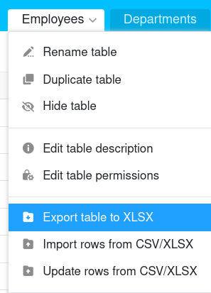
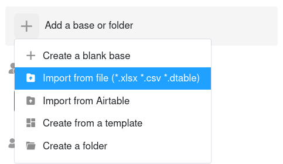
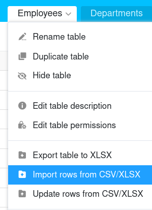

As funções de importação do SeaTable permitem passar de outras soluções para o SeaTable com pouco esforço. O mesmo se aplica à mudança de um sistema SeaTable para outro, por exemplo, ao migrar de um sistema SeaTable Cloud para um sistema auto-hospedado. Pode continuar a trabalhar sem problemas sobre uma base que tenha importado de outra instância SeaTable.

Como exportar bases e tabelas do SeaTable e importá-las para o SeaTable é o tema deste artigo.

## Exportar bases

Pode exportar o estado atual das suas bases, incluindo todas as tabelas, [vistas](), [formulários Web]() e plugins. Os [comentarios](), [automatizações]() e o [histórico de alterações](), bem como [os dados no backend de big data](), **não** são **exportados**.

SeaTable utiliza o [formato de ficheiro DTABLE]() para exportar bases. Para mais informações, ver o artigo [Salvando uma Base como um ficheiro DTABLE]().

## Exportar tabelas

Pode **exportar tabelas** individuais a partir de cada base a que tem acesso **para ficheiros Excel**. O conteúdo das colunas baseadas em texto e números são copiadas como valores para o ficheiro de destino. Os [comentarios](), [automatizações]() e o [histórico de alterações]() **não** são **exportados**.

Inicia-se a exportação de uma tabela a partir da Base. Clique na seta para a direita do nome da tabela a ser exportada. Agora seleccione **Exportar tabela para Excel** para iniciar o download. Quando a exportação estiver concluída, encontrará o ficheiro XLSX no local seleccionado no seu dispositivo.

## Importar bases

SeaTable suporta a importação de bases a partir do seu próprio [formato DTABLE](), de **ficheiros Excel** e do **formato** genérico **CSV**. Quando se importa um **ficheiro DTABLE**, a base é restaurada exactamente como se apresentava no momento da exportação. Ao importar um ficheiro CSV ou Excel, os valores do ficheiro CSV/XLSX são copiados para colunas de tabela de uma nova base, e o SeaTable tenta interpretar os tipos de colunas com base nos dados.

O que tem de considerar ao importar uma base depende do tipo de ficheiro de importação. Contudo, o procedimento é o mesmo para todos os tipos de ficheiro: Vá à página **inicial** e clique em **Adicionar uma base ou pasta** na área ou grupo onde pretende ter a nova base. Pode encontrar informações mais detalhadas nos artigos seguintes:

- [Criação de uma Base a partir de um ficheiro DTABLE]()
- [Importar ficheiros Excel para o SeaTable]()
- [Importação de dados usando CSV em SeaTable]()

## Importar tabelas

Nas bases existentes, pode **preencher tabelas** individuais **via CSV ou importação Excel**. Tem as seguintes opções: Pode importar os dados para uma **tabela existente**

ou importar os dados para uma **nova tabela**.

A importação tem lugar como [ficheiro CSV]() ou [ficheiro Excel]() na tabela. Para mais informações, ver os artigos ligados.

Se já tiver criado uma tabela no **SeaTable** e precisar dela **noutra base**, pode simplesmente copiá-la. Pode descobrir [aqui]() como importar tabelas de outra base.



O backend normal do SeaTable pode conter um máximo de 100.000 linhas por tabela. Se pretender importar um ficheiro Excel ou CSV que contenha mais de 100 000 linhas, tem de [ativar]() para o poder importar.



## Outros artigos úteis sobre o tema da importação de dados

- [Dicas e truques para a importação de ficheiros CSV ou XLSX]()
- [Limitações da importação de CSV/Excel]()
- [Importação de conjuntos de dados CSV para uma base existente]()
