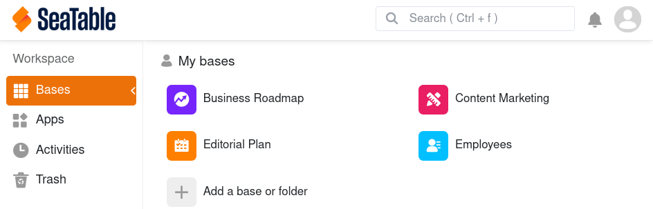
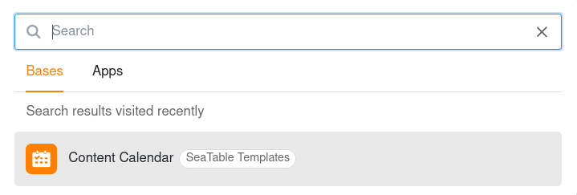

При большом количестве баз на Вашей стартовой странице может возникнуть путаница. Используйте практичную функцию поиска SeaTable, чтобы быстро найти базы.

- Откройте **стартовую страницу** SeaTable.
- Используйте **комбинацию клавиш**  +  или щелкните в **поле поиска** в правом верхнем углу.
- Выберите, что Вы хотите искать – **базы** или **приложения**.
- Теперь введите **часть названия** базы, которое Вы ищете, в поле поиска – и SeaTable предоставит Вам все подходящие **результаты поиска**.
- Щелкните по **названию** в списке результатов, чтобы открыть нужную базу.



Вы также увидите результаты последнего поиска в **истории поиска** и сможете обращаться к этим базам напрямую.

