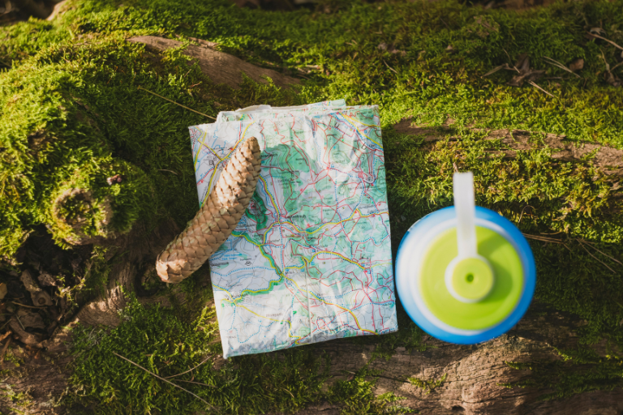
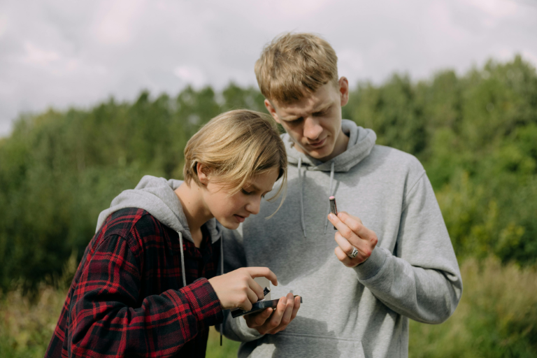

## Key Take-aways

- Geocaching ist eine moderne Schatzsuche, bei der Sie mithilfe von GPS-Koordinaten versteckte Cache-Behälter finden.
- In jedem Cache liegt meist ein Logbuch, in das Sie sich eintragen, und oft kleine Tauschgegenstände, sogenannte Trackables.
- Es gibt unterschiedliche Cache-Arten: Traditional Caches führen direkt zum Ziel, Multi-Caches bestehen aus mehreren Stationen, Mystery Caches beinhalten Rätsel, die vorab gelöst werden müssen.
- Auch Kindergeburtstage lassen sich mit Geocaching gestalten, indem Sie individuelle Routen, Rätsel und kleine Schätze einbauen.
- SeaTable ist ideal für die Planung eigener Geocaching-Routen. Sie können GPS-Koordinaten festhalten, Stationen planen, Rätsel dokumentieren, Aufgaben logisch verknüpfen, Hinweise hinterlegen, digitale Logbücher anlegen und Auswertungen erstellen.

## Geocaching – was ist das?

Geocaching ist ein Hobby, das Technik und Abenteuer auf eine besondere Art verbindet. Dabei **suchen Sie mithilfe von GPS-Koordinaten kleine Verstecke in Ihrer Umgebung**, die andere Menschen zuvor angelegt haben. Diese Verstecke nennt man Caches und sie enthalten meist ein Logbuch, manchmal aber auch kleine Tauschgegensände. 

Sie wählen einen Cache aus, lassen sich per Smartphone oder GPS-Gerät zum Ziel führen und beginnen vor Ort mit der eigentlichen Suche. Genau hier liegt der Reiz, denn Sie brauchen Aufmerksamkeit, Geduld und ein gutes Auge für Details, um die Dinge wahrzunehmen, die im Alltag oft übersehen werden.



Die Idee des Geocachings entstand um das Jahr 2000, als GPS für alle zugänglich wurde. Die Plattform Groundspeak brachte das Ganze ins Rollen und vernetzt bis heute Millionen von Geocachern weltweit.



## Welche Cache-Arten Sie erwarten

Mit der Zeit werden Ihnen beim Geocaching verschiedene Cache-Arten begegnen, die jeweils eigene Herausforderungen und Spielweisen bieten. Jede dieser Cache-Arten trägt auf ihre Weise dazu bei, dass Geocaching nie langweilig wird. Sie fordern unterschiedliche Fähigkeiten, bieten neue Herausforderungen und machen es möglich, Abenteuer in ganz unterschiedlicher Intensität zu erleben.



Der Traditional Cache ist die klassische Form: Die **GPS-Koordinaten führen Sie direkt zum Versteck** und der Reiz liegt in der Suche selbst. Sie müssen aufmerksam sein, die Umgebung genau beobachten und manchmal kleine Details erkennen, die das Logbuch oder die Tauschgegenstände verbergen.





Ein Multi-Cache geht einen Schritt weiter, denn er **besteht aus mehreren Stationen, die Sie nacheinander ablaufen**. Jede Station kann kleine Aufgaben, Hinweise oder Rätsel enthalten, die Sie lösen müssen, bevor Sie zum nächsten Punkt gelangen. Auf diese Weise entwickelt sich die Suche zu einer kleinen Reise, die Orientierungssinn, Geduld und Kreativität erfordert.





Mystery Caches stellen Ihre Kombinationsgabe und Ihren Spürsinn auf die Probe. Bevor Sie überhaupt losziehen können, müssen Sie zunächst **ein Rätsel lösen, um die richtigen GPS-Koordinaten zu erhalten**. Die Rätsel können logisch, mathematisch oder kreativ sein und machen das Spiel besonders spannend, weil schon der Startpunkt nicht sofort verraten wird.





Trackables schließlich bringen zusätzliche Dynamik ins Spiel. Dabei handelt es sich um **spezielle Gegenstände, die von Cache zu Cache reisen und eine eigene Mission erfüllen**, etwa ein bestimmtes Ziel erreichen oder an einem bestimmten Ort hinterlegt werden. Trackables verbinden Geocacher auf der ganzen Welt, sorgen für langfristige Abenteuer und zeigen, dass Geocaching nicht nur das Finden einzelner Caches ist, sondern ein global vernetztes Spiel voller Überraschungen.





Neben den gängigen Cache-Arten gibt es viele weitere Varianten, die das Geocaching abwechslungsreich gestalten. Event- und **CITO-Caches** bringen soziale oder ökologische Aspekte ins Spiel, **Virtual- und Wherigo-Caches** eröffnen interaktive Abenteuer, und **EarthCaches** vermitteln Wissen über die Natur.



## Geocaching kostenlos spielen: So fangen Sie an

Sie können Geocaching kostenlos spielen und sofort starten. Alles, was Sie brauchen, tragen Sie wahrscheinlich schon in Ihrer Tasche. Suchen Sie online nach den Koordinaten eines Geocaches, der sich in Ihrer Nähe befindet. Wählen Sie für den Anfang einfache Verstecke aus, damit Sie schnell erste Erfolgserlebnisse sammeln und ein Gefühl für das Spiel entwickeln. 

Ihr Smartphone übernimmt die Navigation, doch ein kleiner Stift gehört ebenfalls zur Grundausstattung, damit Sie sich nach dem Fund ins Logbuch eintragen können. Wenn Sie möchten, nehmen Sie zusätzlich kleine Gegenstände mit. Diese können Sie gegen andere tauschen und so das Erlebnis persönlicher gestalten. Je öfter Sie Geocaching spielen, desto besser verstehen Sie typische Verstecke und entwickeln Ihre eigene Strategie.

## Schritt-für-Schritt-Anleitung: Ihren ersten Geocache finden

Damit Ihre erste Geocache-Suche zu einem echten Erfolg wird, lohnt es sich, ein paar grundlegende Dinge zu wissen. Mit diesen einfachen Schritten und hilfreichen Tipps können Sie von Anfang an sicherstellen, dass Ihre Suche Spaß macht, reibungslos verläuft und Sie das Abenteuer in vollen Zügen genießen.

1.	Damit Ihr erster Fund gelingt, bereiten Sie sich bewusst vor. Suchen Sie sich einen **Cache mit niedriger Schwierigkeit** aus und lesen Sie die Beschreibung sorgfältig. Viele Hinweise verstecken sich genau dort. 
2.	Die GPS-Koordinaten führen Sie Schritt für Schritt zum Ziel. Kurz vor dem Zielpunkt sollten Sie langsamer werden und Ihre **Umgebung genau beobachten**. Die GPS-Genauigkeit schwankt manchmal leicht, deshalb lohnt sich ein genauer Blick. 
3.	Achten Sie auf **Orte, die ungewöhnlich wirken**. Heben Sie vorsichtig Steine an oder prüfen Sie kleine Verstecke an Bäumen und Geländern. Mit etwas Geduld entdecken Sie den Cache. 
4.	Sobald Sie den Cache-Behälter gefunden haben, öffnen Sie ihn vorsichtig und **tragen Ihren Namen in das Logbuch ein**. Dieser Moment gehört zu den schönsten beim Geocaching, denn Sie haben Ihr Ziel erreicht. 
5.	Achten Sie darauf, **alles wieder genauso zu hinterlassen, wie Sie es vorgefunden haben**. So ermöglichen Sie auch anderen ein gelungenes Erlebnis. Bleiben Sie dabei möglichst unauffällig, denn sogenannte Muggel sollen das Versteck nicht entdecken.



Ein Muggel ist jemand, der nichts von Geocaching weiß. Solche Personen könnten zufällig an einem Cache vorbeikommen oder ihn entdecken, ohne das Spiel zu verstehen. Damit Ihr Cache ungestört bleibt, sollten Sie Ihre Suche diskret gestalten. Beobachten Sie die Umgebung, wahren Sie Aufmerksamkeit und schützen Sie das Versteck, damit der Cache für andere Spieler erhalten bleibt.



## Was Sie beachten sollten, wenn Sie selbst Geocaches verstecken

Wenn Sie selbst Geocaches verstecken möchten, eröffnen Sie sich die Möglichkeit, anderen Spielern ein unvergessliches Abenteuer zu bereiten. Dabei sollten Sie einige wichtige Punkte beachten, um Sicherheit, Spaß und Fairness zu gewährleisten. Wählen Sie zunächst einen geeigneten Ort. Der Platz sollte spannend, aber gleichzeitig sicher zugänglich sein und die Umwelt nicht gefährden. Vermeiden Sie sensible Bereiche wie Naturschutzgebiete, Privatgrundstücke ohne Genehmigung oder Orte, an denen Menschen gefährdet werden könnten. 

Planen Sie außerdem die Art des Caches und das Versteck sorgfältig. Überlegen Sie dafür zum Beispiel, **wie groß der Behälter sein sollte**, **welche Hinweise Sie geben möchten** und **wie Sie Rätsel oder Aufgaben in die Suche integrieren** können. Achten Sie darauf, dass der Cache gut getarnt ist, aber dennoch für geübte Geocacher auffindbar bleibt. Ein weiterer wichtiger Aspekt ist die Wartung der Geocaches. Prüfen Sie regelmäßig, ob das Logbuch intakt ist, ob die Tauschgegenstände noch vollständig sind und ob der Cache an seinem Platz sicher bleibt. Nur so sorgen Sie dafür, dass Ihr Cache langfristig Freude bereitet und die Community ihn nutzen kann.

## Geocaching am Kindergeburtstag: Das ultimative Outdoor-Abenteuer

Wenn Sie einen besonderen Kindergeburtstag planen, bietet sich ein Geocaching Kindergeburtstag hervorragend an. Sie schaffen damit ein Erlebnis, das Kinder begeistert und gleichzeitig Bewegung an der frischen Luft ermöglicht. Sie können die Route individuell gestalten und an das Alter der Kinder anpassen. Bauen Sie eine kleine Geschichte ein, die die Suche begleitet. Kinder schlüpfen gerne in Rollen und tauchen tief in das Abenteuer ein. 

Testen Sie die Strecke vorab, damit am großen Tag alles reibungslos funktioniert. Achten Sie darauf, dass die Wege gut machbar bleiben und die Dauer zur Gruppe passt. Kleine Rätsel entlang der Strecke sorgen für zusätzliche Spannung. Am Ende wartet idealerweise ein Schatz, der für leuchtende Augen sorgt. Ein erfolgreicher Kindergeburtstag mit Geocaching lebt von genau diesem Moment, in dem die Gruppe gemeinsam ein Ziel erreicht. So fördern Sie ganz nebenbei **Teamarbeit und Kreativität**, während die Kinder **einander helfen und erleben, wie viel Spaß gemeinsames Entdecken macht**.

## Organisation mit System: Warum SeaTable das ideale Tool für Geocacher ist

Sobald Sie eine eigene Tour oder sogar einen Geocaching Kindergeburtstag planen, sammeln Sie viele Informationen gleichzeitig. Sie überlegen sich passende GPS-Koordinaten, entwickeln Stationen, denken sich Rätsel aus und legen fest, wo sich welcher Cache-Behälter befinden soll. Ohne ein gutes System verlieren Sie dabei schnell den Überblick.

Mit dem kostenlosen [Template]() von SeaTable planen Sie Ihre komplette Geocaching-Route Schritt für Schritt. Sie halten jede Station fest, notieren Hinweise und verknüpfen Aufgaben logisch miteinander. So entsteht aus einer ersten Idee nach und nach eine durchdachte Schatzsuche, die sich für Ihre Teilnehmer stimmig anfühlt. 



Gerade bei einem Kindergeburtstag Geocaching hilft Ihnen diese Struktur enorm. Sie passen Inhalte gezielt an das Alter der Kinder an und behalten gleichzeitig die gesamte Dramaturgie im Blick. Sie entscheiden bewusst, wann ein Rätsel etwas kniffliger sein darf und wann ein schneller Erfolg für Motivation sorgt. Dadurch gestalten Sie das Erlebnis aktiv und vermeiden typische Planungsfehler.

Über die praktische App greifen Ihre Teilnehmer direkt unterwegs auf GPS-Koordinaten, Hinweise und sogar ein digitales Logbuch zu. Sie müssen keine Zettel verteilen oder Informationen mehrfach erklären, sondern stellen alles zentral bereit. Das sorgt für einen reibungslosen Ablauf und lässt mehr Raum für das eigentliche Abenteuer.

Besonders spannend wird es nach dem Event. Mit den integrierten Auswertungsmöglichkeiten erkennen Sie schnell, wie gut Ihre Planung funktioniert hat. Sie vergleichen Ihre eigene Einschätzung zur Schwierigkeit oder zur Geländebeschaffenheit mit dem tatsächlichen Feedback Ihrer Teilnehmer. So lernen Sie aus jeder Tour dazu und entwickeln Ihre nächsten Geocaching-Erlebnisse gezielt weiter. [Registrieren]() Sie sich kostenlos, um sofort loszulegen.

## Profi-Tipps für Fortgeschrittene

Wenn Sie tiefer ins Geocaching einsteigen, erweitern Sie Ihre Möglichkeiten deutlich. Sie entdecken anspruchsvollere Caches, probieren neue Techniken aus und mit spezieller Ausrüstung erreichen Sie Orte, die anderen verborgen bleiben. UV-Lampen helfen Ihnen beispielsweise dabei, versteckte Hinweise sichtbar zu machen, und mit Magnet-Angeln holen Sie Caches aus ungewöhnlichen Verstecken. 

Vielleicht möchten Sie irgendwann selbst einen Cache verstecken. In diesem Fall **wählen Sie einen Ort, der spannend und sicher zugleich ist**. Holen Sie sich die nötigen Genehmigungen ein und achten Sie auf die Umgebung. Kümmern Sie sich regelmäßig um Ihren Cache, damit er in gutem Zustand bleibt und bei anderen für Freude sorgt. Auf diese Weise schaffen Sie Erlebnisse, die lange in Erinnerung bleiben.

## FAQ – häufige Fragen zum Geocaching



Geocaching ist eine moderne Form der Schatzsuche, die Sie mithilfe von GPS-Koordinaten zu versteckten Behältern führt, sogenannten Caches. Diese Caches enthalten oft ein Logbuch, in das Sie sich eintragen. Manchmal finden Sie auch kleine Tauschgegenstände, die Sie mitnehmen und gegen eigene Gegenstände eintauschen können.





Grundsätzlich können Sie Geocaching völlig kostenlos spielen. Viele Caches sind frei zugänglich und Sie benötigen lediglich ein Smartphone oder GPS-Gerät, um die Koordinaten zu verfolgen. Verschiedene Plattformen bieten zusätzlich Premium-Mitgliedschaften an, die erweiterte Funktionen, genauere Filter oder spezielle Statistiken enthalten. Diese sind jedoch optional und keinesfalls notwendig, um das Abenteuer zu erleben oder Ihren ersten Cache erfolgreich zu finden. 





Ein Muggel bezeichnet im Geocaching jemanden, der nichts von dem Spiel weiß. Diese Personen könnten zufällig an einem Versteck vorbeikommen oder es entdecken, ohne zu verstehen, was es ist. Damit Ihr Cache ungestört bleibt, sollten Sie darauf achten, die Suche unauffällig zu gestalten. Das bedeutet nicht, dass Sie sich verstecken müssen, sondern dass Sie die Umgebung im Blick behalten, Diskretion wahren und die Verstecke so handhaben, dass sie auch für andere Geocacher erhalten bleiben.





Caches dürfen Sie nicht an beliebigen Orten verstecken. Sie müssen immer die Sicherheit und die Rechte anderer beachten. Privatgrundstücke dürfen nur mit ausdrücklicher Genehmigung genutzt werden, und in Naturschutzgebieten oder auf geschützten Flächen gelten besondere Vorschriften. Außerdem sollten die Verstecke so platziert sein, dass sie weder die Umwelt schädigen noch Menschen gefährden.





Auch erfahrene Geocacher stoßen manchmal auf Caches, die sich nicht sofort entdecken lassen. Wenn Sie einen Cache nicht finden, lesen Sie zunächst die Beschreibung und Hinweise erneut sorgfältig. Prüfen Sie, ob die GPS-Koordinaten korrekt eingegeben wurden, und achten Sie auf typische Versteckstellen. Oft hilft es, Abstand zu gewinnen und später noch einmal zurückzukehren oder die Umgebung aus einem anderen Blickwinkel zu betrachten. Sie können auch die Logs anderer Geocacher einsehen, um Hinweise zu erhalten, ohne das Spiel zu spoilern. Geduld und Aufmerksamkeit sind die wichtigsten Werkzeuge, um auch schwierige Verstecke erfolgreich zu finden. 



