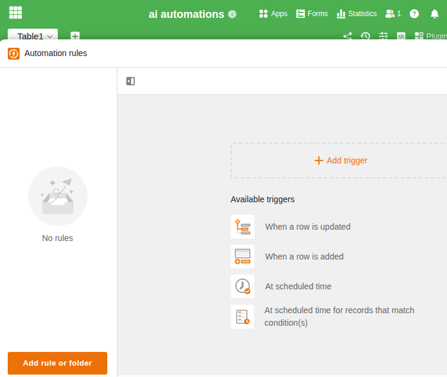
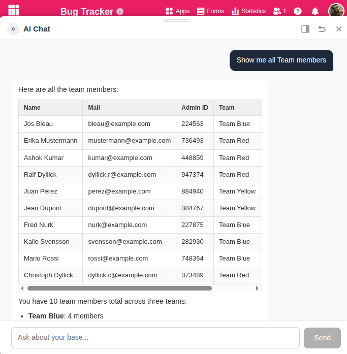
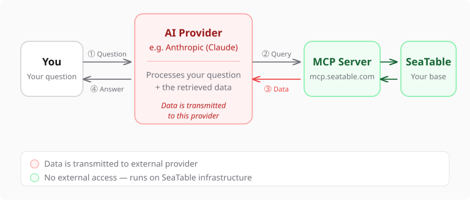

Imaginez : vous ouvrez votre base SeaTable contenant 2 000 entrées de projets. Mais au lieu de définir des filtres, de configurer des vues et d'écrire des formules, vous tapez simplement :

> « Quels projets sont en retard ? Regroupe-les par responsable. »

Et l'IA répond. Non pas avec une vague supposition, mais avec les véritables données de votre base. Le tout en quelques secondes. Ce n'est pas de la science-fiction. C'est possible dès maintenant grâce au nouveau plugin de chat IA dans SeaTable.

Mais reprenons depuis le début. Car l'IA dans SeaTable, c'est bien plus qu'un chatbot.

## Jusqu'ici : les automations IA, des assistants invisibles

Avec SeaTable 6.0, nous avons introduit les automations IA. Le principe : vous définissez une tâche, et l'IA l'exécute automatiquement en arrière-plan. Ligne par ligne, sans que vous ayez besoin d'attendre activement.

Quatre fonctions sont disponibles : **Summarize, OCR, Extract et Classify**. S'y ajoute une **Custom Function**, qui vous permet de définir vos propres prompts.

### Qu'est-ce que cela signifie concrètement ?

- **Traitement des factures :** les factures entrantes sont lues par OCR. Numéro de facture, date, montant et expéditeur sont automatiquement inscrits dans les bonnes colonnes, sans saisie manuelle.
- **Tickets de support :** les demandes entrantes sont analysées, catégorisées et attribuées à la bonne équipe. Avant même qu'un collaborateur ne voie la demande, elle est déjà triée.
- **Résumé de documents :** un rapport de 20 pages est condensé en quelques secondes à ses points essentiels.
- **Classification multilingue :** que ce soit en allemand, en anglais ou en français, l'IA reconnaît la langue et classe correctement le contenu.

### Où s'exécutent ces automations ?

Sur **notre propre serveur IA en Allemagne**, dans le centre de données de Hetzner. Nous exploitons notre propre modèle de langage, qui assure le traitement. Vos données ne quittent à aucun moment notre infrastructure européenne.

Pour les organisations qui accordent de l'importance à la conformité au RGPD et à la souveraineté des données (universités, instituts de recherche, secteur public), c'est un point décisif. Aucune donnée ne transite par OpenAI, Google ou d'autres fournisseurs américains.

Les clients Enterprise reçoivent des crédits IA inclus dans leur abonnement.

## Dès maintenant : le chatbot IA. Dialoguez avec vos données

Les automations sont performantes, mais elles fonctionnent selon des règles fixes : une ligne en entrée, un résultat en sortie. Mais que faire lorsque vous avez une question ouverte ? Lorsque vous ne savez pas quel filtre appliquer, ou lorsque vous avez besoin d'une analyse portant sur l'ensemble de vos données ?

C'est précisément à cela que répond le **plugin de chat IA** (bêta), disponible à partir de SeaTable 6.1.

### Comment cela fonctionne

Vous ouvrez le chat dans votre base et posez votre question en langage naturel. L'IA connaît la structure de votre base (tables, colonnes, liaisons) et interroge de manière ciblée les données pertinentes. Pas d'export, pas de copier-coller, pas besoin d'expliquer la structure de vos tables.

Quelques exemples :

- *« Combien de deals ouverts avons-nous au-delà de 10 000 euros, sans contact depuis 30 jours ? »*
- *« Résume les demandes de support de la semaine dernière et affiche les thèmes les plus fréquents. »*
- *« Crée pour chaque tâche en retard une entrée de suivi dans la table des activités. »*

Oui, le chatbot ne se contente pas de lire : il peut aussi **écrire** : créer des lignes, les mettre à jour, les relier et les supprimer. Le tout directement dans votre base.

### Comment est-ce possible ?

Derrière le chatbot se trouve le **SeaTable MCP Server**. MCP signifie Model Context Protocol, un standard ouvert qui permet aux modèles d'IA d'interagir activement avec des sources de données. Au lieu de copier vos données dans le chat, l'IA interroge de manière autonome via MCP ce dont elle a besoin. En direct, en temps réel, toujours à jour.

C'est ce qui distingue fondamentalement notre approche des solutions où vous exportez vos données en CSV pour les coller dans une fenêtre ChatGPT. Le chatbot travaille directement avec votre base, sans détour et sans perte d'information.

### Quels modèles sont pris en charge ?

Le chatbot utilise des modèles d'IA performants, capables de répondre à des questions complexes et de travailler avec vos données de manière multi-étapes. Nous prenons actuellement en charge :

- **Anthropic Claude** (Haiku et Sonnet)
- **OpenAI** (GPT-4o et GPT-4o mini)
- **Mistral** (Mistral Large et Mistral Small)

Vous apportez votre propre clé API et payez les coûts de tokens directement auprès du fournisseur concerné. C'est transparent : vous voyez exactement ce que chaque interaction coûte et gardez le contrôle total.

## Pourquoi deux voies plutôt qu'une ?

Une question légitime. Pourquoi ne pas tout faire passer par le chatbot ?

La réponse : parce que des tâches différentes ont des exigences différentes.

| | Automations IA | Chatbot IA |
|---|---|---|
| **Tâche** | Définie : OCR, résumé, classification | Ouverte : questions, analyses, recherche exploratoire |
| **Interaction** | En arrière-plan, automatique | Dialogue en temps réel |
| **Données** | Une ligne en entrée | La base entière comme fondement |
| **Modèle d'IA** | Notre serveur en Allemagne | Votre modèle (Claude, OpenAI ou Mistral) |
| **Souveraineté des données** | Maximale : les données restent sur notre infrastructure | Vous décidez : les données sont transmises au fournisseur d'IA choisi |
| **Coûts** | Inclus dans l'abonnement Enterprise | Coûts de tokens auprès du fournisseur d'IA |

Les deux voies sont complémentaires. Utilisez les automations pour les tâches récurrentes qui doivent s'exécuter de manière fiable en arrière-plan. Utilisez le chatbot lorsque vous avez des questions auxquelles un filtre ne peut pas répondre.

## Vos données restent sous votre contrôle

Quel que soit le chemin que vous choisissez : le contrôle et la sécurité sont la priorité.

**Avec les automations**, vos données ne quittent jamais notre infrastructure européenne. Le modèle de langage s'exécute sur notre propre serveur en Allemagne.

**Avec le chatbot**, les données sont transmises au fournisseur d'IA que vous avez choisi. C'est techniquement nécessaire pour que le modèle puisse répondre à vos questions. Mais c'est vous qui décidez du fournisseur.

Et ce n'est pas tout : le plugin de chat IA distingue automatiquement les opérations de lecture des actions destructrices telles que les suppressions ou les mises à jour. Avant toute modification de données, le plugin vous demande confirmation : il précise exactement ce qui sera modifié et combien de lignes sont concernées. Vous pouvez approuver ponctuellement, autoriser pour toute la session ou refuser. De même, pour des volumes de résultats particulièrement importants, une confirmation est demandée avant que l'IA ne traite des milliers de lignes.

## Comment démarrer

### Automations IA

Disponibles pour tous les clients Enterprise sur SeaTable Cloud et pour les auto-hébergeurs à partir de la version 6.0. Créez une nouvelle automation dans votre base, sélectionnez une fonction IA (Summarize, OCR, Extract, Classify ou Custom) et définissez les colonnes d'entrée et de sortie. L'automation s'exécutera désormais à chaque nouvelle entrée.

Avec SeaTable 6.1, nous mettrons les automations (et donc aussi les automations IA) à disposition en volume limité pour les clients Free et Plus.

Vous trouverez un guide détaillé dans notre [section d'aide]().

### Chatbot IA

À partir de SeaTable 6.1, vous pouvez installer le plugin de chat IA (bêta) dans votre base. Renseignez votre clé API (Claude, OpenAI ou Mistral) dans les paramètres du plugin. Posez votre première question. Le chatbot reconnaîtra automatiquement la structure de votre base et répondra à votre question.

## Perspectives

Nous travaillons en permanence à l'extension des fonctionnalités d'IA dans SeaTable :

- **Gestion améliorée des clés API :** actuellement, la clé API est stockée dans les paramètres du plugin. Pour une version future, nous travaillons sur une solution centralisée et plus sécurisée pour la gestion des clés API.
- **Suivi de l'utilisation de l'IA :** un aperçu transparent de votre consommation de tokens.
- **Assistant IA général :** un assistant qui vous permet de dialoguer avec plusieurs bases simultanément.

Les possibilités d'intégrer l'IA dans votre travail quotidien se développent rapidement. Avec SeaTable, vous disposez des outils pour en tirer profit, sans compromis sur le contrôle de vos données.


