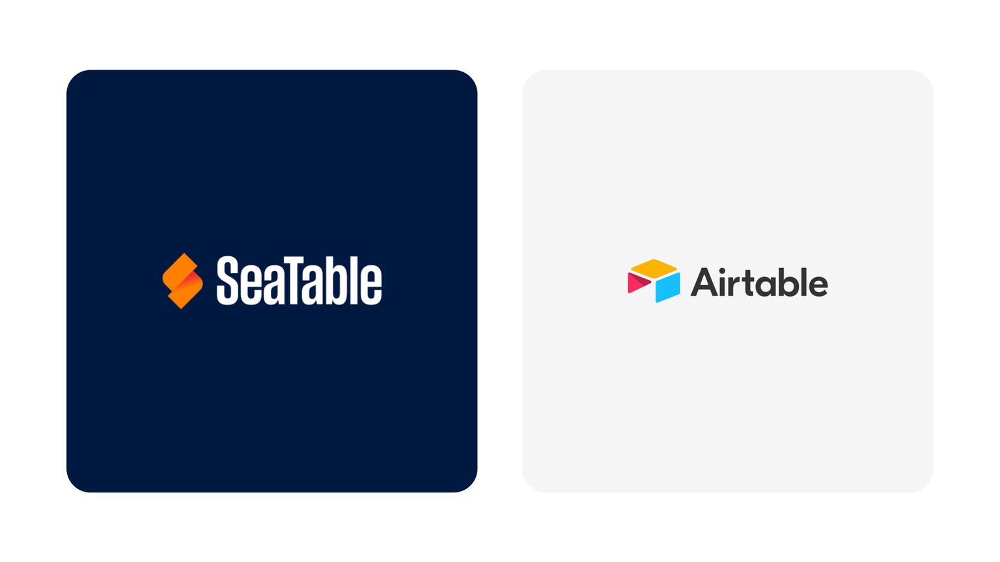

**Atualizado a 5 de outubro de 2026.** Verificámos pela última vez todos os preços e limites nos sites oficiais dos fornecedores a 5 de outubro de 2026.

> **Sobre esta comparação:** Somos o fabricante do SeaTable e conhecemos em primeira mão o mercado das bases de dados no-code. O nosso foco são equipas na Europa: alojamento, RGPD, self-hosting e custos. Segundo estes critérios, o SeaTable fica à frente. Onde outras ferramentas são melhores, dizemo-lo em cada secção.

## Em resumo

- **Melhor alternativa ao Airtable para empresas e entidades públicas com requisitos do RGPD:** SeaTable. Fornecedor sediado em Mainz, servidores na Alemanha, também pode ser executado nos seus próprios servidores.
- **Melhor alternativa open source para alojar por conta própria:** Baserow (licença MIT) ou Grist (Apache-2.0).
- **Melhor interface para uma base de dados SQL existente:** NocoDB.
- **Quando os documentos estão no centro:** Notion.
- **Se já utiliza o Microsoft 365 ou o Google Workspace:** Microsoft Lists ou Google Sheets com AppSheet, respetivamente.

## Porque é que tantas equipas procuram agora uma alternativa ao Airtable

**O Airtable tem um novo proprietário.** O grupo de software Bending Spoons concluiu a aquisição do Airtable a 4 de setembro de 2026, com um valor empresarial de cerca de 1,3 mil milhões de dólares norte-americanos ([comunicado de imprensa](https://investors.bendingspoons.com/newsroom/bending-spoons-completes-acquisition-of-airtable)). A Bending Spoons anuncia que vai investir fortemente no produto, no suporte e nas vendas. Até ao momento, não são conhecidas alterações concretas de preços ou planos. No entanto, após aquisições anteriores, como a do Evernote, a Bending Spoons reduziu pessoal e aumentou preços ([Reworked](https://www.reworked.co/digital-workplace/bending-spoons-acquires-airtable-for-1285b/)). Muitas equipas aproveitam esta ocasião para avaliar a sua dependência de um único fornecedor.

**O Airtable fica caro à medida que a equipa cresce.** O Airtable Team custa 20 dólares norte-americanos por utilizador e por mês com pagamento anual, o Airtable Business 45 dólares. No plano Team, uma base está limitada a 50.000 registos, no Business a 125.000. A API também é limitada: o plano Team inclui 100.000 chamadas à API por mês, o Free apenas 1.000. Quem liga o Airtable a outros sistemas através de n8n, Make ou Zapier depressa atinge este limite ([planos do Airtable](https://support.airtable.com/docs/airtable-plans)).

**O Airtable é um fornecedor norte-americano.** A empresa está sediada em São Francisco e está, por isso, sujeita ao US CLOUD Act. O armazenamento de dados na Europa só existe no plano mais elevado, Enterprise Scale, e mesmo aí os metadados, como nomes de bases, scripts e dados de utilizadores, permanecem nos EUA ([ajuda do Airtable](https://support.airtable.com/docs/european-data-residency-at-airtable)). Não encontrámos o Airtable na [lista oficial do EU-US Data Privacy Framework](https://www.dataprivacyframework.gov/list) (situação a 30.09.2026).

**O Airtable não pode ser alojado nos seus próprios servidores.** Quem tem de operar os seus dados em servidores próprios, por exemplo na administração pública, na investigação ou na saúde, não tem outra opção senão uma alternativa.

## As 8 alternativas ao Airtable em resumo

| Ferramenta | Ideal para | Gratuito na cloud | Preço a partir de (por utilizador/mês, anual) | Fornecedor e alojamento | Self-hosting | Importação do Airtable |
|---|---|---|---|---|---|---|
| **SeaTable** | Empresas e entidades públicas com requisitos do RGPD | sim, 10.000 linhas, 25 utilizadores | 7 € | Alemanha, servidores em Frankfurt e Munique | sim, Enterprise gratuito até 3 utilizadores | sim |
| **Baserow** | Open source para alojar por conta própria | sim, 3.000 linhas | 10 $ | Países Baixos, servidores na Alemanha | sim, sem limite de linhas, núcleo sob licença MIT | sim |
| **NocoDB** | Interface sobre bases de dados SQL existentes | sim, 1.000 registos | 12 $ | EUA, cloud na AWS | sim, sem limite de linhas, Sustainable Use License | sim |
| **Grist** | Tabelas com fórmulas em Python | sim, 5.000 registos por documento | 8 $ | EUA, cloud na AWS nos EUA | sim, sem limites de licença, Apache-2.0 | sim |
| **SmartSuite** | Muitos modelos setoriais, gestão de projetos | não, teste de 14 dias | 15 $ (mín. 3 utilizadores) | EUA, região UE disponível | não | sim |
| **Notion** | Documentos e bases de dados simples | sim, limitado | 9,50 € | EUA, região UE apenas no Enterprise | não | não, apenas CSV |
| **Microsoft Lists** | Organizações com Microsoft 365 | sim, para contas pessoais | incluído no Microsoft 365 (a partir de aprox. 6,07 €) | EUA, EU Data Boundary | apenas através do SharePoint Server | não, apenas Excel/CSV |
| **Google Sheets + AppSheet** | Organizações com Google Workspace | sim, AppSheet para protótipos | incluído no Google Workspace (a partir de 6,80 €) | EUA, região de dados UE a partir do Business Standard | não | não, apenas CSV |

## Como fizemos a comparação

Comparámos as oito ferramentas com base nas páginas oficiais de preços, na documentação e nos textos legais dos fornecedores (situação a 05.10.2026). Como fornecedor, conhecemos naturalmente melhor o SeaTable. Os nossos critérios:

1. **Modelo de dados:** ligações entre tabelas, vistas, fórmulas
2. **Limites e preço:** registos por base, armazenamento, preço para uma equipa de 10 utilizadores
3. **Fornecedor e alojamento:** sede, localização dos servidores, acordo de tratamento de dados, Data Privacy Framework
4. **Self-hosting:** possível ou não, sob que licença, com que custos
5. **Migração:** importação a partir do Airtable, o que é transferido e o que não é
6. **Automatizações, scripts e IA**

## 1. SeaTable – a alternativa ao Airtable com servidores na Alemanha

O SeaTable é uma base de dados no-code da SeaTable GmbH, sediada em Mainz, na Alemanha. Bases, tabelas, vistas e tipos de coluna funcionam como no Airtable, pelo que os utilizadores do Airtable se orientam de imediato. A cloud funciona em centros de dados na Alemanha e, se quiser, pode executar o SeaTable nos seus próprios servidores. Entre os utilizadores contam-se as Forças Armadas alemãs (Bundeswehr), a Universidade Humboldt de Berlim, a Sociedade Max Planck e a agência francesa de avaliação Hcéres.

**Ideal para:** empresas, universidades e entidades públicas que procuram uma base de dados como o Airtable, mas que têm de manter os seus dados na Alemanha ou em servidores próprios.

**Onde o SeaTable supera o Airtable:**
- Fornecedor sediado na Alemanha. O SeaTable Cloud funciona na Exoscale em Frankfurt am Main e Munique (ISO 27001). Está disponível um [acordo de tratamento de dados]() para todos os clientes.
- Três modalidades de operação: SeaTable Cloud, um [sistema dedicado]() ou o [SeaTable Server]() na sua própria infraestrutura. Em self-hosting, a Enterprise Edition é gratuita para até 3 utilizadores.
- Mais barato: o SeaTable Enterprise custa 14 € por utilizador e por mês, o Airtable Team 20 dólares norte-americanos. Uma base comporta 100.000 linhas no SeaTable Enterprise e 50.000 no Airtable Team.
- Python e JavaScript diretamente na base, sem extensões. O Airtable só suporta JavaScript.
- Um backend de big data para grandes volumes de dados e um servidor de IA próprio na Alemanha para automatizações com IA.

**Onde o Airtable é melhor:**
- **IA:** O Airtable oferece muito mais apoio de IA. Com o Omni, cria apps e agentes a partir de uma descrição, e os Field Agents preenchem campos automaticamente. Até agora, o SeaTable utiliza a IA sobretudo em automatizações e scripts. Com a próxima versão 7.0, a IA também poderá criar tabelas e campos.
- **Tipos de coluna:** o Airtable tem 28, o SeaTable 26.
- **Suporte:** o Airtable oferece opcionalmente suporte empresarial com SLAs, o SeaTable não.
- **Ecossistema:** para o Airtable existem mais integrações de terceiros, modelos e tutoriais.

**Para quem o SeaTable não é adequado:** equipas que querem usar a IA sobretudo para construir as suas bases de dados e apps, e empresas que precisam de tempos de resposta garantidos por contrato.

**Migração a partir do Airtable:** Ao criar uma base, escolha "Import from Airtable" e introduza o ID da base e um Personal Access Token. São transferidas todas as tabelas, todas as linhas incluindo anexos, todas as colunas exceto Button, Count, Lookup e Rollup, bem como as vistas. As colunas de fórmula são criadas com a fórmula original do Airtable como marcador de posição. A fórmula propriamente dita terá de a converter para a sintaxe do SeaTable. Para mais controlo, existe um [script de migração]().

**Preço:** Free gratuito (10.000 linhas, 25 utilizadores), Plus 7 €, Enterprise 14 € por utilizador e por mês com pagamento anual. Todos os detalhes na [página de preços]().

**Conclusão:** A escolha óbvia se quer substituir o Airtable e manter os seus dados na Alemanha ou em servidores próprios. Saiba mais na nossa página [SeaTable como alternativa ao Airtable]().

## 2. Baserow – a alternativa open source dos Países Baixos

O Baserow é uma base de dados no-code da Baserow B.V., sediada em Amesterdão. O núcleo está sob a licença MIT e pode ser alojado livremente por conta própria.

**Ideal para:** equipas que querem operar e personalizar elas próprias uma solução open source.

**Onde o Baserow supera o Airtable:**
- Fornecedor da UE; segundo o Baserow, os dados da cloud estão na Alemanha ([Baserow](https://baserow.io/blog/baserow-data-residency)).
- Pode ser alojado por conta própria, com o núcleo sob licença MIT. As funcionalidades Premium e Enterprise estão sob uma licença própria, que não é de código aberto ([licença](https://gitlab.com/baserow/baserow/-/raw/develop/LICENSE)).
- 3.000 linhas gratuitas; no Airtable Free são 1.000 registos por base.
- O assistente de IA cria tabelas, campos, vistas e fórmulas.

**Onde o Airtable é melhor:**
- Na importação a partir do Airtable perdem-se fórmulas, lookups, rollups, automatizações e interfaces ([documentação do Baserow](https://baserow.io/user-docs/import-airtable-to-baserow)).
- Os limites de linhas aplicam-se por workspace, não por base.

**Para quem o Baserow não é adequado:** equipas que querem levar consigo muitas fórmulas e automatizações do Airtable.

**Preço:** Free, Premium 10 $, Advanced 18 $ por utilizador e por mês com pagamento anual ([preços](https://baserow.io/pricing)).

**Conclusão:** A escolha mais forte quando uma verdadeira licença open source é obrigatória.

## 3. NocoDB – a interface para bases de dados existentes

O NocoDB coloca uma interface semelhante à do Airtable sobre uma base de dados SQL. O fornecedor é a NocoDB Inc., sediada nos EUA.

**Ideal para:** equipas de desenvolvimento que querem tornar uma base de dados Postgres ou MySQL existente utilizável por utilizadores de negócio.

**Onde o NocoDB supera o Airtable:**
- Em self-hosting, sem limites de registos, armazenamento ou utilizadores.
- No plano Business, 300.000 registos; no Airtable Business, 125.000.
- É possível ligar bases de dados externas (a partir do Business).
- A importação a partir do Airtable também transfere vistas com filtros e ordenações ([documentação do NocoDB](https://nocodb.com/docs/product/bases/import-base-from-airtable)).

**Onde o Airtable é melhor:**
- Para o NocoDB Cloud não está documentada nem uma região UE nem um acordo de tratamento de dados ([informação legal](https://nocodb.com/docs/legal)).
- As fórmulas não são transferidas na importação.

**Para quem o NocoDB não é adequado:** departamentos sem apoio técnico. Além disso, o NocoDB não está sob uma licença open source em sentido estrito, mas sim sob a Sustainable Use License.

**Preço:** Free, Plus 12 $, Business 24 $, Scale 45 $ por utilizador e por mês com pagamento anual. Nos planos Plus e Business, paga no máximo por 9 utilizadores ([preços](https://nocodb.com/pricing)).

**Conclusão:** Forte para equipas técnicas que alojam por conta própria. Para a versão cloud, faltam-nos informações sobre proteção de dados.

## 4. Grist – tabelas com fórmulas em Python

O Grist combina uma folha de cálculo com uma base de dados relacional. O fornecedor é a Grist Labs Inc., de Nova Iorque.

**Ideal para:** equipas que gostam de trabalhar com fórmulas e querem operar elas próprias uma solução de código aberto.

**Onde o Grist supera o Airtable:**
- O Grist Core está sob a licença Apache-2.0 e pode ser alojado gratuitamente por conta própria.
- Fórmulas em Python.
- 5.000 registos gratuitos por documento.
- Económico: o Pro custa 8 $ por utilizador e por mês.

**Onde o Airtable é melhor:**
- A cloud funciona na AWS nos EUA, sem certificação SOC 2 ou ISO 27001 ([documentação do Grist](https://support.getgrist.com/data-security/)).
- As automatizações só estão disponíveis no plano Business.
- Na importação a partir do Airtable, as vistas, interfaces e formulários não são transferidos.

**Para quem o Grist não é adequado:** equipas que querem usar a versão cloud com dados sensíveis e dependem de alojamento na UE.

**Preço:** Free, Pro 8 $, Business 24 $ (mín. 5 utilizadores) por utilizador e por mês com pagamento anual ([preços](https://www.getgrist.com/pricing/)).

**Conclusão:** Em self-hosting, uma escolha muito boa; na cloud, pouco indicado para dados pessoais da UE.

## 5. SmartSuite – plataforma de trabalho com muitos modelos setoriais

O SmartSuite é uma plataforma de trabalho com base de dados, gestão de projetos e muitos modelos setoriais. O fornecedor é a SmartSuite Holdings, Inc., da Califórnia.

**Ideal para:** equipas que querem combinar base de dados e gestão de projetos e procuram modelos prontos para o seu setor.

**Onde o SmartSuite supera o Airtable:**
- O Professional custa 32 $ por 100.000 registos, o Airtable Business 45 $ por 125.000.
- É possível o alojamento na UE (Irlanda). As informações a este respeito são contraditórias: segundo a ajuda, a região pode ser escolhida; segundo a página de preços, apenas no plano Enterprise.
- Acordo de tratamento de dados em todos os planos.

**Onde o Airtable é melhor:**
- Não há versão gratuita, apenas um teste de 14 dias.
- No mínimo 3 utilizadores no plano Team e 5 no plano Professional.
- No plano Team, apenas 5.000 registos por Solution.

**Para quem o SmartSuite não é adequado:** particulares, pequenas equipas com orçamento reduzido e todos os que precisam de alojar por conta própria.

**Preço:** Team 15 $, Professional 32 $ por utilizador e por mês com pagamento anual ([preços](https://www.smartsuite.com/pricing)).

**Conclusão:** Forte em modelos e trabalho de projeto, mas também um fornecedor norte-americano sem self-hosting.

## 6. Notion – documentos e bases de dados num só

O Notion combina documentos, wikis e bases de dados simples. O fornecedor é a Notion Labs, Inc., de São Francisco.

**Ideal para:** equipas em que os textos e o conhecimento estão no centro e as bases de dados têm um papel secundário.

**Onde o Notion supera o Airtable:**
- Documentos e bases de dados numa única ferramenta.
- Mais barato: o Business custa 19,50 € por utilizador e por mês, o Airtable Business 45 $.
- Certificado ao abrigo do EU-US Data Privacy Framework.

**Onde o Airtable é melhor:**
- As funcionalidades de base de dados são mais fracas, sobretudo em ligações e grandes volumes de dados.
- Não há importação a partir do Airtable, apenas via CSV ([ajuda do Notion](https://www.notion.com/help/import-data-into-notion)).
- O armazenamento de dados na UE só existe no plano Enterprise.

**Para quem o Notion não é adequado:** equipas que gerem dados estruturados com muitas ligações e automatizações.

**Preço:** Free, Plus 9,50 €, Business 19,50 € por utilizador e por mês com pagamento anual ([preços](https://www.notion.com/pricing)).

**Conclusão:** Uma alternativa se até agora utilizou o Airtable sobretudo como uma wiki melhorada.

## 7. Microsoft Lists – a opção óbvia com o Microsoft 365

O Microsoft Lists faz parte do Microsoft 365 e baseia-se no SharePoint.

**Ideal para:** organizações que já utilizam o Microsoft 365 e precisam de listas simples sem software adicional.

**Onde o Microsoft Lists supera o Airtable:**
- Muitas vezes já licenciado, sem custos adicionais.
- Até 30 milhões de itens por lista ([Microsoft](https://learn.microsoft.com/en-us/office365/servicedescriptions/sharepoint-online-service-description/sharepoint-online-limits)).
- Dados dentro da EU Data Boundary da Microsoft.

**Onde o Airtable é melhor:**
- Não há importação a partir do Airtable, apenas a partir do Excel ou de CSV.
- As funcionalidades de IA exigem uma licença adicional do Copilot.
- Menos flexível em ligações, vistas e automatizações.

**Para quem o Microsoft Lists não é adequado:** equipas que querem modelar bases de dados relacionais complexas e todos os que pretendem tornar-se independentes de grandes empresas norte-americanas.

**Preço:** incluído no Microsoft 365, a partir do Business Basic por aprox. 6,07 € por utilizador e por mês com pagamento anual (desde o aumento de preços em julho de 2026).

**Conclusão:** Pragmático para listas simples em ambientes Microsoft, mas não um substituto completo do Airtable.

## 8. Google Sheets e AppSheet – gratuitos e conhecidos

O Google Sheets é uma folha de cálculo, e o AppSheet cria a partir dela apps sem código. Ambos fazem parte do Google Workspace.

**Ideal para:** organizações com Google Workspace e casos de utilização simples com orçamento reduzido.

**Onde o Google Sheets e o AppSheet superam o Airtable:**
- Incluídos no Google Workspace, a partir de 6,80 € por utilizador e por mês ([preços](https://workspace.google.com/pricing)).
- Até 20 milhões de células por folha de cálculo.
- Uma região de dados na UE a partir do Business Standard.
- O Gemini cria no AppSheet tabelas e colunas a partir de uma descrição.

**Onde o Airtable é melhor:**
- Uma folha de cálculo não é uma base de dados relacional.
- É preciso combinar duas ferramentas.
- Não há importação a partir do Airtable, apenas via CSV.

**Para quem o Google Sheets não é adequado:** equipas com dados ligados, permissões ao nível da linha ou muitos utilizadores a trabalhar em simultâneo.

**Preço:** incluído no Google Workspace, o AppSheet em separado a partir de 5 $ por utilizador e por mês.

**Conclusão:** Suficiente para casos simples, mas, para migrar do Airtable, normalmente é pouca base de dados.

## Funcionalidades em comparação

| | SeaTable | Baserow | NocoDB | Grist | SmartSuite | Notion | Microsoft Lists | Google Sheets + AppSheet |
|---|---|---|---|---|---|---|---|---|
| Fornecedor sediado na UE | ✅ | ✅ | – | – | – | – | – | – |
| Alojamento na UE | ✅ Alemanha | ✅ Alemanha | – | – | ✅ Irlanda | apenas Enterprise | ✅ | a partir do Business Standard |
| Self-hosting | ✅ | ✅ | ✅ | ✅ | – | – | através do SharePoint Server | – |
| Versão gratuita | ✅ | ✅ | ✅ | ✅ | – | ✅ | ✅ | ✅ |
| Importação do Airtable | ✅ | ✅ | ✅ | ✅ | ✅ | – | – | – |
| Scripts ou fórmulas em Python na base | ✅ | – | – | ✅ | – | – | – | – |
| A IA cria tabelas e campos | com a versão 7.0 | ✅ | a partir do Plus | ✅ | ✅ | a partir do Business | com licença do Copilot | através do AppSheet |
| Apps e interfaces | ✅ App Builder | ✅ Application Builder | a partir do Plus | páginas com widgets | dashboards | – | através do Power Apps | ✅ AppSheet |
| Automatizações | ✅ | ✅ | ✅ | a partir do Business | ✅ | a partir do Plus | através do Power Automate | através do AppSheet |
| Permissões ao nível da coluna ou da linha | colunas a partir do Plus, linhas através de apps | funções a partir do Advanced | campos a partir do Business, linhas a partir do Scale | ✅ | campos a partir do Professional, registos a partir do Enterprise | linhas a partir do Business | ✅ | através do AppSheet |
| Single sign-on (SAML) | a partir do Enterprise | a partir do Advanced | a partir do Business | apenas Enterprise | apenas Enterprise | a partir do Business | ✅ | ✅ |
{.sticky-2}

Nas linhas relativas a apps, automatizações, permissões e single sign-on, ✅ significa: incluído em todos os planos. Caso contrário, indicamos o plano a partir do qual a funcionalidade está disponível.

## Custos em comparação: uma equipa de 10 utilizadores

Eis quanto custam as ferramentas por ano para uma equipa de 10 utilizadores com pagamento anual. Comparamos, em cada caso, o plano pago mais barato e o plano seguinte, juntamente com o número de registos que o plano permite. Atenção à unidade de referência: alguns fornecedores limitam por base ou documento, outros para todo o workspace. Não convertemos os preços em dólares norte-americanos. Os preços em euros são os indicados para clientes na Alemanha.

| Ferramenta | Plano de entrada | por ano | Registos | Plano seguinte | por ano | Registos |
|---|---|---|---|---|---|---|
| **Airtable** | Team | 2.400 $ | 50.000 por base | Business | 5.400 $ | 125.000 por base |
| **SeaTable** | Plus | 840 € | 50.000 no total | Enterprise | 1.680 € | 100.000 por base, ilimitado no total |
| **Baserow** | Premium | 1.200 $ | 50.000 por workspace | Advanced | 2.160 $ | 250.000 por workspace |
| **NocoDB** | Plus | 1.296 $ | 50.000 | Business | 2.592 $ | 300.000 |
| **Grist** | Pro | 960 $ | 100.000 por documento | Business | 2.880 $ | 150.000 por documento |
| **SmartSuite** | Team | 1.800 $ | 5.000 por Solution | Professional | 3.840 $ | 100.000 por Solution |
| **Notion** | Plus | 1.140 € | não indicado | Business | 2.340 € | não indicado |

O Microsoft Lists e o Google Sheets não constam desta tabela porque fazem parte do Microsoft 365 e do Google Workspace, respetivamente. Quem já utiliza estes pacotes não paga nada a mais por eles.


No Airtable (plano Team), no Baserow, no NocoDB e no Notion, uma subscrição aplica-se sempre a um único workspace. Quem colabora em vários workspaces é faturado como utilizador em cada um deles. Se, por exemplo, as mesmas 10 pessoas trabalharem em dois workspaces, paga 20 lugares em vez de 10.

Por isso, planeie antes da compra quantos workspaces precisa e, sempre que possível, reúna as suas bases num só. No Airtable, a dupla faturação só desaparece a partir do plano Business. No SeaTable, cada utilizador pertence a exatamente uma equipa e só é faturado nessa equipa. As bases podem ser partilhadas entre equipas sem custos adicionais ([Airtable](https://support.airtable.com/docs/billing-overview-and-faqs), [Baserow](https://baserow.io/user-docs/subscriptions-overview), [Notion](https://www.notion.com/help/billing)).


Duas particularidades: nos planos Plus e Business, o NocoDB cobra no máximo 9 utilizadores, sendo cada utilizador adicional gratuito. Por isso, aqui 10 utilizadores custam o mesmo que 9. No SmartSuite, paga apenas pelos utilizadores que editam dados. Quem apenas lê, comenta ou preenche formulários é gratuito.

Quem aloja por conta própria não paga licença pela versão base no Baserow, no NocoDB e no Grist, e no SeaTable até 3 utilizadores. Em contrapartida, acrescem os custos de servidor e de operação.

## Outras ferramentas que não incluímos

Em muitas listas de alternativas ao Airtable surgem outras ferramentas. Deixámo-las de fora deliberadamente, porque só substituem o Airtable em parte:

- **Teable:** uma alternativa open source recente (AGPL-3.0) baseada em PostgreSQL. Interessante para equipas técnicas, mas ainda não tão madura como as ferramentas da nossa comparação. Estamos a acompanhar a sua evolução.
- **Coda:** combina documentos com tabelas e componentes para pequenas aplicações. Tal como o Notion, é mais uma ferramenta de documentos do que uma base de dados.
- **ClickUp, monday.com, Asana e Smartsheet:** ferramentas de gestão de projetos e tarefas. São adequadas se utilizou o Airtable sobretudo para projetos, mas não como base de dados de uso geral.
- **Zoho Creator:** uma plataforma low-code para aplicações empresariais personalizadas. Poderosa, mas muito mais próxima do desenvolvimento de software do que o Airtable.
- **Microsoft Excel:** não é uma base de dados, mas sim uma folha de cálculo. Explicamos a diferença nas FAQ.

## Que alternativa ao Airtable é a mais indicada para si?

- **Precisa de alojamento na Alemanha e de um parceiro contratual na UE:** SeaTable ou, em alternativa, Baserow.
- **Tem de alojar por conta própria e quer um produto acabado com suporte:** SeaTable Server.
- **Tem de alojar por conta própria e o software tem de ser open source:** Baserow ou Grist.
- **Quer tornar utilizável uma base de dados SQL existente:** NocoDB.
- **Quer ter de reaprender o mínimo possível:** SeaTable, Baserow ou NocoDB. As suas interfaces inspiram-se de perto no Airtable.
- **Procura modelos setoriais prontos e gestão de projetos numa única ferramenta:** SmartSuite.
- **No seu caso, os documentos estão no centro:** Notion.
- **Utiliza o Microsoft 365 ou o Google Workspace e tem listas simples:** Microsoft Lists ou Google Sheets.
- **Utiliza a IA sobretudo para construir bases de dados e apps:** aqui, o próprio Airtable é atualmente o mais forte.

## Como migrar com sucesso do Airtable

1. **Fazer o levantamento das bases:** Que bases são utilizadas ativamente, por quem e com que dados?
2. **Documentar automatizações, interfaces e fórmulas:** Nenhuma das ferramentas transfere estes elementos na totalidade.
3. **Importação de teste:** Importar uma base para a nova ferramenta e verificar o que falta.
4. **Voltar a configurar as permissões:** Regra geral, as permissões não são transferidas.
5. **Operação em paralelo:** Trabalhar durante algumas semanas nos dois sistemas antes de desligar o Airtable.
6. **Cancelar o Airtable e exportar os dados:** Antes de cancelar, guardar também todas as bases em CSV.

## FAQ


Não é possível dar uma resposta geral. O Airtable é uma empresa norte-americana e está sujeita ao CLOUD Act. O armazenamento de dados na UE só existe no plano Enterprise Scale, e os metadados permanecem nos EUA. Se a sua utilização é admissível para os seus dados, deve ser avaliado pelo seu encarregado da proteção de dados.



A aquisição foi concluída a 4 de setembro de 2026. Até ao momento, não foram anunciadas alterações concretas de preços e planos.



Sim. O SeaTable, o Baserow, o NocoDB, o Grist e o Notion têm planos gratuitos. Os mais generosos são o SeaTable, com 10.000 linhas e 25 utilizadores, e o Grist, com 5.000 registos por documento.



O Baserow (núcleo sob licença MIT) e o Grist (Apache-2.0). O NocoDB está sob a Sustainable Use License, que não é uma licença open source em sentido estrito. O SeaTable não é open source, mas pode ser alojado gratuitamente por conta própria.



O SeaTable, o Baserow, o NocoDB e o Grist. O próprio Airtable, o SmartSuite, o Notion e a Google não oferecem uma versão para alojar por conta própria.



O SeaTable, o Baserow, o NocoDB, o Grist e o SmartSuite oferecem uma importação direta a partir do Airtable. Em todos eles, terá de voltar a criar as fórmulas, automatizações e interfaces.



Não diretamente. A Google descontinuou o seu produto Google Tables e integrou-o no AppSheet. O mais próximo é a combinação de Google Sheets e AppSheet. Na Microsoft, é o Microsoft Lists e, para aplicações mais exigentes, o Power Apps com Dataverse, que requer uma licença adicional. Nenhuma das soluções é uma base de dados relacional como o Airtable, mas ambas compensam se já utiliza o Google Workspace ou o Microsoft 365. Saiba mais na nossa comparação [SeaTable como alternativa ao Microsoft Lists]().



Para um CRM simples, servem todas as ferramentas com tabelas ligadas: clientes, contactos, propostas e tarefas podem ser ligados entre si. O SeaTable, o Baserow e o SmartSuite incluem modelos prontos para o efeito. Quem precisa de permissões ao nível da linha, por exemplo para que cada comercial veja apenas os seus próprios clientes, deve consultar a tabela "Funcionalidades em comparação". Para email marketing e automatização de vendas em grande escala, um CRM especializado é a melhor escolha. Saiba mais no nosso artigo [CRM no-code]().



O Excel é uma folha de cálculo, o Airtable é uma base de dados relacional com a interface de uma tabela. No Airtable e nas suas alternativas, cada coluna tem um tipo fixo, como data, seleção ou ficheiro, e as tabelas podem ser ligadas entre si. A isto juntam-se formulários, vistas, permissões e automatizações. O Excel é mais forte em cálculos e análises, mas torna-se confuso assim que várias pessoas trabalham em simultâneo com dados ligados. Saiba mais no nosso artigo [Bases de dados: 5 vantagens em relação às tabelas simples]().


## Conclusão

A melhor alternativa ao Airtable depende do que pretende substituir no Airtable. Quem procura sobretudo soberania sobre os dados, ou seja, um fornecedor na UE, servidores na Alemanha e a possibilidade de alojar por conta própria, está no sítio certo com o SeaTable. Quem precisa de uma verdadeira licença open source escolhe o Baserow ou o Grist. E quem valoriza sobretudo as funcionalidades de IA do Airtable não encontra, de momento, um substituto equivalente.

[Experimente o SeaTable gratuitamente]() e importe a sua primeira base do Airtable em poucos minutos.

## Registo de alterações

Verificamos regularmente os preços, limites e funcionalidades e registamos aqui as alterações.

- **5 de outubro de 2026:** Todos os preços e limites verificados nos sites dos fornecedores. Acrescentados a comparação de custos para 10 utilizadores, as funcionalidades relativas a apps, automatizações, permissões e single sign-on, bem como o preço do Microsoft 365.
- **30 de setembro de 2026:** Primeira versão.
